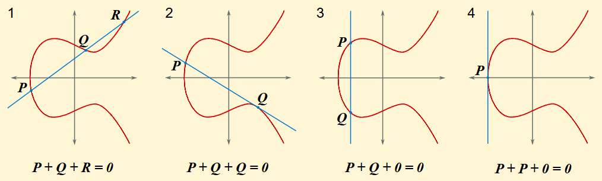

+++
title = "ECC-(一)"
date = "2026-02-20"
categories = ["密码学习"]

+++

# ECC学习-(一)

**前言**

之前零零散散做过几道ecc的基础题目，但是没有系统性的学习，许多知识点和攻击手法也只是停于表面，没有理解其原理，故有此文。主要借助Cryptohack上的ECC专栏进行学习，共计23个题目，希望最后都能理解掌握

下面的介绍内容摘自Cryptohack

The use of elliptic curves for public-key cryptography was first suggested in 1985. After resisting decades of attacks, they started to see widespread use from around 2005, providing several benefits over previous public-key cryptosystems such as RSA.

Smaller EC keys offer greater strength, with a 256-bit EC key having the same security level as a 3072-bit RSA key. Furthermore, several operations using those keys (including signing) can be more efficient both time- and memory-wise. Finally, since ECC is more complex than RSA, it has the welcome effect of encouraging developers to make use of trusted libraries rather than rolling their own.

These challenges aim to give you an intuition for the trapdoor function behind ECC; dip your toes into the mathematical structure underlying it; and have you breaking popular schemes like ECDSA.

可见，ecc是一种比较新的，高效的公钥密码体系，相应地，其也更为复杂

不过，Cryptohack官网不让在其他平台发布题解，原因是防止初学者不劳而获，而Cryptohack的题解似乎一搜一大把，而且也应该没人会看我的博客，若真有不妥，后面就删掉了

## Background

Elliptic Curve Cryptography (ECC) 椭圆曲线密码学

考虑 Weierstrass equations 最典型的形式，形如$E:Y^2=X^3+aX+b$

一条椭圆曲线上的点(以及无穷远点)和点加运算构成了一个**交换群**，无穷远点在群中充当单位元的作用，一个点的逆元即为其关于x轴对称的点

加法规则：一线三点相加为0(无穷远点)，下面的图是直观的点加的几何形式

1. 要计算P+Q，做出过PQ的直线交于第三点R，则P+Q = -R
2. 要计算P+Q，但是直线PQ与椭圆曲线没有第三个交点，而是在Q点与曲线相切，则P+Q+Q = 0，即P+Q = -Q，更容易理解的是，要计算Q+Q，故做过Q点的切线交于第三点P，此时Q+Q = -P
3. P和Q横坐标相同，此时互为逆元，相加为0
4. 特殊情况，过P的切线斜率不存在，此时P+P = 0



Weierstrass 方程的参数a和b需满足$4a^3+27b^3 \neq 0$，为了保证曲线上没有奇点，奇点是曲线尖点或自相交的点，导致曲线在该点不光滑，这样的曲线在椭圆曲线理论中不被认为是有效的，它不具备良好的群结构

在 ECC 中，我们研究有限域 Fp 上的椭圆曲线。这意味着我们对曲线进行取模，椭圆曲线不再是曲线，而是一组坐 x,y 标为整数的离散的点


## Starter

在这个系列中，使用固定的椭圆曲线$E:Y^2=X^3+497X+1768\pmod {9739}$

### Point Negation

找到点P(8045,6936)的逆元Q，即P+Q=0

题目说注意处理负数(negative number)，那么就是(8045,-6936) -> (8045,2803)

### Point Addition

之前从几何角度直观展示了点加，下面是具体的坐标运算公式
$$
\begin{aligned}
&\text{(a) If } P = \mathcal{O}, \text{ then } P + Q = Q. \\
&\text{(b) Otherwise, if } Q = \mathcal{O}, \text{ then } P + Q = P. \\
&\text{(c) Otherwise, write } P = (x_1, y_1) \text{ and } Q = (x_2, y_2). \\
&\text{(d) If } x_1 = x_2 \text{ and } y_1 = -y_2, \text{ then } P + Q = \mathcal{O}. \\
&\text{(e) Otherwise:} \\
&\quad \text{(e1) if } P \neq Q: \lambda = \dfrac{y_2 - y_1}{x_2 - x_1}. \\
&\quad \text{(e2) if } P = Q: \lambda = \dfrac{3x_1^2 + a}{2y_1}. \\
&\text{(f) } x_3 = \lambda^2 - x_1 - x_2. \\
&\text{(h) } y_3 = \lambda(x_1 - x_3) - y_1. \\
&\text{(i) } P + Q = (x_3, y_3).
\end{aligned}
$$
这道题的任务是让我们计算(P+P+Q+R)的和，应当是自己设计算法去算，不过我这里就直接用现成的了

```python
p = 9739
A = 497
B = 1768
E = EllipticCurve(GF(p), [A, B])
P = E(493,5564)
Q = E(1539,4742)
R = E(4403,5202)
assert P in E and Q in E and R in E # 可用 in 判断点是否在线上
ans = P + P + Q + R
print(ans)
```

### Scalar Multiplication

标量乘，即数乘，Q=kP，一个常见的优化就是利用k的二进制展开加速计算，之前在 [link](https://hataovo.github.io/p/isctf-2025/#沉迷数学的小蓝鲨) 有提及过

这道题的任务是让我们计算一个数乘

```python
# same curve
P = E(2339,2213)
Q = 7863 * P
print(Q)
```

### Curves and Logs

即熟悉的椭圆曲线离散对数问题（ECDLP），给出P和Q，寻找一个整数n ，使得Q=nP

这里介绍了基于椭圆曲线的Diffie-Hellman Key Exchange（DH密钥交换协议）

- Alice generates a secret random integer $n_{A}$ and calculates $Q_{A}=[n_{A}]G$  

- Bob generates a secret random integer $n_{B}$ and calculates $Q_{B}=[n_{B}]G$  

- Alice sends Bob $Q_{A}$, and Bob sends Alice $Q_{B}$. Due to the hardness of ECDLP, an onlooker Eve is unable to calculate $n_{A} \ or \  n_B$ in reasonable time.  

- Alice then calculates $[n_{A}]Q_{B}$, and Bob calculates $[n_{B}]Q_{A}$.  

- Due to the associativity (结合性) of scalar multiplication, $S=[n_{A}]Q_{B}=[n_{B}]Q_{A}$.  

- Alice and Bob can use $S$ as their shared secret.

这道题的任务是，已知$Q_A$和$n_B$让我们计算出共享密钥，然后提交其x坐标的SHA1哈希值

```python
# same curve
QA = E(815,3190)
nb = 1829
S = nb * QA
x = S[0]

from hashlib import sha1
x = str(x)
ans = sha1(x.encode()).hexdigest() # 需要encode一下才行
print(ans)
```

### Efficient Exchange

高效交换，说的是在发送一个点时，可以只发送x坐标，因为x坐标确定后，y随之也能确定，但是不一定唯一

已知x(QA)=4726，nB=6534

```python
QA = E.lift_x(4726) # 在已知x坐标情况下，可以获取到一个点
nb = 6534
S = nb * QA
```

然后用S的x坐标作为密钥，密文和IV给出了，用题目给出的解密脚本解密即可

若不对，则取S逆元的x坐标


## End

第一部分先写到这里，目前完成了两个系列的六个题目，主要是偏引导式的入门题目和介绍

后面的内容目测了一下基本都是ctf题目的形式，应该难度会提升了...
