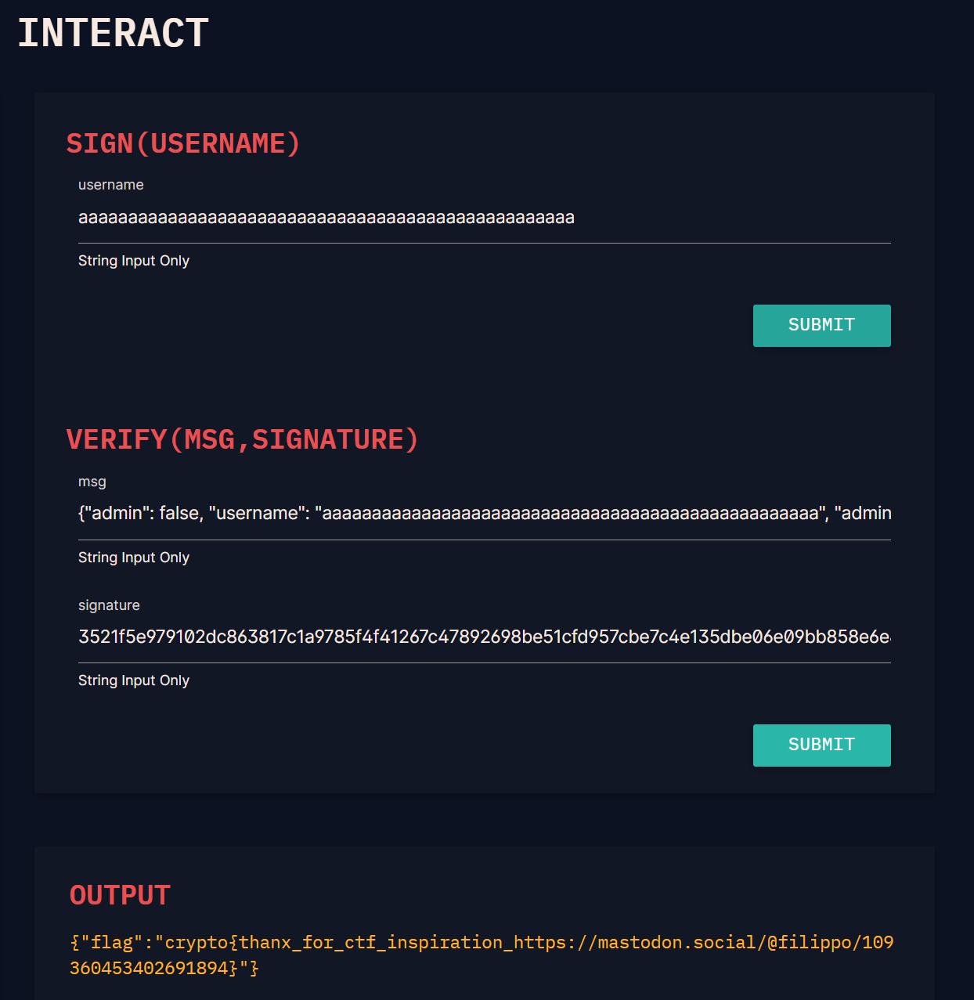

+++
title = "ECC-(二)"
date = "2026-03-03"
categories = ["密码学习"]

+++

# ECC学习-(二)

**前言**

本想按顺序，在第二部分完成Parameter Choice系列的，但上手后发现由于我数学功底严重不足，导致做起来很吃力，只好先做了其他的题目


## Signatures

**ECDSA**

**密钥生成**

1、选择一条椭圆曲线E和基点G，G的阶为n (椭圆曲线的阶也是n，也就是说G是一个生成元)

2、选择私钥$d_A$，计算公钥$Q = d_AG$，Q即为公钥

**签名**

1、取随机数k，计算$P=k*G$

2、取P的x坐标，$r \equiv x_P \pmod n$

3、使用一个哈希函数计算m的哈希值（m一般为签名信息），用H(m)表示

4、计算$s \equiv k^{-1}(H(m)+rd_A) \pmod n$

5、(r, s)做为签名值

**验签**

1、接受方在收到消息(m)和签名值(r, s)后，进行以下运算

2、计算h = H(m)

3、计算 $\omega \equiv s^{-1} \pmod n$

4、计算$u_1 = h\omega$，$u_2=r\omega$

5、计算$X = (x_1,y_1)=u_1G+u_2Q$

6、若X不存在，则签名错误；计算$v\equiv x_1 \pmod n$

7、若 v == r，签名正确

**简单证明**
$$
X =u_1G+u_2Q=h\omega G + r\omega d_A G = \omega(h+rd_A)G = \omega skG = \omega s P = P
$$


**若k泄露**，则能从一组(r, s)中算出私钥d


**若k复用**

则对应的r也一样

$s_1^{-1}(H(m_1)+rd_A) \equiv s_2^{-1}(H(m_2)+rd_A) \pmod n $

$s_1^{-1}H(m_1) + s_1^{-1}rd_A \equiv s_2^{-1}H(m_2) + s_2^{-1}rd_A \pmod n$

$r(s_1^{-1}-s_2^{-1})d_A \equiv s_2^{-1}H(m_2) - s_1^{-1}H(m_1) \pmod n$ 

最后两边乘个模逆即可得到私钥


### Digestive

```python
import hashlib
import json
import string
from ecdsa import SigningKey

SK = SigningKey.generate() # uses NIST192p
VK = SK.verifying_key


class HashFunc:
    def __init__(self, data):
        self.data = data

    def digest(self):
        # return hashlib.sha256(data).digest()
        return self.data

@chal.route('/digestive/sign/<username>/')
def sign(username):
    sanitized_username = "".join(a for a in username if a in string.ascii_lowercase)
    msg = json.dumps({"admin": False, "username": sanitized_username})
    signature = SK.sign(
        msg.encode(),
        hashfunc=HashFunc,
    )

    # remember to remove the backslashes from the double-encoded JSON
    return {"msg": msg, "signature": signature.hex()}

@chal.route('/digestive/verify/<msg>/<signature>/')
def verify(msg, signature):
    try:
        VK.verify(
            bytes.fromhex(signature),
            msg.encode(),
            hashfunc=HashFunc,
        )
    except:
        return {"error": "Signature verification failed"}

    verified_input = json.loads(msg)
    if "admin" in verified_input and verified_input["admin"] == True:
        return {"flag": FLAG}
    else:
        return {"error": f"{verified_input['username']} is not an admin"}
```

Python 的 json 模块提供了 json.dumps() 将字典转换为 JSON 字符串，以及 json.loads() 将 JSON 字符串解析为字典。此外，布尔值在 JSON 中写作 true/false，在 Python 中写作 True/False

翻阅sign函数的源码发现，其在取哈希函数返回结果时，只会取前面若干固定长度的值，而这个题的哈希函数又有问题，他直接返回的是数据原始内容，这就导致我们可以伪造前缀一样的数据

在验证时，利用字典的特性，在后面覆写一个"admin": True，json.loads()后可以绕过这层校验

```python
username1 = 'a' * 50
# 提交 aaa...a 进行签名，实际上的数据是字节串msg1 b'{"admin": false, "username": "aaa...a"}'
# json.dumps() 把 False -> false

msg2 = '{"admin": false, "username": "aaa...a", "admin": true}'
# msg2和msg1的前缀一样，相当于原始数据一样，那么验签可以通过
# 在 json.loads() 后，变成字典 {'admin': True, 'username': 'aaa...a'}
```

结果如下



### Curveball

```python
#!/usr/bin/env python3

import fastecdsa
from fastecdsa.point import Point
from fastecdsa.curve import P256
from utils import listener


FLAG = "crypto{????????????????????????????????????}"
G = P256.G
assert G.x, G.y == [0x6B17D1F2E12C4247F8BCE6E563A440F277037D812DEB33A0F4A13945D898C296,
                    0x4FE342E2FE1A7F9B8EE7EB4A7C0F9E162BCE33576B315ECECBB6406837BF51F5]


class Challenge():
    def __init__(self):
        self.before_input = "Welcome to my secure search engine backed by trusted certificate library!\n"
        self.trusted_certs = {
            'www.cryptohack.org': {
                "public_key": Point(0xE9E4EBA2737E19663E993CF62DFBA4AF71C703ACA0A01CB003845178A51B859D, 0x179DF068FC5C380641DB2661121E568BB24BF13DE8A8968EF3D98CCF84DAF4A9, curve=P256),
                "curve": "secp256r1",
                "generator": [G.x, G.y]
            },
            'www.bing.com': {
                "public_key": Point(0x3B827FF5E8EA151E6E51F8D0ABF08D90F571914A595891F9998A5BD49DFA3531, 0xAB61705C502CA0F7AA127DEC096B2BBDC9BD3B4281808B3740C320810888592A, curve=P256),
                "curve": "secp256r1",
                "generator": [G.x, G.y]
            },
            'www.gchq.gov.uk': {
                "public_key": Point(0xDEDFC883FEEA09DE903ECCB03C756B382B2302FFA296B03E23EEDF94B9F5AF94, 0x15CEBDD07F7584DBC7B3F4DEBBA0C13ECD2D2D8B750CBF97438AF7357CEA953D, curve=P256),
                "curve": "secp256r1",
                "generator": [G.x, G.y]
            }
        }

    def search_trusted(self, Q):
        for host, cert in self.trusted_certs.items():
            if Q == cert['public_key']:
                return True, host
        return False, None

    def sign_point(self, g, d):
        return g * d

    def connection_host(self, packet):
        d = packet['private_key']
        if abs(d) == 1:
            return "Private key is insecure, certificate rejected."
        packet_host = packet['host']
        curve = packet['curve']
        x, y = packet['generator']
        g = Point(x, y, curve=P256)
        Q = self.sign_point(g, d)
        cached, host = self.search_trusted(Q)
        if cached:
            return host
        else:
            self.trusted_certs[packet_host] = {
                "public_key": Q,
                "curve": "secp256r1",
                "generator": G
            }
            return "Site added to trusted connections"

    def bing_it(self, s):
        return f"Hey bing! Tell me about {s}"

    #
    # This challenge function is called on your input, which must be JSON
    # encoded
    #
    def challenge(self, your_input):
        host = self.connection_host(your_input)
        if host == "www.bing.com":
            return self.bing_it(FLAG)
        else:
            return self.bing_it(host)


import builtins; builtins.Challenge = Challenge # hack to enable challenge to be run locally, see https://cryptohack.org/faq/#listener
listener.start_server(port=13382)
```

实测后发现，只有一次交互机会，我们可以提供一个json，包含private_key，host，curve，generator四个内容，核心函数是connection_host函数，其会计算我们提供的 Q = private_key * generator，若算出的Q和已知列表中 www.bing.com 对应的 public_key (记为点P)一样，即可获得flag

关键点在于private_key和generator都是我们可以指定的，直白地想法是传private_key=1，generator=P，但是这种情况被ban了，故可以获取P的阶ord，然后传(ord+1, P)，算出来也还是P，而P的阶可以拿曲线的阶来用，一查就找到了，payload如下 (json里的数用十六进制会报错，十进制没问题)

```text
{"private_key": 115792089210356248762697446949407573529996955224135760342422259061068512044370, "host": "www.bing.com", "curve": "secp256r1", "generator": [26917031336335630350805290904899574903292792639991422008541635695952008983857, 77517656757371332161127542375026653060402730453393832579023072993157413624106]}
```

### ProSign 3

```python
#!/usr/bin/env python3

import hashlib
from Crypto.Util.number import bytes_to_long, long_to_bytes
from ecdsa.ecdsa import Public_key, Private_key, Signature, generator_192
from utils import listener
from datetime import datetime
from random import randrange

FLAG = "crypto{?????????????????????????}"
g = generator_192
n = g.order()


class Challenge():
    def __init__(self):
        self.before_input = "Welcome to ProSign 3. You can sign_time or verify.\n"
        secret = randrange(1, n)
        self.pubkey = Public_key(g, g * secret)
        self.privkey = Private_key(self.pubkey, secret)

    def sha1(self, data):
        sha1_hash = hashlib.sha1()
        sha1_hash.update(data)
        return sha1_hash.digest()

    def sign_time(self):
        now = datetime.now()
        m, n = int(now.strftime("%m")), int(now.strftime("%S"))
        current = f"{m}:{n}"
        msg = f"Current time is {current}"
        hsh = self.sha1(msg.encode())
        sig = self.privkey.sign(bytes_to_long(hsh), randrange(1, n))
        return {"msg": msg, "r": hex(sig.r), "s": hex(sig.s)}

    def verify(self, msg, sig_r, sig_s):
        hsh = bytes_to_long(self.sha1(msg.encode()))
        sig_r = int(sig_r, 16)
        sig_s = int(sig_s, 16)
        sig = Signature(sig_r, sig_s)

        if self.pubkey.verifies(hsh, sig):
            return True
        else:
            return False

    #
    # This challenge function is called on your input, which must be JSON
    # encoded
    #
    def challenge(self, your_input):
        if 'option' not in your_input:
            return {"error": "You must send an option to this server"}

        elif your_input['option'] == 'sign_time':
            signature = self.sign_time()
            return signature

        elif your_input['option'] == 'verify':
            msg = your_input['msg']
            r = your_input['r']
            s = your_input['s']
            verified = self.verify(msg, r, s)
            if verified:
                if msg == "unlock":
                    self.exit = True
                    return {"flag": FLAG}
                return {"result": "Message verified"}
            else:
                return {"result": "Bad signature"}

        else:
            return {"error": "Decoding fail"}


import builtins; builtins.Challenge = Challenge # hack to enable challenge to be run locally, see https://cryptohack.org/faq/#listener
listener.start_server(port=13381)
```

~~有点阴~~ sign_time函数内用的随机数k取自randrange(1, n)，而这个n不是`n = g.order()`，而是`n = int(now.strftime("%S")`，这个n的取值范围是0到59，故可以先拿一组签名，枚举k，进一步可以算出私钥，然后可以伪造"unlock"的签名 (交互没有次数限制)

```python
from ecdsa.ecdsa import Public_key, Private_key, Signature, generator_192
import hashlib
from Crypto.Util.number import bytes_to_long

g = generator_192
n = g.order()

def sha1(data):
    sha1_hash = hashlib.sha1()
    sha1_hash.update(data)
    return sha1_hash.digest()

def solve_d():
    msg = "Current time is 2:42"
    hsh = bytes_to_long(sha1(msg.encode()))
    r = 0xc013b8cb3620f4482f9e82fde0ae9eeef53ccfa0f05b46f3
    s = 0xf7d54775b985995423e57fd84acceb63c7c463ec006e321b
    for k in range(60):
        tmp = k * g
        if tmp.x() == r:
            break
    d = (s * k - hsh) * pow(r, -1, n) % n
    return d

def test():
    msg = 'Current time is 2:14'
    r = 0xa37abc6c431f9ac398bf5bd1aa6678320ace8ecb93d23f2a
    s = 0xffe7af869f7b7bbfb17a49d13fe198d9f18e6ef53330387d    
    hsh = bytes_to_long(sha1(msg.encode()))
    sig = Signature(r, s)
    print(pubkey.verifies(hsh, sig))

d = solve_d()
pubkey = Public_key(g, g * d)
privkey = Private_key(pubkey, d)
test()

msg = f"unlock"
hsh = sha1(msg.encode())
sig = privkey.sign(bytes_to_long(hsh), 1) # 随便取一个k
print(hex(sig.r))
print(hex(sig.s))
# 最后的payload，需提交十六进制数据
{"option": "verify", "msg": "unlock", "r": "0x188da80eb03090f67cbf20eb43a18800f4ff0afd82ff1012", "s": "0xf21d59e608c22c82dc026f2f40cc892901f1ab2452841b35"}
```

### No Random, No Bias

```python
from hashlib import sha1
from Crypto.Util.number import bytes_to_long, long_to_bytes
from ecdsa import ellipticcurve
from ecdsa.ecdsa import curve_256, generator_256, Public_key, Private_key
from random import randint

G = generator_256
q = G.order()

FLAG = b'crypto{??????????????????}'


def hide_flag(privkey):
    x = bytes_to_long(FLAG)
    p = curve_256.p()
    b = curve_256.b()
    ysqr = (x**3 - 3*x + b) % p
    y = pow(ysqr, (p+1)//4, p)
    Q = ellipticcurve.Point(curve_256, x, y)
    T = privkey.secret_multiplier*Q
    return (int(T.x()), int(T.y()))


def genKeyPair():
    d = randint(1,q-1)
    pubkey = Public_key(G, d*G)
    privkey = Private_key(pubkey, d)
    return pubkey, privkey


def ecdsa_sign(msg, privkey):
    hsh = sha1(msg.encode()).digest()
    nonce = sha1(long_to_bytes(privkey.secret_multiplier) + hsh).digest()
    sig = privkey.sign(bytes_to_long(hsh), bytes_to_long(nonce))
    return {"msg": msg, "r": hex(sig.r), "s": hex(sig.s)}


pubkey, privkey = genKeyPair()
hidden_flag = hide_flag(privkey)

sig1 = ecdsa_sign('I have hidden the secret flag as a point of an elliptic curve using my private key.', privkey)
sig2 = ecdsa_sign('The discrete logarithm problem is very hard to solve, so it will remain a secret forever.', privkey)
sig3 = ecdsa_sign('Good luck!', privkey)

print('Hidden flag:', hidden_flag)
print('\nPublic key:', (int(pubkey.point.x()), int(pubkey.point.y())), '\n')
print(sig1)
print(sig2)
print(sig3)
```

对ecdsa略有改动，具体是在随机数k的选取方式上，对应于代码中的nonce，涉及到了一个未知数privkey.secret_multiplier，但是因为套了一层sha1，没办法直接解方程组解出来，比直觉上要难

后来也是找到了一个题解 [Lattice - HackMD](https://hackmd.io/@L4m/B1Vpr_vK0#Hidden-Number-Problem) ，发现竟是用hnp解的，~~真是什么莫名奇妙的问题都能归到hnp里~~

由于做了一层sha1，只好将他们视作3个无关的变量，结合ecdsa的 $s \equiv k^{-1}(H(m)+rd_A) \pmod n$，k就是nonce，可得3个式子，其中h，r，s已知，k是小量
$$
s_ik_i \equiv h_i + r_id_A  \pmod n \\
k_i \equiv s_i^{-1}h_i + s_i^{-1}r_id_A \pmod n \\
k_i = s_i^{-1}h_i + s_i^{-1}r_id_A - t_in
$$
而sha1返回的是160bit左右，其余值在模n意义下，大概为256bit，可以构造如下的hnp格，$B = 2^{160}$
$$
(-t_1, -t_2, -t_3,1,d_A)
\begin{bmatrix}
n & & & \\
& n & & \\
& & n & \\
s_1^{-1}h_1 & s_2^{-1}h_2 & s_3^{-1}h_3 & B \\
s_1^{-1}r_1 & s_2^{-1}r_2 & s_3^{-1}r_3 & & \frac{B}{n}
\end{bmatrix} = 
(k_1,k_2,k_3,B,\frac{Bd_A}{n})
$$
有意思的是这个格里有个分数$\frac{B}{n}$，故声明矩阵时为QQ，而QQ上的矩阵也可以进行LLL，(之前看hnp看这个分数以为其只是个配平的整数，今天才发现原来不是整数)

```python
from ecdsa.ecdsa import generator_256, curve_256
from hashlib import sha1
from Crypto.Util.number import bytes_to_long

# G = generator_256
# q = G.order()
# p = curve_256.p()

p = 115792089210356248762697446949407573530086143415290314195533631308867097853951
q = 115792089210356248762697446949407573529996955224135760342422259061068512044369

msg1 = 'I have hidden the secret flag as a point of an elliptic curve using my private key.'
msg2 = 'The discrete logarithm problem is very hard to solve, so it will remain a secret forever.'
msg3 = 'Good luck!'
r1 = 0x91f66ac7557233b41b3044ab9daf0ad891a8ffcaf99820c3cd8a44fc709ed3ae
s1 = 0x1dd0a378454692eb4ad68c86732404af3e73c6bf23a8ecc5449500fcab05208d
r2 = 0xe8875e56b79956d446d24f06604b7705905edac466d5469f815547dea7a3171c
s2 = 0x582ecf967e0e3acf5e3853dbe65a84ba59c3ec8a43951bcff08c64cb614023f8
r3 = 0x566ce1db407edae4f32a20defc381f7efb63f712493c3106cf8e85f464351ca6
s3 = 0x9e4304a36d2c83ef94e19a60fb98f659fa874bfb999712ceb58382e2ccda26ba
r = [r1, r2, r3]
s = [s1, s2, s3]
msg = [msg1, msg2, msg3]
h = [bytes_to_long(sha1(i.encode()).digest()) for i in msg]
n = q
B = 2**160

A = matrix(QQ, 5, 5)
A[0,0], A[1,1], A[2,2], A[3,3], A[4,4] = n, n, n, B, B/n
A[3, 0] = pow(s[0], -1, n) * h[0] % n
A[3, 1] = pow(s[1], -1, n) * h[1] % n
A[3, 2] = pow(s[2], -1, n) * h[2] % n
A[4, 0] = pow(s[0], -1, n) * r[0] % n
A[4, 1] = pow(s[1], -1, n) * r[1] % n
A[4, 2] = pow(s[2], -1, n) * r[2] % n

for i in A.LLL():
    if i[-2] == B:
        d = i[-1] * n // B
        break
# d = -5687835041414401518037487927537571677695910561554102725890750391076891295276
```

发现规约出的目标向量中d是个负数，其余全为正符合预期，故给整个目标向量取反也显然不对，事实上，回看前面的式子，发现其实 $d,d+n,d-n$ 等等这些都符合等式，不过发现负数也能自动处理

最后，根据题意，privkey.secret_multiplier应当指的就是私钥d，$T = dQ$，现在已知T和d，要求Q，这也是容易的，只需两边同乘 d模order(Q)的逆元 即可 $d^{-1}T = d^{-1}dQ = Q$，因为 d 的取值在模order(Q)意义下，不过Q的阶不知道，拿G的阶算即可 order(Q) | order(G)

```python
from ecdsa.ecdsa import generator_256, curve_256
from ecdsa.ellipticcurve import Point
from Crypto.Util.number import long_to_bytes

G = generator_256
q = G.order()
p = curve_256.p()

pub = (48780765048182146279105449292746800142985733726316629478905429239240156048277, 74172919609718191102228451394074168154654001177799772446328904575002795731796)
d = -5687835041414401518037487927537571677695910561554102725890750391076891295276
print((d * G).x() == pub[0])
print((d * G).y() == pub[1])

dinv = pow(d, -1, q)
T = (16807196250009982482930925323199249441776811719221084165690521045921016398804, 72892323560996016030675756815328265928288098939353836408589138718802282948311)
T = Point(curve_256, T[0], T[1])
print(long_to_bytes((dinv * T).x()))
```


## Side Channels

### Montgomery's Ladder

介绍了计算倍点时的蒙哥马利二进制展开算法，算是比较熟悉了

这道题的曲线方程不是以往的 Weierstrass 形式，而是 Montgomery 形式$E:By^2=x^3+Ax^2+x$，$y^2$前面的B似乎没什么用，一般都会把其约为1

容易理解，对于不同表达形式的曲线，点加的几何形式是一样的，但是对应的坐标运算表达式是不一样的

在sage中，一般的声明语句为 EllipticCurve([a1,a2,a3,a4,a6])，对应的曲线形式为$y^2 + a_1xy + a_3y = x^3 + a_2x^2 + a_4x + a_6$

这个题涉及的曲线是$E:Y^2=X^3+486662X^2+X \pmod{2^{255}−19}$，本意应是自己写一个 Montgomery 版本的点加函数和优化后的倍点函数，不过在sage中声明好后，直接用就行了 XD

```python
p = 2^255 -19
E = EllipticCurve(GF(p), [0,486662,0,1,0])
G = E.lift_x(9)
Q = 0x1337c0decafe * G
```

### Double and Broken

```python
import json
from ecc_side_channel import Point, double_and_add
from Crypto.Util.number import bytes_to_long

FLAG = b'crypto{?????????????????????????????????????}'

# Secp256k1 curve parameters
p = 2**256 - 2**32 - 977
a = 0
b = 7

# Generator 
gx = 0x79be667ef9dcbbac55a06295ce870b07029bfcdb2dce28d959f2815b16f81798
gy = 0x483ada7726a3c4655da4fbfc0e1108a8fd17b448a68554199c47d08ffb10d4b8
G = Point(gx, gy)

# Private key
d = bytes_to_long(FLAG)

# Side channel data collection
collected_data = []
for _ in range(50):
    Q, leak = double_and_add(G, d)
    collected_data.append(leak)

with open('collected_data.txt', 'w') as f:
    f.write(json.dumps(collected_data))
```

说是和侧信道相关，但是这个代码看着有点不知所云，给的collected_data.txt是一个50*359的二维列表，说是和功耗有关，数值大概可以看出有大小之分

大概能猜出其意思是：蒙哥马利优化算法基于二进制展开，359应该代表359比特，即进行了359次操作，若比特位为1，则需进行二倍和点加操作，功耗大，若比特位为0，则只二倍操作，功耗小，而给了50组数据应该是要取其平均值，据此进行判断

```python
with open('collected_data.txt') as f:
    data = eval(f.read())
avg = []
for i in range(359):
    tmp = 0 
    for j in range(50):
        tmp += data[j][i]
    avg.append(tmp // 50)
# print(avg)
d = ''
for i in avg:
    if i > 130:
        d += '1'
    else:
        d += '0'
from Crypto.Util.number import long_to_bytes
print(long_to_bytes(int(d[::-1], 2))) # 逆一下，应是从低bit向高bit运算的
```


## Edwards Curves

又介绍了一种新的曲线表达形式 Edwards 爱德华曲线 $x^2 + y^2 = 1+ dx^2y^2$

其在处理点加时有优势，不必区分P是否等于Q，有统一的坐标表达式
$$
(x_1, y_1) + (x_2, y_2) = \left( \frac{x_1y_2 + x_2y_1}{1 + dx_1x_2y_1y_2}, \frac{y_1y_2 - x_1x_2}{1 - dx_1x_2y_1y_2} \right)
$$

$$
2(x_1, y_1) = \left( \frac{2x_1y_1}{1 + dx_1^2y_1^2}, \frac{y_1^2 - x_1^2}{1 - dx_1^2y_1^2} \right)
$$

不难看出其实是一样的，实际问题中一般在有限域Fp上进行

神奇的是，爱德华曲线可以代换为之前提过的蒙哥马利曲线，做代换如下
$$
\begin{cases}
u &= \dfrac{1+y}{1-y} \\
v &= \dfrac{2(1+y)}{x(1-y)} = \dfrac{2u}{x} \\
A &= \dfrac{4}{1-d} - 2 \\
B &= \dfrac{1}{1-d}
\end{cases}
$$

可得方程

$$
Bv^2 = u^3 + Au^2 + u
$$
不知道这是怎么构造出来的，但是验证了一下确实是对的


形式很相近的，有**扭曲爱德华曲线** (Twisted Edwards)，$ax^2 + y^2 = 1+ dx^2y^2$，多了一个系数a，其点加坐标表达式如下，略有不同
$$
(x_1, y_1) + (x_2, y_2) = \left( \frac{x_1y_2 + x_2y_1}{1 + dx_1x_2y_1y_2}, \frac{y_1y_2 - ax_1x_2}{1 - dx_1x_2y_1y_2} \right)
$$

$$
2(x_1, y_1) = \left( \frac{2x_1y_1}{1 + dx_1^2y_1^2}, \frac{y_1^2 - ax_1^2}{1 - dx_1^2y_1^2} \right)
$$
同样地，其也可以代换为蒙哥马利形式
$$
\begin{cases}
u &= \dfrac{1+y}{1-y} \\
v &= \dfrac{1+y}{x(1-y)} = \dfrac{u}{x} \\
A &= \dfrac{2(a+d)}{a-d} \\
B &= \dfrac{4}{a-d}
\end{cases}
$$

可得方程

$$
Bv^2 = u^3 + Au^2 + u
$$

### Edwards Goes Degenerate

```python
from Crypto.Util.number import inverse, bytes_to_long
from Crypto.Cipher import AES
from Crypto.Util.Padding import pad, unpad
from random import randint
from hashlib import sha1
import os

FLAG = b'crypto{????????????????????????????????????}'


class TwistedEdwards():
    # Elliptic curve in Edwards form:
    # -x**2 + y**2 = 1 + d*x**2*y**2
    # birationally equivalent to the Montgomery curve:
    # y**2 = x**3 + 2*(1-d)/(1+d)*x**2 + x

    def __init__(self, p, d, order, x0bit, y0):
        self.p = p
        self.d = d
        self.order = order
        self.base_point = (x0bit, y0)

    def recover_x(self, xbit, y):
        xsqr = (y**2 - 1)*inverse(1 + self.d*y**2, self.p) % self.p
        x = pow(xsqr, (self.p + 1)//4, self.p)
        if x**2 == xsqr :
            if x & 1 != xbit:
                return p - x
            return x
        return 0

    def decompress(self, compressed_point):
        xbit, y = compressed_point
        x = self.recover_x(xbit, y)
        return (x, y)

    # complete point addition formulas
    def add(self, P1, P2):
        x1, y1 = P1
        x2, y2 = P2
        
        C = x1*x2 % self.p
        D = y1*y2 % self.p
        E = self.d*C*D
        x3 = (1 - E)*((x1 + y1)*(x2 + y2) - C - D) % self.p
        y3 = (1 + E)*(D + C) % self.p
        z3 = 1 - E**2 % self.p
        z3inv = inverse(z3, self.p)
        return (x3*z3inv % self.p, y3*z3inv % self.p)

    # left-to-right double-and-add
    def single_mul(self, n, compressed_point):
        P = self.decompress(compressed_point)        
        t = n.bit_length()
        if n == 0:
            return (0,1)
        R = P
        for i in range(t-2,-1,-1):
            bit = (n >> i) & 1
            R = self.add(R, R)
            if bit == 1:
                R = self.add(R, P)
        return (R[0] & 1, R[1])


def gen_key_pair(curve):
    n = randint(1, curve.order-1)
    P = curve.single_mul(n, curve.base_point)
    return n, P
    
def gen_shared_secret(curve, n, P):
    xbit, y = curve.single_mul(n, P)
    return y
    

def encrypt_flag(shared_secret: int):
    # Derive AES key from shared secret
    key = sha1(str(shared_secret).encode('ascii')).digest()[:16]
    # Encrypt flag
    iv = os.urandom(16)
    cipher = AES.new(key, AES.MODE_CBC, iv)
    ciphertext = cipher.encrypt(pad(FLAG, 16))
    # Prepare data to send
    data = {}
    data['iv'] = iv.hex()
    data['encrypted_flag'] = ciphertext.hex()
    return data


# curve parameters
# birationally equivalent to the Montgomery curve y**2 = x**3 + 337*x**2 + x mod p
p = 110791754886372871786646216601736686131457908663834453133932404548926481065303
order = 27697938721593217946661554150434171532902064063497989437820057596877054011573
d = 14053231445764110580607042223819107680391416143200240368020924470807783733946
x0bit = 1
y0 = 11
curve = TwistedEdwards(p, d, order, x0bit, y0)


# Generate key pairs
n_a, P_alice = gen_key_pair(curve)
n_b, P_bob = gen_key_pair(curve)

print(f"Alice sends public key: {P_alice}")
print(f"Bob sends public key: {P_bob}\n")


# Encrypted flag with shared secret
shared_secret = gen_shared_secret(curve, n_a, P_bob)
encrypted_flag = encrypt_flag(shared_secret)

print(f"Alice sends encrypted_flag: {encrypted_flag}")
```

```text
# Elliptic curve in Edwards form:
# -x**2 + y**2 = 1 + d*x**2*y**2
# birationally equivalent to the Montgomery curve:
# y**2 = x**3 + 2*(1-d)/(1+d)*x**2 + x
```

对于这一段注释，结合上面的公式 $x^2$ 的系数确实没问题，但是 $y^2$ 的系数不应当是1，这是为什么呢，ai给出的解释是通过下面的代换，将 $y^2$ 的系数归1，实际上是多了一个缩放因子
$$
u' = \frac{1 + y}{1 - y}
$$

$$
v' = \frac{1 + y}{x(1 - y)} \cdot \sqrt{B} = \sqrt{B} \cdot v
$$

这一系列变换，从扭爱德华到蒙哥马利再到系数缩放，得到的曲线都是**双有理等价（Birationally equivalent）**的，其是代数几何中的一个核心概念，简单理解：两条看起来方程式完全不同的曲线，在数学的本质结构上是“同一条曲线”的两种不同表达方式

这样的话，用给出的d去计算`2 * (1-d) * pow((1+d), -1, p) % p`，得到的确实是337，和注释对应上了

源代码中还有不少有用信息

在表示一个点时，用的是压缩后的形式(x0bit, y0)，其中x0bit表示的是x的最低比特位，只有0和1两种取值用以区分从一个y得出的两个x，具体细节在recover_x函数中

recover_x函数的思路是，由$-x^2 + y^2 = 1 + dx^2y^2$，先把 $x^2$ 算出来，p模4余3，可以方便的开平方得到两个候选值，可以记为 $x_0,p-x_0$ ，不难发现其最低为必定是一个为0一个为1，然后`x & 1 =? xbit`进行区分

add函数实现了a=-1时的加法，不过具体代码不是直来直去，做了一些操作，可能有什么别的作用

single_mul函数实现了倍点算法，依旧二进制展开计算，这里可以看到，返回值是`(R[0] & 1, R[1])`，可以解释recover_x区分x的做法

不难验证，对于爱德华曲线和扭爱德华曲线，其**单位元**是点 **(0,1)**


说了一通，但是没有触及到这个题的本质，下面开始正题

首先发现这里的p有问题，p-1光滑，但是order是一个素数。而且，用已知的三个点尝试去调用recover_x函数，发现返回的都是0，这是因为`if x**2 == xsqr`这一步没有`x**2 % p`，故导致这个条件基本上一定不会成立。若在判断中加上求余p，也只有基点能正确处理，alice和bob的公钥仍然返回0，说明已经是出问题了

检索 Edwards Degenerate 这些关键词，可以找到一些资料，关键的一点是这个式子，由加法公式可得 $(0, y_1) + (0, y_2) = (0, y_1y_2)$，进一步的，有 $k(0,y_1) = (0,y_1^k)$，这就是 Degenerate(退化) 的含义

最后，由于本题recover_x的问题，导致生成密钥时，$P_a = n_aG$，实际上等价于$y_{pa} \equiv 11^{n_a} \pmod p$，而最开始说的p有问题，这个题就解决了

```python
p = 110791754886372871786646216601736686131457908663834453133932404548926481065303
pa = (0, 109790246752332785586117900442206937983841168568097606235725839233151034058387)
pb = (0, 45290526009220141417047094490842138744068991614521518736097631206718264930032)
na = discrete_log(GF(p)(pa[1]), GF(p)(11))
nb = discrete_log(GF(p)(pb[1]), GF(p)(11))
assert pow(pb[1], na, p) == pow(pa[1], nb, p)
# 之后可算出共享密钥，解密即可
```

最后想说的是，虽然代码里注释一直在说蒙哥马利曲线，但是实际攻击中并没有用到。而且代码里进行点运算之前并没有检查点是否真的在曲线上，导致出了问题


## End

ecc这块接下来可能会花很长时间，断断续续的研究剩下的题目和数学原理了，距离做完遥遥无期啊 (っ﹏-) .｡o
