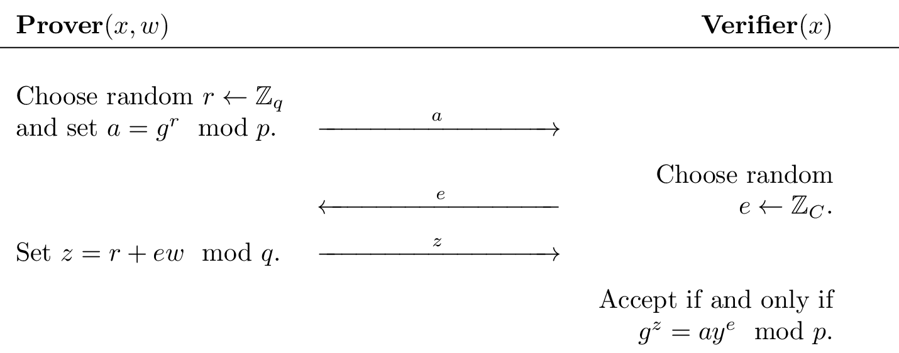
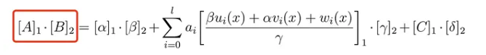

+++
title = "ZKPS-(一)"
date = "2026-04-12"
categories = ["密码学习"]

+++

# ZKPS学习-(一)

**前言**

初识 ZKP

用 Cryptohack 入门针不戳

## 介绍

Zero-knowledge proofs (ZKPs) are a technique that enable one party (the prover) to demonstrate to another party (the verifier) the truth of a certain statement without revealing any additional information besides the fact that the statement is true. The foundation for ZKPs was laid in 1985 by Goldwasser, Micali, Rackoff, Babai, and Moran, who won the first Gödel Prize for their contribution to theoretical computer science.

定义：使一方（证明者）能够向另一方（验证者）证明某个陈述的真实性，而无需透露除了该陈述为真之外的任何额外信息

零知识证明背后的核心思想是，虽然通过披露信息来证明你拥有某种知识是很简单的，但真正的挑战在于证明你拥有该知识而实际上不透露知识本身或其任何细节

典型示例：

你需要向你的色盲朋友 Victor 证明两个形状相同的球：一个红色，一个绿色，是不同的，但不透露哪一个是哪个，你使用了一个特定的证明系统。你将两个球交给他，而他因为无法辨别颜色，会测试你。Victor 把两个球藏起来，然后展示一个球，之后在再次展示前可能会交换球，也可能不交换，你必须判断他是否交换了球。重复这个过程足够次数（例如50次），由于你可以通过看到颜色可靠地辨别交换情况，Victor 就会相信球是不同的，而不会知道哪个是红色或绿色。这个演示不会泄露任何额外信息，是零知识证明的一个例子

## DLP Version

考虑下面这个 DLP 版本的零知识证明系统，好像就是 Schnorr 协议

素数 p 和 q，g 生成了 Fp* 的阶为 q 的子群

Prover (P) 想向 Verifier (V) 证明他知道秘密数字 w，满足 $g^w \equiv y \pmod p$

他们之间做如图所示的交互，注意计算 z 时用的是模 q，这是因为 g 生成的子群的阶是 q



用 x=(p, q, g, y) 代表公共信息，w 代表私有信息，R 代表整个 DLP 系统，可表示为 (x, w) ∈ R

具体看上面的交互过程(称为协议)

1. P 发送 a 给 V
2. V 发送 e 给 P
3. P 发送 z 给 V，V 依据 (x, a, e, z) 来决定接受还是拒绝 (⊤,⊥)

这是一个所谓的西格玛协议(Sigma Protocol)的实例，通常表示为 Σ-协议，是一种具有许多优良特性的零知识证明类型

某个协议是一个 Σ-协议，该协议必须满足三个属性，分别是：

- 完整性(Completeness)：如果 P、V 在公共输入 x 和私有输入 w 上运行协议，其中 (x, w) ∈ R，则 V 返回 ⊤
- 特殊可靠性(Special Soundness)：如果 P 能说服 V，那么 P 知道 w
- SHVZK(Special-Honest-Verifier-Zero-Knowledge)：V 不会从 P 那里学习到任何关于 w 的信息

例题 [Proofs of Knowledge]，谈不上是"题目"，只是一个上面协议的实现，按要求交互即可

```python
import random

# Diffie-Hellman group (512 bits)
# p = 2*q + 1 where p,q are both prime, and 2 modulo p generates a group of order q
p = 0x1ed344181da88cae8dc37a08feae447ba3da7f788d271953299e5f093df7aaca987c9f653ed7e43bad576cc5d22290f61f32680736be4144642f8bea6f5bf55ef
q = 0xf69a20c0ed4465746e1bd047f57223dd1ed3fbc46938ca994cf2f849efbd5654c3e4fb29f6bf21dd6abb662e911487b0f9934039b5f20a23217c5f537adfaaf7
g = 2

# w,y for the relation `g^w = y mod P` we want to prove knowledge of
# w = random.randint(0,q)
# y = pow(g,w,P)
w = 0x5a0f15a6a725003c3f65238d5f8ae4641f6bf07ebf349705b7f1feda2c2b051475e33f6747f4c8dc13cd63b9dd9f0d0dd87e27307ef262ba68d21a238be00e83
y = 0x514c8f56336411e75d5fa8c5d30efccb825ada9f5bf3f6eb64b5045bacf6b8969690077c84bea95aab74c24131f900f83adf2bfe59b80c5a0d77e8a9601454e5

assert (y%p) >= 1
assert pow(y, q, p) == 1

class Challenge:
    def __init__(self):
        self.before_input = "Prove to me that you know an w such that g^w = y mod p. Send me a = g^r mod p for some random r in range(q)\n"
        self.state = "CHALLENGE"

    def challenge(self, msg):
        if self.state == "CHALLENGE":
            # Prover sends a randomly sampled `A` value from Z_p* to verifier
            self.a = msg["a"]
            if (self.a%p) < 1 or pow(self.a, q, p) != 1:
                self.exit = True
                return {"error": "Invalid value"}

            # Verifier sends a random challenge sampled from range(0, 2^t) where 2^t <= q
            self.e = random.randint(0,2**511)
            self.state = "PROVE"
            return {"e": self.e, "message": "send me z = r + e*w mod q"}
        elif self.state == "PROVE":
            # Prover sends z = r + e*w mod q to the Verifier
            z = msg["z"]
            self.exit = True
            # Verifier checks g^z = A*h^e mod p
            if pow(g,z,p) == (self.a*pow(y,self.e,p)) % p:
                return {"flag": FLAG, "message": "You convinced me you know an `w` such that g^w = y mod p!"}
            else:
                return {"error": "something went wrong :("}
```

上面说的即是第一个特性完整性，也就是说：如果证明者和验证者，拥有有效的输入且遵循协议，并且证明者知道真实的秘密，那么验证者将总是接受

下面来看第二个特性：特殊可靠性(Special Soundness)。其说的是：能够通过挑战-应答测试，就等同于知道秘密；换句话说，就是刚才写的 "如果 P 能说服 V，那么 P 知道 w"

显然，如果通过了测试，要么是真的知道，要么是蒙对的，而随机选一个 w，正确概率为 1/(2^t)，是可忽略的。另一方面，假设一个证明者不知道 w，但是他却可以多次通过测试，那么实际上他自己就可以在本地算出 w，即可以认为他本来就知道 w

例题 [Special Soundness] 

```python
import os
import random
from Crypto.Util.number import bytes_to_long

# Diffie-Hellman group (512 bits)
# p = 2*q + 1 where p,q are both prime, and 2 modulo p generates a group of order q
p = 0x1ed344181da88cae8dc37a08feae447ba3da7f788d271953299e5f093df7aaca987c9f653ed7e43bad576cc5d22290f61f32680736be4144642f8bea6f5bf55ef
q = 0xf69a20c0ed4465746e1bd047f57223dd1ed3fbc46938ca994cf2f849efbd5654c3e4fb29f6bf21dd6abb662e911487b0f9934039b5f20a23217c5f537adfaaf7
g = 2

FLAG = b"crypto{??????????????????????}"
padded_flag = FLAG + os.urandom(q.bit_length() // 8 - len(FLAG) - 2)
flag = bytes_to_long(padded_flag)
y = pow(g,flag,p)

class Challenge:
    def __init__(self):
        self.before_input = f"I will prove to you that I know flag `w` such that y = g^w mod p.\n"
        self.state = "CHALLENGE1"
        self.no_prompt = True

    def challenge(self, msg):
        if self.state == "CHALLENGE1":
            # Prover sends a randomly sampled `A` value from Z_P* to verifier
            self.r = random.randint(0,q)
            self.a = pow(g,self.r,p)           
            self.state = "PROVE1"
            return {"a": self.a, "y": y, "message": "send random e in range 0 <= e < 2^511"}

        elif self.state == "PROVE1":
            # Verifier sends a random challenge sampled from range(0, 2^t) where 2^t <= q
            self.e = msg["e"]
            # Prover sends z = r + e*w mod q to the Verifier
            self.z = (self.r + self.e*flag) % q
            self.state = "CHALLENGE2"
            self.no_prompt = True # immediately send next line
            return {"z": self.z, "message": "not convinced? I'll happily do it again!"}

        elif self.state == "CHALLENGE2":
            # Prover sends a randomly sampled `A` value from Z_P* to verifier
            # self.r = random.randint(0,q) # oh no they reused the same r
            self.a2 = pow(g,self.r,p)          
            self.state = "PROVE2"
            return {"a2": self.a2, "y": y, "message": "send random e in range 0 <= e < 2^511"}

        elif self.state == "PROVE2":
            # Verifier sends a random challenge sampled from range(0, 2^t) where 2^t <= q
            self.e2 = msg["e"]
            # Prover sends z = r + e*w mod q to the Verifier
            self.z2 = (self.r + self.e2*flag) % q
            self.exit = True
            return {"z2": self.z2, "message": "I hope you're convinced I know the flag now. Goodbye :)"}
```

上一个题目我们扮演的是 Prover，这次则是 Verifier。漏洞在于 (a, e, z) 和 (a, e', z') 两次使用了相同的 a，故我们可以高效地计算出秘密 w，只需做简单的公式推导，这里就不写了

下面看第三个特性：SHVZK(Special-Honest-Verifier-Zero-Knowledge)：V 不会从 P 那里学习到任何关于 w 的信息

Honest-Verifier：诚实验证者是指会严格按照协议进行操作的验证者。具体而言，这意味着 e 保证是一个**均匀随机**的 t 位比特字符串，并且与协议中的所有其他值相互独立

Zero-Knowledge：验证者对证明信息一无所知。我们证明这一点的方法是通过展示存在一个高效的模拟器 S，在输入 S(x,e) 时，能够生成一个可通过测试的记录 (a,e,z)，该记录与证明者和验证者之间的真实交互记录无法区分

这个模拟器说的是这样一个事情：首先其**输入是(x,e)**，即是不知道 w ，并且难以计算出 w 的。那它如何生成可通过测试的记录？关键在于**顺序**不一样，在真实协议中，P 先发 a，收到挑战 e 后再发 z；而模拟器可以先随机选一个 z，再根据 e 倒算出 a，使得 (a,e,z) 能通过 V 的检查

也就是说，如果先把 a 给确定了，即 r 确定了，那么没有 w 肯定算不了 z。而若是不管 a，先随机选一个 z，那么很容易算出满足条件的 a，即可得到满足条件的 (a,e,z)

S 接受的输入不包含秘密，那么 V 自己本身就可以在本地产生一系列的 (a,e,z) 数据，而他自己又无法从中获知 w。这也就意味着，他拿到 P 发送的 (a,e,z) 数据，而这组数据和 V 在本地实现的数据是不可区分的，他只能判断 P 是否知道 w，而无法得知 w，满足零知识

换句话说，对于诚实的验证者而言，如果存在一个模拟器，那么验证者与证明者完成交互后，除了确信证明者确实知道秘密 w 这一事实外，并没有获得任何他自己无法在本地有效计算出的额外信息

例题 [Honest Verifier Zero Knowledge]

这次需要我们构造一个模拟器 S，根据上面的分析，显然只需要先随机取一个 z，然后算出 a 即可

也不难发现这里的顺序和标准协议顺序是不一样的

```python
import os
import random
from Crypto.Util.number import bytes_to_long

# Diffie-Hellman group (512 bits)
# p = 2*q + 1 where p,q are both prime, and 2 modulo p generates a group of order q
p = 0x1ed344181da88cae8dc37a08feae447ba3da7f788d271953299e5f093df7aaca987c9f653ed7e43bad576cc5d22290f61f32680736be4144642f8bea6f5bf55ef
q = 0xf69a20c0ed4465746e1bd047f57223dd1ed3fbc46938ca994cf2f849efbd5654c3e4fb29f6bf21dd6abb662e911487b0f9934039b5f20a23217c5f537adfaaf7
g = 2

FLAG = b"crypto{?????????????????????????????}"
padded_flag = FLAG + os.urandom(q.bit_length() // 8 - len(FLAG) - 1)
flag = bytes_to_long(padded_flag)
y = pow(g,flag,p)

assert (y%p) >= 1
assert pow(y, q, p) == 1

class Challenge:
    def __init__(self):
        self.before_input = f"Send me a transcript for my given `e` proving that you know the flag `w` such that y = g^w mod p\n"
        self.state = "CHALLENGE"
        self.no_prompt = True

    def challenge(self, msg):
        if self.state == "CHALLENGE":
            self.e = random.randint(0,2**511)           
            self.state = "PROVE"
            return {"e": self.e, "y": y, "message": "send me your transcript"}

        elif self.state == "PROVE":
            self.a = msg["a"]
            self.z = msg["z"]

            if (self.a%p) < 1 or pow(self.a, q, p) != 1:
                self.exit = True
                return {"error": "Invalid value"}
            self.exit = True
            # Verifier checks g^z = A*h^e mod p
            if pow(g,self.z,p) == (self.a*pow(y,self.e,p)) % p:
                return {"flag": FLAG.decode(), "message": "You convinced me you know an `w` such that g^w = y mod p!"}
            else:
                return {"error": "something went wrong :("}
```

上面所说的 Σ-协议 的第三个特性 SHVZK 需要 V 是诚实的。倘若 V 并非诚实， 即他选择的 e 并非随机，而是刻意构造的，此时假如协议又有一些漏洞，V 可以提取出秘密 w

例题 [Too Honest]

```python
import os
import random
from Crypto.Util.number import bytes_to_long
from utils import listener

# RSA group (2024 bits)
# p,q are both strong primes (i.e. of the form 2x+1 for x prime)
#p = REDACTED
#q = REDACTED
#N = p * q
N = 63506177426384102189597350894327047299059434133653566917776601666605133716653510828029111986956978773016660313963972378811186153674164948861199369871734498221215139927864142313488277305751745855210473314367642273303159704466900274761354992859789827863358153922459760984397971477173435625199596782211170294424560686178858124003120741008270927463303483018910205943877584647744143454984243979284973117132536957364157878132874844783228762221620863204335896952103079109039534346621267709606103312376393511653638269034043434410564414042523141936372609708140474052147124354400977541403247799192906955295291389109531010594317
FLAG = b"crypto{???????????????????}"
g = 2
k1 = 512
k2 = 128
S = 2**k1
R = 2**(2*k2+k1)
padded_flag = FLAG + os.urandom(S.bit_length() // 8 - len(FLAG) - 2)
flag = bytes_to_long(padded_flag)
y = pow(g,-flag,N)

class Challenge:
    def __init__(self):
        self.before_input = f"I will prove to you that I know flag `w` such that y = g^-w mod N\n"
        self.state = "CHALLENGE"
        self.no_prompt = True

    def challenge(self, msg):
        if self.state == "CHALLENGE":
            # Prover sends a randomly sampled `A` value to verifier
            self.r = random.randint(0,R)
            self.a = pow(g,self.r,N)
            self.state = "PROVE"
            return {"y": y, "a": self.a, "message": "Send a random e in range 0 <= e < 2^{k2}"}

        elif self.state == "PROVE":
            # Verifier sends a random challenge sampled from Z_{2^k2}
            self.e = msg["e"]
            # Prover sends z = r + e*w mod q to the Verifier
            self.z = (self.r + self.e*flag)
            self.exit = True 
            return {"z": self.z, "message": "I hope you're convinced I know the flag now. Goodbye :)"}
```

发现在求 z 时并没有取模，故可以取一个比 r 大的 e (如 e=N)，然后 z%e，可得 r，进而可算出 flag

另外地，也可构造格，同样取 e=N

$ew+r=z$ ，w 在 512bit 数量级，r 在 768bit，可构造如下格
$$
(w,r,-1)
\begin{pmatrix}
1&0&e \\
0&1&1 \\
0&0&z 
\end{pmatrix} = (w,r,0)
$$
最后一列配个大系数 2^512，也可以规约出来

## Non-Interactive

上面的说明中，都是 P 和 V 在交互，那是否有非交互式的零知识证明呢？

我们不难发现，在上述交互的过程中，V 的作用其实就是接收一个输入 a，然后提供一个随机数 e。一个巧妙的想法就是，利用 hash 函数，因为其也可以看作接收一个输入，然后输出一个随机数。那么现在 P 就不必再和 V 交互，他可以自己产生一个 a，然后计算 hash(a) 作为 e。这一过程称之为 Fiat and Shamir transformation

例题 [Non-Interactive] 

我们扮演 P 的角色进行一个非交互式的零知识证明，由于已知 w，故只需按需操作即可

```python
from utils import listener
from Crypto.Util.number import bytes_to_long
from hashlib import sha512

# Diffie-Hellman group (512 bits)
# p = 2*q + 1 where p,q are both prime, and 2 modulo p generates a group of order q
p = 0x1ed344181da88cae8dc37a08feae447ba3da7f788d271953299e5f093df7aaca987c9f653ed7e43bad576cc5d22290f61f32680736be4144642f8bea6f5bf55ef
q = 0xf69a20c0ed4465746e1bd047f57223dd1ed3fbc46938ca994cf2f849efbd5654c3e4fb29f6bf21dd6abb662e911487b0f9934039b5f20a23217c5f537adfaaf7
g = 2

FLAG = b"crypto{????????????????????}"
# w,y for the relation `g^w = y mod P` we want to prove knowledge of
# w = random.randint(0,q)
# y = pow(g,w,P)
w = 0xdb968f9220c879b58b71c0b70d54ef73d31b1627868921dfc25f68b0b9495628b5a0ea35a80d6fd4f2f0e452116e125dc5e44508b1aaec89891dddf9a677ddc0
y = 0x1a1b551084ac43cc3ae2de2f89c6598a081f220010180e07eb62d0dee9c7502c1401d903018d9d7b06bff2d395c46795aa7cd8765df5ebe7414b072c8289170f0
assert (y%p) >= 1
assert pow(y, q, p) == 1

class Challenge:
    def __init__(self):
        self.before_input = f"Send me a nizk showing that you know `w` such that y = g^w mod p\n"
        self.state = "CHALLENGE"
        self.no_prompt = True

    def challenge(self, msg):
        if self.state == "CHALLENGE":
            self.state = "PROVE"
            return {"y": y}

        elif self.state == "PROVE":
            # Prover computes (a,z) such that the transcript (a, e=hash(a), z) is an accepting transcript
            # Note that in a real protocol, you'd want to hash a lot for e. (public parameters, sesion information, etc etc)
            self.a = msg["a"]
            self.z = msg["z"]

            if (self.a%p) < 1 or pow(self.a, q, p) != 1:
                self.exit = True
                return {"error": "Invalid value"}

            # verifier computes challenge in same way as prover
            fiat_shamir_input = str(self.a).encode()
            self.e = bytes_to_long(sha512(fiat_shamir_input).digest()) % 2**511
            self.exit = True

            # Verifier checks g^z = A*h^e mod p
            if pow(g,self.z,p) == (self.a*pow(y,self.e,p)) % p:
                return {"flag": FLAG.decode(), "message": "You convinced me you know an `w` such that g^w = y mod p!"}
            else:
                return {"error": "something went wrong :("}
                print("something went wrong :(")
```

## OR Proof

概念：给定两个 Σ-协议 Σ1 和 Σ2，存在一个通用变换，可以给出一个新的 Σ-协议 Σ3，该协议是 Σ1 和 Σ2 的 OR

作用：P 有两个公开的声明 x0 和 x1，以及一个证据 w。这个 w 能够证明 x0 或 x1 中至少有一个是真实的（即 (x0,w) 或 (x1,w) 属于关系 R）。P 自己知道具体是哪一个。Σ OR 协议让 P 可以向验证者证明“我知道 x0 或 x1 中至少一个的证据”，而不泄露具体是哪一个 (回顾：用 x=(p, q, g, y) 代表公共信息，w 代表私有信息，R 代表整个 DLP 系统，可表示为 (x, w) ∈ R)

协议具体流程如下，对于公共输入 (x0, x1)，其中 P 拥有关于 $x_b$ 的证据 $w_b$

1. 对于协议 (1-b)，P 随机采样一个 $e_{1-b}$，然后运行 $\Sigma_{1-b}$ 的模拟器，得到一个有效交互记录 $(a_{1-b},e_{1-b},z_{1-b})$
2. 对于协议 b，P 诚实地计算 $a_b$
3. P 将 (a0, a1) 发给 V
4. V 向 P 发送随机挑战 s
5. P 设置 $e_b = s\oplus e_{1-b}$
6. P 使用 $(a_b,e_b.w_b)$ 诚实地计算 $z_b$，得到一个有效交互记录 $(a_{b},e_{b},z_{b})$
7. P 将 $t_0=(a_{0},e_{0},z_{0}) ,t_1=(a_{1},e_{1},z_{1})$ 发送给 V
8. 如果 $e_0 \oplus e_{1} = s$，并且两个交互记录 t0 和 t1 对于相关的公共参数都是接受的，则 V 接受

理解：在 OR 协议中，P 实质上是为 Σ0 和 Σ1 都提供了有效的交互记录，其中两个 e 值的异或必须等于 V 的挑战值。这使得证明者可以自行选择其中一个 e 值。对于它没有证据的那个分支，它使用选定的 e 来运行模拟器，在本地生成完整的交互记录，然后诚实地创建另一个交互记录，即真实协议，并以它模拟的 e 与验证者挑战值的异或作为该诚实协议中的 e

基本思路：证明者通过自行选择挑战值来模拟其没有证据的那一半协议。这样一来，从验证者接收到的 s 唯一确定了另一半协议的挑战值，而由于证明者拥有那一半的证据，它可以诚实地完成剩余的部分

例题 [OR Proof]

```python
from enum import Flag
import random
from params import p, q, g
import os

FLAG = os.environ["FLAG"].encode()

# w,y for the relation `g^w = y mod p` we want to prove knowledge of
# w = random.randint(0,q)
# y = pow(g,w,p)
w0 = 0x5a0f15a6a725003c3f65238d5f8ae4641f6bf07ebf349705b7f1feda2c2b051475e33f6747f4c8dc13cd63b9dd9f0d0dd87e27307ef262ba68d21a238be00e83
y0 = 0x514c8f56336411e75d5fa8c5d30efccb825ada9f5bf3f6eb64b5045bacf6b8969690077c84bea95aab74c24131f900f83adf2bfe59b80c5a0d77e8a9601454e5
# w1 = REDACTED
y1 = 0x1ccda066cd9d99e0b3569699854db7c5cf8d0e0083c4af57d71bf520ea0386d67c4b8442476df42964e5ed627466db3da532f65a8ce8328ede1dd7b35b82ed617
assert (y0%p) >= 1 and (y1%p) >= 1
assert pow(y0, q, p) == 1 and pow(y1, q, p) == 1


def correctness():
    print("Correctness!")
    print(f'Prove to me that you know either w0 or w1, where g^w0 = y0 mod p, g^w1 = y1 mod p')
    # Send first round messages (a0) and (a1), for sigma protocols P1 and P2:
    a0 = int(input("a0:"))
    a1 = int(input("a1:"))

    assert (a0%p) >= 1 and (a1%p) >= 1
    assert pow(a0, q, p) == 1 and pow(a1, q, p) == 1

    # Verifier sends a random challenge sampled from range(0, 2^t) where 2^t <= q
    s = random.randint(0,2**511-1)
    print(f'verifier sends s = {s}')

    # Prover sends (e0,z0) and (e1,z1) such that (a0,e0,z0) and (a1,e1,z1) are satisfying transcripts and e0 xor e1 == s
    e0 = int(input("e0:"))
    e1 = int(input("e1:"))
    z0 = int(input("z0:"))
    z1 = int(input("z1:"))

    # Verifier checks e0 xor e1 == s mod p
    if not e0^e1 == s:
        print("something went wrong with e0^e1 == s")
        exit()
    # Verifier checks g^z0 = A0*h^e0 mod p
    if not pow(g,z0,p) == (a0*pow(y0,e0,p)) % p:
        print("something went wrong with b=0")
        exit()
        # Verifier checks g^z1 = A1*h^e1 mod p
    if not pow(g,z1,p) == (a1*pow(y1,e1,p)) % p:
        print("something went wrong with verifying b=1 :(")
        exit()


def specialSoundness():
    # w,y for the relation `g^w = y mod p` we want to prove knowledge of
    w0 = random.randint(0,q)
    y0 = pow(g,w0,p)
    w1 = random.randint(0,q)
    y1 = pow(g,w1,p)
    assert (y0%p) >= 1 and (y1%p) >= 1
    assert pow(y0, q, p) == 1 and pow(y1, q, p) == 1

    print(f'i will now prove knowledge of w such that either g^w=y0 or g^w=y1 mod p')
    print(f'y0 = {y0}')
    print(f'y1 = {y1}')

    # pick which one we are going to prove knowledge of
    b = random.randint(0,1)
    if b:
        w0,y0,w1,y1 = w1,y1,w0,y0

    # Special soundness!
    print("Special Soundness!")
    # honestly run transcript 0
    r0 = random.randint(0,q)
    a0 = pow(g,r0,p)

    # Simulate transcript 1
    e1 = random.randint(0,2**511-1)
    z1 = random.randint(0,q-1)
    a1 = (pow(pow(y1,e1,p),-1,p) *pow(g,z1,p)) % p

    # randomly sample s
    s = random.randint(0,2**511-1)

    # Complete transcript 0
    e0 = s^e1
    z0 = (r0 + e0*w0) % q

    ### Lets REWIND the prover back to before it received s!
    # We then recompute the e and z values with the new s, and print both transcripts
    # randomly sample s
    s2 = random.randint(0,2**511-1)

    # Complete transcript 0
    e2 = s2^e1
    z2 = (r0 + e2*w0) % q

    # if we swapped w1/w0 now we swap transcripts back
    if b:
        a0,a1,e0,e1,z0,z1 = a1,a0,e1,e0,z1,z0

    print(f'transcript 1:')
    print(f'a0 = {a0}')
    print(f'a1 = {a1}')
    print(f's = {s}')
    print(f'e0 = {e0}')
    print(f'e1 = {e1}')
    print(f'z0 = {z0}')
    print(f'z1 = {z1}')

    # update correct values in second transcript
    if b:
        e1 = e2
        z1 = z2
    else:
        e0 = e2
        z0 = z2

    print(f'transcript 2:')
    print(f'a0 = {a0}')
    print(f'a1 = {a1}')
    print(f's* = {s2}')
    print(f'e0* = {e0}')
    print(f'e1* = {e1}')
    print(f'z0* = {z0}')
    print(f'z1* = {z1}')

    wb = int(input(f'give me a witness!'))

    if not ((wb == w0) or (wb == w1)):
        print("you didn't recover the correct witness :(")
        exit()

    print("Well done! You proved extraction!")

def SHVZK():
    print(f'Finally, show me you can simulate proofs!')

    # w,y for the relation `g^w = y mod p` we want to prove knowledge of
    w0 = random.randint(0,q)
    y0 = pow(g,w0,p)
    w1 = random.randint(0,q)
    y1 = pow(g,w1,p)
    assert (y0%p) >= 1 and (y1%p) >= 1
    assert pow(y0, q, p) == 1 and pow(y1, q, p) == 1


    s = random.randint(0,2**511-1)
    print(f'y0 = {y0}')
    print(f'y1 = {y1}')
    print(f'give me satisfying transcript for s = {s}')

    a0 = int(input(f'a0: '))
    a1 = int(input(f'a1: '))
    e0 = int(input(f'e0: '))
    e1 = int(input(f'e1: '))
    z0 = int(input(f'z0: '))
    z1 = int(input(f'z1: '))

    # Verifier checks e0 xor e1 == s mod p
    if not e0^e1 == s:
        print("something went wrong with e0^e1 == s")
        exit()
    # Verifier checks g^w0 = A0*h^e0 mod p
    if not pow(g,z0,p) == (a0*pow(y0,e0,p)) % p:
        print("something went wrong with b=0")
        exit()
        # Verifier checks g^z1 = A1*h^e1 mod p
    if not pow(g,z1,p) == (a1*pow(y1,e1,p)) % p:
        print("something went wrong with verifying b=1 :(")
        exit()

### Correctness!
# prove to the server you know either w0 or w1
correctness()

### Now do special soundness!!! 
# The server will compute two satisfying transcripts, extract one of the witnesses :)
specialSoundness()

### SHVZK
# Finally, show me you can simulate proofs!
SHVZK()

print("well done!")
print(FLAG)
```

params.py

```python
# Diffie-Hellman group (512 bits)
# p = 2*q + 1 where p,q are both prime, and 2 modulo p generates a group of order q
p = 0x1ed344181da88cae8dc37a08feae447ba3da7f788d271953299e5f093df7aaca987c9f653ed7e43bad576cc5d22290f61f32680736be4144642f8bea6f5bf55ef
q = 0xf69a20c0ed4465746e1bd047f57223dd1ed3fbc46938ca994cf2f849efbd5654c3e4fb29f6bf21dd6abb662e911487b0f9934039b5f20a23217c5f537adfaaf7
g = 2
```

需要依次完成三个任务

- 第一个 correctness，即 OR 标准流程，扮演 P 的角色，证明自己知道 w，按正常流程操作即可

```python
import random
p = 0x1ed344181da88cae8dc37a08feae447ba3da7f788d271953299e5f093df7aaca987c9f653ed7e43bad576cc5d22290f61f32680736be4144642f8bea6f5bf55ef
q = 0xf69a20c0ed4465746e1bd047f57223dd1ed3fbc46938ca994cf2f849efbd5654c3e4fb29f6bf21dd6abb662e911487b0f9934039b5f20a23217c5f537adfaaf7
g = 2

w0 = 0x5a0f15a6a725003c3f65238d5f8ae4641f6bf07ebf349705b7f1feda2c2b051475e33f6747f4c8dc13cd63b9dd9f0d0dd87e27307ef262ba68d21a238be00e83
y0 = 0x514c8f56336411e75d5fa8c5d30efccb825ada9f5bf3f6eb64b5045bacf6b8969690077c84bea95aab74c24131f900f83adf2bfe59b80c5a0d77e8a9601454e5
# w1 = REDACTED
y1 = 0x1ccda066cd9d99e0b3569699854db7c5cf8d0e0083c4af57d71bf520ea0386d67c4b8442476df42964e5ed627466db3da532f65a8ce8328ede1dd7b35b82ed617

r0 = random.randint(1, q)
a0 = pow(g, r0, p)

e1 = random.randint(0,2**511)
z1 = random.randint(0,q)
a1 = (pow(g, z1, p) * pow(pow(y1, e1, p), -1, p)) % p

s = ... # receive s
e0 = s ^ e1
z0 = (r0 + e0 * w0) % q
```

- 第二个 specialSoundness，我们需要提取秘密 w，代码逻辑如下

先生成 (w0, y0) 和 (w1, y1)；**假设 P 已知的秘密是 w0**；P 诚实计算 a0，用模拟器得到 (a1, e1, z1)，然后得到 s，计算 (e0, z0) 其中 e0=s^e1 (其实就是一个标准流程)

让后状态回退，P 得到一个新的 s2，计算 (e2, z2) 其中 e2=s2^e1

我们现在有 (a0, a1, s, e0, e1, z0, z1) 和 (a2, a1, s2, e2, e1, z2, z1)，也就是说有两组记录，每组由一个真实计算和一个模拟器记录构成，且模拟器记录是一样的，并且两组的真实计算用的 a 是一样的，故可以提取 w

故我们接收到数据，先根据两组记录中相同的那一部分来判断 P 已知的是 w0 还是 w1，然后利用 a 重复使用计算 w 即可

(代码中关于 `if b:` 这样的交换操作其实就是在保证 $w_{b}$ 是已知的而 $w_{1-b}$ 是未知的)

- 第三个 SHVZK，我们需要构造一个模拟器输出有效记录

既是模拟器，那顺序当然就和标准协议顺序不一样了，这里我们可以先拿到 s，然后随机取 e1，进而得到 e0，然后模拟两组数据即可

```python
y0 = ...
y1 = ...
s = ...
e1 = random.randint(0,2**511)
e0 = s ^ e1
z1 = random.randint(0,q)
a1 = (pow(g, z1, p) * pow(pow(y1, e1, p), -1, p)) % p
z0 = random.randint(0,q)
a0 = (pow(g, z0, p) * pow(pow(y0, e0, p), -1, p)) % p
```

这三步实际上就是在说由 OR Proof 得到的协议，具备 ∑ 协议的三个特性，仍然是一个 ∑ 协议

## Hamiltonicity

这部分研究的 Σ 协议是一个用于证明给定图包含哈密顿环的 Σ 协议

> 哈密顿环是指一条经过图中每个节点恰好一次，并最终回到起点的路径
>
> 想要直接求出一个图中的哈密顿环是一个困难问题 (求解复杂度很高，非多项式时间)；但是给了一个环，判断其是不是图中的哈密顿环是容易的
>
> 因此，在这个情景中，P 和 V 共享图 G，但是 V 自己无法判断是否存在哈密顿环，而 P 知道这一点，故需要向 V 证明

协议具体流程如下，P 和 V 以具有 N 个节点的图 G 作为公共信息，秘密 w 代表 G 中的哈密顿环

1. P 将 G 编码为一个 N*N 的矩阵，索引 (i, j) 处的值为1代表 G 中存在从 i 到 j 的边，为0代表不存在
2. P 将明文图 G 变为承诺图 G'，并保存所有 "打开信息" (细节可以在后续代码中看到)
3. P 采取一个随机置换 perm，将其作用到 G' 上
4. P 向 V 发送 a = G' (置换后的)
5. V 随机选一个挑战比特 e，并将其发送给 P
6. 如果 e=1

- P 将置换 perm 作用到 w 上得到 G' 中的环 cycle'
- P 设置用于打开该环上承诺的随机数为 openings (和第2步有关)
- P 设置 z=(cycle', openings)

7. 如果 e=0

- P 设置用于打开 G' 中每个条目的随机数为 openings (和第2步有关)
- P 设置 z=(perm, openings)

8. P 向 V 发送 z
9. 如果 e=1

- V 检查 cycle' 是否为 G' 中的哈密顿环
- V 使用 openings 验证该环上的所有边都是对图 G 的承诺 (后面具体解释)
- 如果两者均满足，V 返回 $\top$，否则返回 $\bot$

10. 如果 e=0

- V 将 perm 作用于 G 得到 G''
- V 使用 openings 打开 G' 中的每个条目
- 如果 G'=G''，V 返回 $\top$，否则返回 $\bot$

每一轮中用的置换均不同，也就是每轮发的 a 不同 (a 一样的话，V 就可以提取秘密 w 了)

---

至此流程结束，初看时不理解第二步是在干什么？既然 G 是 P 和 V 共享的，那还对其做承诺干什么？不妨先结合代码看看这里是在干什么，承诺后的图**每个元素都是一个随机值**，具体进行的操作如下公式，message 是原本图中各个位置上的0或1，h1 h2 为公共参数，r 是选取的随机值
$$
commitment = (h_1^{message} \cdot h_2^r) \% P
$$
承诺的"打开信息"就是对应的 r，验证承诺即进行下面的操作
$$
(commitment\cdot h_1^{-message}\cdot h_2^{-r} )\% P = 1
$$
e=0的情况比e=1更好理解一些，这时不涉及哈密顿环的东西，只是判断 perm 作用于 G 后是否和 P 发的 G' 用 openings 打开后一致。**openings 即 (message, r)**，先检查上面等式是否满足，若满足就将打开承诺后的图的该位置的值设为 message

e=1时：V 的第一步，检查 cycle' 是否为 G' 中的哈密顿环，这时进行的检查只是验证 cycle' 是否包含所有 N 个顶点且每个顶点恰好出现一次；第二步使用 openings 验证该环上的所有边都是对图 G 的承诺，即对于环上的每条边 (u,v)，V 使用 P 提供的 openings 打开 a 中对应位置 (u,v) 的承诺，得到打开后的比特 b。V 检查 b=1。如果所有打开的比特都是1，则说明这些边在**置换后的图**中都存在。因为此时 V 也只是知道了置换图中的环，他不知道置换，就无法知道原图中的环

---

接下来直白地讲讲理解。P 要向 V 零知识地证明他们共享的图 G 中有哈密顿环 w，P 采取的办法是给 G 做一个置换得到 H，先把 H 告诉 V，然后把环也相应置换得到 w'，告诉 V 置换后的环，让其判断 w' 是不是 H 中的环。其思想是 V 不知道置换，故他不会知道原始的环

但这样在明文图上操做存在问题：假设 G 中原本没有环，但 P 发送的 H 不是 G 置换后得到的图，而是 P 自己构造了一个有环的图，(V 是无法验证的，因为只给了两个图，判断它们是否同构 (图同构和互为置换是充要条件) 是困难问题)，这样就可以实现欺骗 V

为了解决上面的问题，就有了另外一种操作，P 将 H 告诉 V 后，又把所用的置换告诉 V，让 V 验证 H 是否真的是 G 置换而来的。(显然，每轮交互的 perm 需要不一样，否则就能从 perm 的逆置换推出原始环了)。这样进行多轮操作，如128轮，每一轮内，P 需要**先发 H，再接收挑战比特**，这样若 P 不知道原图的环，他通过所有轮的概率可以忽略

到这里看起来就逻辑自洽了，对图的承诺看似多余了？实则不是。如果 H 一开始就是明文发给 V 的，那么当挑战是“给我看环”时，V 已经看到了整张置换后的图 H，再加上环 w'。这时 V 学到的信息就太多了：他拿到的是 G 的一个具体同构副本 H 以及 H 里的一个哈密顿环。  零知识要求的是：V 不该因此得到除 G 有哈密顿环 之外的额外知识。但这里，如果 V 能找到 G 到 H 的同构，就能把 w' 拉回 G 中，直接得到原图的一个哈密顿环。零知识安全性不能建立在 V 不会做图同构 这种假设上。另外地，传明文图在模拟器这一方面上也会有一些问题，模拟器可以先选择 e，再构造对应的 H，当 e=1 时，模拟器想构造一个与 G 的置换不可区分的"假图"也没那么容易，需要考虑各种图的特性。即模拟器在 e=1 分支下很难生成一个与真实 perm(G) 分布足够接近的假样本，但是加入承诺这一操作后就可以容易实现了  [AI 解答]

所以我们需要对图进行承诺，承诺后的图每个位置上都相当于是一个随机数，且 e=1 时只打开环上的边，不把整张 H 暴露出来。这样模拟器在 e=1 时只需要伪造一圈被承诺的 1，而不需要伪造一整张像 perm(G) 的明文图，其他位置都随机填充即可。同时传承诺后的图也没有上面说的泄露信息太多的问题

---

例题 [Hamiltonicity 1]

hamiltonicity.py	有关的函数实现

```python
import random
from Crypto.Util.number import isPrime
from hashlib import sha256

P = 0x19dad539e2d348cc3ab07d51f2bb6491d1552aa8cf1db928920fd3d86946aed8805d2e279fa8632dd5fbab8aaf7df1069906b057cc785b7f191ef1b9b5da38cff2e7c64da17bb56a058707d9fd69e546a95e502e556a314c587c7ae36c3d1122e6954f5d81dd9239e02f61b045360187b4caeed271cec1919a0d8a39e855040cf
q = 0xced6a9cf169a4661d583ea8f95db248e8aa9554678edc944907e9ec34a3576c402e9713cfd43196eafdd5c557bef8834c83582be63c2dbf8c8f78dcdaed1c67f973e326d0bddab502c383ecfeb4f2a354af28172ab518a62c3e3d71b61e8891734aa7aec0eec91cf017b0d8229b00c3da65776938e760c8cd06c51cf42a82067
# Generate `h1,h2` to be a random element Z_P of order q
# Unknown dlog relation is mask for the Pedersen Commitment
# Hardcoded a random `h1,h2` value for ease of use
# h1 = pow(random.randint(2,P-1),2,P)
# h2 = pow(random.randint(2,P-1),2,P)
h1 = 250335104192448110684442096964171969189371208477846978499544515755228857598805930673171509152681305793789903169450438090936970626429806187630240086681623358732517929314870247393468568111513100989768455673769015138136779312483203922847547169463972757664497001482465636402329003817055202840451714256443734563502
h2 = 50837518481371967588098771977165879422445597094015682347125264774697010574110399136037637691883034517374621248070926110725252171239208140392324019115211573768989274797050961703999139947885402838647962534519882622024973824201026885393782961783980351898031905383197219266093119145616328556294476943229578292306
comm_params = P,q,h1,h2

# Information theoretically hiding commitment scheme
def pedersen_commit(message, pedersen_params = comm_params):
    P,q,h1,h2 = pedersen_params
    r = random.randint(0,q)
    commitment = (pow(h1,message,P) * pow(h2,r,P)) % P
    return commitment, r

def pedersen_open(commitment,message,r, pedersen_params = comm_params):
    P,q,h1,h2 = pedersen_params
    if (commitment * pow(h1,-message,P) * pow(h2,-r,P) ) % P == 1:
        return True
    else:
        return False

# Given a graph, return an element-wise commitment to the graph
def commit_to_graph(G,N):
    G2 = [[0 for _ in range(N)] for _ in range(N)]
    openings = [[0 for _ in range(N)] for _ in range(N)]
    for i in range(N):
        for j in range(N):
            v = G[i][j]
            comm, r = pedersen_commit(v)
            assert pedersen_open(comm,v,r)
            G2[i][j] = comm
            openings[i][j] = [v,r]
    return G2, openings

def check_graph(G,N):
    assert len(G) == N, "G has wrong size"
    for r in G:
        assert len(r) == N, "G has wrong size"
    return True

# Takes a commitment to a graph, and opens all the commitments to reveal the graph
def open_graph(G2,N, openings):
    G = [[0 for _ in range(N)] for _ in range(N)]
    for i in range(N):
        for j in range(N):
            v = G2[i][j]
            m,r = openings[i][j]
            assert pedersen_open(v, m, r)
            G[i][j] = m
    return G

# Takes a commitment to a graph, and a claimed set of entries which should open a hamiltonian cycle
# Returns True if the opened nodes form a hamiltonian cycle
def testcycle(graph, N, nodes, openings):
    assert len(nodes) == N
    from_list = [n[0] for n in nodes]
    to_list = [n[1] for n in nodes]
    for i in range(N):
        assert i in from_list
        assert i in to_list
        assert nodes[i][1] == nodes[(i+1)%N][0]

    for i in range(N):
        src,dst = nodes[i]
        r = openings[i]
        # print(f'trying to open {src}->{dst} {r} {graph[src][dst]}')
        assert pedersen_open(graph[src][dst], 1, r)
    return True

# Given a graph, and a permutation, shuffle the graph using the permutation
def permute_graph(G, N, permutation):
    G_permuted = [[G[permutation[i]][permutation[j]] for j in range(N)] for i in range(N)]
    return G_permuted

# given a set of commitment private values, and a subset of these indexes
# return a vector of the randomness needed to open the commitments.
def get_r_vals(openings,N, cycle):
    rvals = []
    for x in cycle:
        m,r = openings[x[0]][x[1]]
        rvals.append(r)
    return rvals

# Iterated Fiat Shamir, take previous state and current graph
def hash_committed_graph(G, state, comm_params):
    fs_state = sha256(str(comm_params).encode())
    fs_state.update(state)
    first_message = "".join([str(x) for xs in G for x in xs])
    fs_state.update(first_message.encode())
    iterated_state = fs_state.digest()
    return iterated_state 
```

chal.py	题目主体

```python
from hamiltonicity import pedersen_commit, pedersen_open
from hamiltonicity import commit_to_graph, open_graph, permute_graph
from hamiltonicity import hash_committed_graph, testcycle, check_graph
from hamiltonicity import comm_params
import json
import os

FLAG = os.environ["FLAG"].encode()

numrounds = 128
LocalTest = False

if LocalTest:
    # Graph with Hamiltonian cycle (0,4) (4,2) (2,3) (3,1) (1,0)
    # You can use this locally to test correct proofs :)
    N = 5
    G = [
        [0,1,1,0,1],
        [1,0,0,0,0],
        [0,0,0,1,0],
        [0,1,1,0,0],
        [1,0,1,1,0]
    ]
else: 
    # Graph with no hamiltonian cycle
    # Break the fiat shamir to convince the server this has a cycle to get the flag :)
    N = 5
    G = [
        [0,0,1,0,0],
        [1,0,0,0,0],
        [0,1,0,0,0],
        [0,0,0,0,1],
        [0,0,0,1,0]
    ]

print(f'prove to me that G has a hamiltonian cycle!')

# 128 bit security
FS_state = b''
for i in range(numrounds):
    # send permuted commitment matrix
    payload = json.loads(input(b"send fiat shamir proof: "))

    A = payload["A"]
    z = payload["z"]
    check_graph(A,N)

    FS_state = hash_committed_graph(A, FS_state, comm_params)
    # take one bit of hash as challenge
    challenge = FS_state[-1] & 1
    
    # Challenge bit is 1:
    # You should open the hamiltonian path
    # z = [cycle, openings of cycle]
    if challenge:
        cycle, openings = z
        if not testcycle(A, N, cycle, openings):
            print("your proof didn't verify :(")
            exit()
        else:
            print("accepted")
    
    # challenge bit is 0:
    # you should show permutation and open everything
    # z = [permutation, openings of everything]
    else:
        permutation, openings = z
        G_permuted = open_graph(A,N, openings)
        G_test = permute_graph(G, N, permutation)
        if G_permuted == G_test:
            print("accepted")
        else:
            print("your proof didn't verify :()")
            exit()
    
print("you've convinced me it has a hamiltonian path! Cool!")
print(FLAG)
```

不妨先简单分析下 hamiltonicity.py 中的9个函数的作用

- pedersen_commit：承诺图中一个具体位置上的元素
- pedersen_open：打开图中一个具体位置上的元素上的承诺，返回 T or F
- commit_to_graph：承诺整张图
- check_graph：检查图的大小
- open_graph：用"打开信息"打开承诺图，得到明文图
- testcycle：检测是否为哈密顿环，具体有上面说过的两步操作
- permute_graph：对图做置换
- get_r_vals：获取环上的承诺对应的 r 值
- hash_committed_graph：计算哈希值，用于后续非交互式的 ZKP

然后看看这道题要干什么：我们需要向 V 证明一个不含哈密顿环的图含有哈密顿环，采用的是 fs 变换的非交互式形式

采用的是逐轮攻破的思想，每次调用 commit_to_graph 得到的结果都不一样，而 hash 得到的挑战比特理论上0和1各占1/2。我们可以在本地测试，在每一轮内反复承诺直至得到想要的挑战比特，进而生成出一组挑战比特为全0的数据，把对应的承诺图存下来，即可通过挑战 

(当然不是128位全0也可以，总之每一轮内想回答哪个挑战是可以通过反复承诺来掌控的)

贴一个不完整的 exp 大概思路

```python
N = 5
G1 = [
    [0, 0, 1, 0, 0],
    [1, 0, 0, 0, 0],
    [0, 1, 0, 0, 0],
    [0, 0, 0, 0, 1],
    [0, 0, 0, 1, 0],
]
PERM = [2, 1, 0, 4, 3] # 随便选了一个
G1_PERM = permute_graph(G1, N, PERM)

fs_state = b""
proofs = []
# 逐轮攻破
for round_idx in range(128):
    while True:
        A, openings = commit_to_graph(G1_PERM, N)
        cand_state = hash_committed_graph(A, fs_state, comm_params)
        challenge = cand_state[-1] & 1
        if challenge == 0:
            proofs.append({"A": A, "z": [PERM, openings]})
            fs_state = cand_state
            break
```

> 正确实现应当是：先固定所有轮的第一条消息，也就是先生成全部 A_1, A_2, ..., A_128；再一次性哈希这些内容，得到整串挑战位，e_1...e_128；这样就没办法像上面一样一轮一轮攻破了
>

例题 [Hamiltonicity 2]

修复了刚才说的对于 fs 实现的问题，hamiltonicity.py 中的辅助函数不变，挑战主体变成下面

```python
# 128 bit security
FS_state = b''

A_vals = []
z_vals = []
for i in range(numrounds):
    # send permuted commitment matrix
    payload = json.loads(input(b"send fiat shamir proof: "))
    A = payload["A"]
    z = payload["z"]
    check_graph(A,N)
    A_vals.append(A)
    z_vals.append(z)    
    
print("computing fiat shamir challenge")
for i in range(numrounds):
    FS_state = hash_committed_graph(A_vals[i], FS_state, comm_params)
challenge_bits = bin(int.from_bytes(FS_state, 'big'))[-numrounds:]

for i in range(numrounds):
    print(f"checking round {i}")
    challenge = int(challenge_bits[i])
    print(f"challenge bit is {challenge}")
    A = A_vals[i]
    z = z_vals[i]
    # Challenge bit is 1:
    # You should open the hamiltonian path
    # z = [cycle, openings of cycle]
    if challenge:
        cycle, openings = z
        if not testcycle(A, N, cycle, openings):
            print("your proof didn't verify :(")
            exit()
        else:
            print("accepted")
    
    # challenge bit is 0:
    # you should show permutation and open everything
    # z = [permutation, openings of everything]
    else:
        permutation, openings = z
        G_permuted = open_graph(A,N, openings)
        G_test = permute_graph(G, N, permutation)
        if G_permuted == G_test:
            print("accepted")
        else:
            print("your proof didn't verify :()")
            exit()    
print("you've convinced me it has a hamiltonian path! Cool!")
print(FLAG)
```

我们这次需要先一次性把128组 A 和 z 都发过去，显然我们没办法直接控制128个挑战比特，故需要找别的能利用的地方，核心利用如下

- hash_committed_graph 中的代码 `first_message = "".join([str(x) for xs in G for x in xs])` 没有检查 G 中元素的类型是否为整数

图 G 中有五条边 [(0,2), (1,0), (2,1), (3,4), (4,3)]；我们构造一个有环的图，设环为  [(0,1), (1,3), (3,2), (2,4), (4,0)]

我们对 G 先做恒等置换，然后进行承诺，把五条边的承诺取出来，然后重新排到环上五条边的位置 (原来在哪一行就放到哪一行)，然后其余位置用**字符串** (特殊位置用**空字符串**) 填充。这样实现的效果是两张图 hash_committed_graph 后的结果是一样的，而且因为验证环的挑战只打开环上的承诺，故不受到影响

两张图 hash_committed_graph 后结果一样，这样我就可以本地直接模拟出挑战比特，然后依此构造数据，即可通过挑战

```python
from hamiltonicity import pedersen_commit, pedersen_open
from hamiltonicity import commit_to_graph, open_graph, permute_graph
from hamiltonicity import hash_committed_graph, testcycle, check_graph
from hamiltonicity import comm_params
import json
from pwn import *

N = 5
G = [
    [0,0,1,0,0],
    [1,0,0,0,0],
    [0,1,0,0,0],
    [0,0,0,0,1],
    [0,0,0,1,0]
]
perm = [0, 1, 2, 3, 4]
G_prem = permute_graph(G, N, perm)
A, openings = commit_to_graph(G_prem, N)

# 重排边，构成环
tmp1 = openings[0][2], openings[1][0], openings[2][1], openings[3][4], openings[4][3]
r = []
for i in tmp1:
    r.append(i[1])
cycle = [(0,1), (1,3), (3,2), (2,4), (4,0)]
G1 = [[0 for _ in range(N)] for _ in range(N)]
G1[0][1], G1[1][3], G1[2][4], G1[3][2], G1[4][0] = A[0][2], A[1][0], A[2][1], A[3][4], A[4][3]
# print(testcycle(G1, N, cycle, r))

# 填充其他位置
'''
[0,1,0,0,0]
[0,0,0,1,0]
[0,0,0,0,1]
[0,0,1,0,0]
[1,0,0,0,0]  ring
'''
G1[0][0] = str(A[0][0]) + str(A[0][1])
G1[0][2] = str(A[0][3]) + str(A[0][4])
G1[0][3], G1[0][4] = '', ''

G1[1][0:3] = ['', '', '']
G1[1][4] = str(A[1][1]) + str(A[1][2]) + str(A[1][3]) + str(A[1][4])

G1[2][0] = str(A[2][0])
G1[2][1:4] = ['', '', ''] # 后面没位置了，只能填到下一行了
G1[3][0] = str(A[2][2]) + str(A[2][3]) + str(A[2][4])

G1[3][1] = str(A[3][0]) + str(A[3][1]) + str(A[3][2]) + str(A[3][3])
G1[3][3] = ''

G1[3][4] = str(A[4][0]) + str(A[4][1]) + str(A[4][2]) # 前面没位置了，只能填到上一行了
G1[4][1] = str(A[4][4])
G1[4][2:] = ['', '', '']
# print(hash_committed_graph(A, b'', comm_params) == hash_committed_graph(G1, b'', comm_params))

# 计算挑战比特
FS_state = b''
tmp = []
for i in range(128):
    tmp.append(A)
for i in range(128):
    FS_state = hash_committed_graph(tmp[i], FS_state, comm_params)
challenge_bits = bin(int.from_bytes(FS_state, 'big'))[-128:]
# print(challenge_bits)

# 交互
p = remote('archive.cryptohack.org', 34597)
proofs = []
A_vals = []
z_vals = []
for i in range(128):
    challenge = int(challenge_bits[i])
    p.recvuntil(b": '")
    if challenge:
        A_vals.append(G1)
        z_vals.append([cycle, [r[0], r[1], r[3], r[2], r[4]]])
        proofs.append({"A": A_vals[i], "z": z_vals[i]})
    else:
        A_vals.append(A)
        z_vals.append([perm, openings])
        proofs.append({"A": A_vals[i], "z": z_vals[i]})
    p.sendline(json.dumps(proofs[i]).encode())

print(p.recvline())
for i in range(128):
    p.recvline()
    p.recvline()
    p.recvline()

print(p.recvline())
print(p.recvline())
```

> 还有一个问题是 permute_graph 没有对置换进行检查，可以输入不合法的置换，但在本题中这条路行不通

## Fischlin Transform

对于Σ-协议，我们利用了这样一个事实：P 针对同一个消息 a，回答两个不同的挑战 c，就可以高效地计算出证据。这使得通用的**提取器**能够通过完成一个副本，将 P **回滚** (rewind) 到刚发送 a 之后的状态，并获取另一个不同挑战的副本，从而高效地提取出 w

对于通过 Fiat-Shamir 变换得到的非交互式 Σ-协议，也可以通过回滚实现类似的效果

虽然这是一种广泛使用的证明技术，但在某些特定情况下无法进行回滚。这种情况催生了 “直连提取” 的概念，即提取器不具备对证明者的回滚能力

在本题中，我们将研究一种替代 Fiat-Shamir 变换的方案，该方案的**提取过程**仅需有读取权限即可工作，不需要回滚能力。即 Fischlin 变换，是一种类似于 Fiat-Shamir 的通用变换，能够将任意的 Σ-协议转换为具有直连可提取性的非交互式零知识证明

该协议背后的思路是：迫使证明者对随机预言机发起多次查询，这些查询对于给定的 a 都产生令人满意的副本，然后从这些副本中提取出证据 w

> Random Oracle (RO)：随机预言机，个人理解就是 fs 变换中的哈希函数的推广，接受 a，输出 e

个人理解：虽然没有显式的回滚，但想提取出 w 还是需要对一个 a 的多条交互记录

本题的目标与一个称为“证人不可区分性”的性质有关。ΣOR 协议具有这一性质，即验证者**无法检测出证明者正在证明 OR 语句中的哪一个分支**

> Witness-Indistinguishability (WI)：证人不可区分性，是指仅通过与证明者交互，验证者无法区分证明者在证明中使用了哪一个证据。等价地说，无法区分由知道不同证据的不同证明者所产生的证明。在涉及多方参与的协议的安全性证明中，这是一个非常有用的性质

例题 [Fischlin Transform]

```python
import random
from Crypto.Util.number import bytes_to_long
from params import p, q, g
from hashlib import sha512
import json
import os

FLAG = os.environ["FLAG"].encode()

# kinda a random oracle
def Totally_a_random_oracle(a0,a1,e,e0,e1,z0,z1):
    ROstep = sha512(b'my')
    ROstep.update(str(a0).encode())
    ROstep.update(b'very')
    ROstep.update(str(a1).encode())
    ROstep.update(b'cool')
    ROstep.update(str(e).encode())
    ROstep.update(b'random')
    ROstep.update(str(e0).encode())
    ROstep.update(b'oracle')
    ROstep.update(str(e1).encode())
    ROstep.update(b'for')
    ROstep.update(str(z0).encode())
    ROstep.update(b'fischlin')
    ROstep.update(str(z1).encode())
    res = bytes_to_long(ROstep.digest())
    return res

def fischlin_proof(w0,w1,y0,y1,b):
    if b:
        w_sim, w_b, y_sim, y_b = w0, w1, y0, y1
    else:
        w_sim, w_b, y_sim, y_b = w1, w0, y1, y0

    r_b = random.randint(0,q)
    a_b = pow(g,r_b,p)
    # Simulate transcript 1
    e_sim = random.randint(0,2**511-1)
    z_sim = random.randint(0,q)
    a_sim = (pow(pow(y_sim,e_sim,p),-1,p) *pow(g,z_sim,p)) % p
    
    # Normally you would sample for some `t` rounds, with `rho` parallel iterations
    # We simplify slightly for the purposes of this challenge. 
    # we just use `t` = 2**10, and `B` = 6, (and for this challenge we ignore parallel repititions/what happens if B is never hit)
    t = 2**10
    B = 6
    for e in range(t):
        # complete real transcript
        e_b = e^e_sim
        z_b = (r_b + e_b*w_b) % q

        # fix blinding
        if b:
            a0, a1, e0, e1, z0, z1 = a_sim, a_b, e_sim, e_b, z_sim, z_b
        else:
            a1, a0, e1, e0, z1, z0 = a_sim, a_b, e_sim, e_b, z_sim, z_b

        # if result of "random oracle" is small enough, we go with this transcript \o/
        res = Totally_a_random_oracle(a0,a1,e,e0,e1,z0,z1)
        if res < 2**(512-B):
            break

    proof = {}
    proof["a0"] = a0
    proof["a1"] = a1
    proof["e"] = e
    proof["e0"] = e0
    proof["e1"] = e1
    proof["z0"] = z0
    proof["z1"] = z1

    return proof


def gen_round():
    w0 = random.randint(0,q)
    y0 = pow(g,w0,p)
    w1 = random.randint(0,q)
    y1 = pow(g,w1,p)
    assert (y0%p) >= 1 and (y1%p) >= 1
    assert pow(y0, q, p) == 1 and pow(y1, q, p) == 1
    return w0, w1, y0, y1

attempts = 2**4

for round in range(64):
    print(f'round: {round}')
    print(f'I will prove knowledge of one of these dlogs, using either w0 or w1')
    
    for i in range(attempts):
        w0,w1,y0,y1 = gen_round()

        print(f'y0 = {y0}')
        print(f'y1 = {y1}')
        leak_witness = int(input("which witness do you want to see?"))
        if leak_witness:
            print(f'w1 = {w1}')
        else:
            print(f'w0 = {w0}')

        # choose which witness will be used for the proof
        b = int(random.randint(0,1))

        # Gives transcript (a0,a1) e (e0,e1,z0,z1) made using witness `b` where:
        # (a0,e0,z0) and (a1,e1,z1) are satisfying transcripts
        # e0 xor e1 = e 
        # RO(a0,a1,e,e0,e1,z0,z1) has `B` leading zeroes
        proof = fischlin_proof(w0,w1,y0,y1,b)

        print(f'here is your fishlin transcript')
        print(json.dumps(proof))

        trying = input("do you think you can guess my witness? (y,n)")
        if trying.lower().startswith("n"):
            continue
        else:
            break

    b_guess = int(input("which witness did the prover use?"))
    if b == b_guess:
        print("wow you distinguished my witness!")
        print(f'do it {64-round} times more for flag!')
    else:
        print("you didn't guess the right witness")
        print("skill issue + L + ratio + not able to distinguish the witness in a fischlin transform")
        exit()

print("well done, you distinguished all the witnesses!")
print(FLAG)

'''
params.py
# Diffie-Hellman group (512 bits)
# p = 2*q + 1 where p,q are both prime, and 2 modulo p generates a group of order q
p = 0x1ed344181da88cae8dc37a08feae447ba3da7f788d271953299e5f093df7aaca987c9f653ed7e43bad576cc5d22290f61f32680736be4144642f8bea6f5bf55ef
q = 0xf69a20c0ed4465746e1bd047f57223dd1ed3fbc46938ca994cf2f849efbd5654c3e4fb29f6bf21dd6abb662e911487b0f9934039b5f20a23217c5f537adfaaf7
g = 2
'''
```

对于实现正确的 ΣOR 协议，V 应当无法判断 P 拥有的是哪一个证据。这道题目给了我们额外信息，需要我们分辨出 P 拥有的是哪一个证据

这个 RO 的实现是没问题的。分析 fischlin_proof 函数内部的实现：

$(a_{sim},e_{sim},z_{sim})$ 这一组以及 $(r_b,a_b)$ 是固定的，`for e in range(t):` 循环内，不断改变的是 $(e_b,z_b)$ 的值，若 RO 返回值小于目标阈值，就 break

故我们可以这样操作：每一次我们都选择得到 w0，并且假设 b=0。我们可以先计算出对应的 $r_0$，然后去模拟 fischlin_proof 内的循环，将循环次数设置为 proof["e"]。如果循环在 $e'< proof[e]$ 的情况下终止了，那说明 b 一定为1。因为 proof["e"] 是 P 选择了 b=0 的情况下循环终止的最小 e 值，现在得到一个更小的 e，那说明假设有错误

但是循环在 $e'< proof[e]$ 的情况下没有终止，不能给出绝对的判断，这种情况下的策略是输入 n，再来一次，若16次都失败，那就随便猜一个b=0

没有具体推算成功的概率，我测试了五次：第一次成功了60轮(但是忘记记录每一轮最后发的是1还是0了)；第二次发了64轮1拿到了flag；第三次成功了20轮，前面19轮发1通过，最后发0失败了；第四次发了63轮1和1轮0，也拿到了flag；第五次依旧是发了64轮1拿到了flag。是可行的

```python
from Crypto.Util.number import bytes_to_long
from hashlib import sha512
from params import p, q, g
from pwn import *

def Totally_a_random_oracle(a0,a1,e,e0,e1,z0,z1):
	pass

p = remote('archive.cryptohack.org', 3583)
for round in range(64):
    for attempts in range(16):
        p.recvuntil(b'see?')
        p.sendline(b'0')
        w0 = int(p.recvline().decode().split('= ')[1])
        p.recvline()
        pr = eval(p.recvline().decode())
        def check(pr, w0):
            r0 = (pr["z0"] - pr["e0"] * w0) % q
            for ee in range(pr["e"]):
                e0 = ee ^ pr["e1"]
                z0 = (r0 + e0 * w0) % q
                if Totally_a_random_oracle(pr["a0"], pr["a1"], ee, e0, pr["e1"], z0, pr["z1"]) < 2**(512-6):
                    return False
            return True
        tmp = check(pr, w0)
        if not tmp:
            p.recvuntil(b'(y,n)')
            p.sendline(b'y')
            p.recvuntil(b'use?')
            p.sendline(b'1')
            print('send 1')
            print(p.recvline())
            print(p.recvline())
            break
        else:
            p.recvuntil(b'(y,n)')
            p.sendline(b'n')
    if attempts == 15:
        p.recvuntil(b'use?')
        p.sendline(b'0')
        print('send 0')
        print(p.recvline())
        print(p.recvline())

print(p.recvline())
print(p.recvline())
```

提交后看题解，看到了另外一种有趣的非预期，不过已经被修了...

## SNARK

通过之前的学习，我们可以注意到，用于证明知道哈密顿环的零知识协议需要发送比最初的离散对数 Σ-协议多得多的数据。近年来，有大量研究致力于如何更高效地证明更复杂的陈述，其中包括了简洁非交互式知识论证 (Succint Noninteractive Argument of Knowledge) (SNARK) 的发展。这里的关键词是简洁，即证明的大小，以及验证者的运行时间，相对于陈述或witness的大小而言非常小

相比于我们在上一个挑战中看到的哈密顿性 NIZK，其证明大小随图的规模增大而增大，SNARK 能够在图规模任意大的情况下保持相同的证明大小和验证者运行时间

最早广泛使用的 ZK-SNARK 之一是 Groth16，它实现了仅有3个群元素的常数大小证明，并且验证速度非常快。自那以后，许多其他的 ZK-SNARK 协议及其变体不断涌现

本题围绕 Groth16 证明展开，其中的 witness 是 Poseidon 哈希摘要的原像。Poseidon 是一种被设计为在零知识证明中高效进行证明的哈希函数

例题 [Ticket Maestro]

maestro.rs

```rust
use std::collections::HashSet;

use blake2::Digest;

use ark_bn254::{Bn254, Fr};
use ark_ff::{PrimeField, UniformRand};
use ark_groth16::{Groth16, Proof, ProvingKey, VerifyingKey};
use ark_r1cs_std::alloc::AllocVar;
use ark_r1cs_std::{eq::EqGadget, fields::fp::FpVar, R1CSVar};
use ark_relations::r1cs::{ConstraintSynthesizer, ConstraintSystemRef, SynthesisError};
use ark_serialize::{CanonicalDeserialize, CanonicalSerialize};
use ark_snark::SNARK;
use arkworks_native_gadgets::poseidon::{
    sbox::PoseidonSbox, FieldHasher, Poseidon, PoseidonParameters,
};
use arkworks_r1cs_gadgets::poseidon::{FieldHasherGadget, PoseidonGadget};
use arkworks_utils::{
    bytes_matrix_to_f, bytes_vec_to_f, poseidon_params::setup_poseidon_params, Curve,
};
use serde::Deserialize;
use serde::Serialize;

fn poseidon() -> Poseidon<Fr> {
    let data = setup_poseidon_params(Curve::Bn254, 5, 3).unwrap();

    let params = PoseidonParameters {
        mds_matrix: bytes_matrix_to_f(&data.mds),
        round_keys: bytes_vec_to_f(&data.rounds),
        full_rounds: data.full_rounds,
        partial_rounds: data.partial_rounds,
        sbox: PoseidonSbox(data.exp),
        width: data.width,
    };

    Poseidon::<Fr>::new(params)
}

#[derive(Serialize, Deserialize, Clone, Debug)]
pub struct Ticket {
    pub proof: String,
}

#[derive(Copy, Clone)]
pub struct TicketMaestroCircuit<F: PrimeField> {
    pub secret: Option<F>,
}

impl ConstraintSynthesizer<Fr> for TicketMaestroCircuit<Fr> {
    fn generate_constraints(self, cs: ConstraintSystemRef<Fr>) -> Result<(), SynthesisError> {
        // create the poseidon gadget
        let poseidon = PoseidonGadget::from_native(&mut cs.clone(), poseidon())?;

        // witness the secret
        let secret = FpVar::new_witness(cs.clone(), || Ok(self.secret.unwrap()))?;
        let hash = poseidon.hash(&[secret])?;

        // input the hash and enforce equality
        FpVar::new_input(cs.clone(), || hash.value())?.enforce_equal(&hash)?;
        Ok(())
    }
}

pub struct TicketMaestro {
    secret: Fr,
    digest: Fr,
    spent: HashSet<[u8; 32]>, // spent ticket ids
    pk: ProvingKey<Bn254>,    // proving key
    vk: VerifyingKey<Bn254>,  // verifying key
}

impl TicketMaestro {
    pub fn digest(&self) -> String {
        let mut bs = vec![];
        self.digest.serialize(&mut bs).unwrap();
        hex::encode(bs)
    }

    pub fn ticket_verify(&self, ticket: Ticket) -> Result<[u8; 32], anyhow::Error> {
        // deserialize the ticket
        let proof = hex::decode(ticket.proof)?;
        let proof = Proof::<Bn254>::deserialize(&proof[..])?;

        // verify the ticket
        if !Groth16::<Bn254>::verify(&self.vk, &[self.digest], &proof)? {
            return Err(anyhow::Error::msg("Invalid ticket"));
        }

        // compute the ticket id
        let mut ser = vec![];
        self.digest.serialize(&mut ser).unwrap();
        proof.serialize(&mut ser).unwrap();
        Ok(blake2::Blake2b::digest(&ser).into())
    }

    pub fn issue(&self) -> Result<Ticket, SynthesisError> {
        // create fresh ticket
        let circuit = TicketMaestroCircuit {
            secret: Some(self.secret),
        };
        let proof = Groth16::<Bn254>::prove(&self.pk, circuit, &mut rand::thread_rng())?;

        // serialize the proof
        let mut bs = vec![];
        proof.serialize(&mut bs).unwrap();
        Ok(Ticket {
            proof: hex::encode(bs),
        })
    }

    pub fn redeem(&mut self, ticket: Ticket) -> bool {
        match self.ticket_verify(ticket) {
            Ok(id) => self.spent.insert(id),
            Err(_) => false,
        }
    }

    pub fn setup() -> Self {
        let mut rng = rand::thread_rng();
        let circuit = TicketMaestroCircuit { secret: None };
        let (pk, vk) =
            Groth16::<Bn254>::circuit_specific_setup(circuit, &mut rand::thread_rng()).unwrap();
        let secret = Fr::rand(&mut rng);
        let digest = poseidon().hash(&[secret]).unwrap();
        Self {
            pk,
            vk,
            secret,
            digest,
            spent: HashSet::new(),
        }
    }

    pub fn pk(&self) -> String {
        let mut bs = vec![];
        self.pk.serialize(&mut bs).unwrap();
        hex::encode(bs)
    }

    pub fn vk(&self) -> String {
        let mut bs = vec![];
        self.vk.serialize(&mut bs).unwrap();
        hex::encode(bs)
    }
}

#[derive(Serialize, Deserialize, Debug)]
pub enum Request {
    Redeem(Ticket),
    Balance,
    BuyFlag,
    BuyTicket,
    ProvingKey,
    VerifyingKey,
    Digest,
}

#[derive(Serialize, Deserialize, Debug)]
pub enum Response {
    Hello(String),
    Ticket(Ticket),
    ProvingKey(String),
    VerifyingKey(String),
    GoodTicket,
    BadTicket,
    LolTooPoor,
    Balance(i64),
    Flag(String),
    Digest(String),
}

#[test]
fn test() {
    let mut maestro = TicketMaestro::setup();
    let ticket = maestro.issue().unwrap();
    assert!(maestro.redeem(ticket.clone()));
    assert!(!maestro.redeem(ticket.clone()));
}
```

main.rs

```rust
use serde_json::from_str;
use std::env;

mod maestro;

use maestro::{Request, Response, TicketMaestro};

const BALANCE: i64 = 10;
const COST_OF_FLAG: i64 = 2 * BALANCE;
const COST_OF_TICKET: i64 = 2;
const VALUE_OF_TICKET: i64 = 1;

macro_rules! respond {
    ($resp:expr) => {
        println!("{}", serde_json::to_string(&$resp).unwrap());
    };
}

fn main() {
    let mut balance: i64 = BALANCE;
    let mut maestro = TicketMaestro::setup();

    // greeting
    respond!(Response::Hello("Welcome to ticket maestro!".to_string()));

    // request/response loop
    loop {
        let mut line = String::new();
        std::io::stdin().read_line(&mut line).unwrap();

        // parse
        let req: Request = match from_str(&line) {
            Ok(req) => req,
            Err(_) => {
                break;
            }
        };

        // process
        match req {
            Request::BuyTicket => {
                if balance > 0 {
                    let ticket = maestro.issue().unwrap();
                    balance -= COST_OF_TICKET;
                    respond!(Response::Ticket(ticket));
                } else {
                    respond!(Response::LolTooPoor);
                }
            }
            Request::ProvingKey => {
                respond!(Response::ProvingKey(maestro.pk()));
            }
            Request::VerifyingKey => {
                respond!(Response::VerifyingKey(maestro.vk()));
            }
            Request::Redeem(ticket) => {
                if maestro.redeem(ticket) {
                    balance += VALUE_OF_TICKET;
                    respond!(Response::GoodTicket);
                } else {
                    respond!(Response::BadTicket);
                }
            }
            Request::BuyFlag => {
                if balance >= COST_OF_FLAG {
                    balance -= COST_OF_FLAG;
                    respond!(Response::Flag(env::var("FLAG").unwrap()));
                } else {
                    respond!(Response::LolTooPoor);
                }
            }
            Request::Balance => {
                respond!(Response::Balance(balance));
            }
            Request::Digest => {
                respond!(Response::Digest(maestro.digest()));
            }
        }
    }
}
```

类似地，上面那个提供辅助函数，下面是挑战主体。(rust 代码真滴看不懂，只能借助 AI 理解其大概逻辑了) main 函数内的循环各分支作用如下：

  - BuyTicket：如果余额大于 0，就生成一张票，余额减 2，然后把票返回
  - ProvingKey：返回 proving key
  - VerifyingKey：返回 verifying key
  - Redeem(ticket)：兑换票，成功就余额加 1，失败就返回 BadTicket
  - BuyFlag：如果余额 >= 20，就扣钱并返回 flag
  - Balance：返回当前余额
  - Digest：返回当前系统里的公开哈希值 digest

大致流程可以直观地描述为

 1. 启动 
  - 服务端随机生成一个 secret
  - 计算 digest = Poseidon(secret)
  - 再生成对应的 pk / vk
 2. 出票 
  - 服务端拿着自己的 secret，用 pk 生成一份 Groth16 proof
  - 这份 proof 证明的是：存在某个秘密值，它的哈希等于这个公开的 digest
  - 然后把 proof 序列化后作为 ticket 发送
 3. 兑票
  - 服务端收到 ticket 后，先反序列化 proof
  - 用 vk 和公开输入 digest 去验证这份 proof
  - 如果验证通过，就说明： 这张票确实是针对当前这套系统里的那个 digest 生成的合法证明
  - 然后再检查这张票有没有花过

注意兑票的最后一点，在检查这张票有没有花过时，想要实现的是"新发的一张票第一次兑换应该成功，同一张票第二次兑换应该失败"的效果。采用的方法是判断发送的 proof 是否相同 (抛去具体实现细节)，只要发送的 proof 字节序列不一样，那就能兑换

我们需要想办法重复兑换一张票使得余额达到20。这就是：Extensibility attacks on ZKP (可扩展性攻击) 指的是攻击者能够在不掌握秘密的情况下，根据一个已有的有效证明来生成一个新的有效证明

Extensibility Attacks on Groth16 Proofs：Groth16 选取3个群元素，这里是椭圆曲线上的三个点 A, B, C。验证公式如下



观察到若把左边的 A 和 B 换成 $xA$ 和 $x^{-1}B$，等式仍然成立。这也是实现上面说的"根据一个已有的有效证明来生成一个新的有效证明"效果的核心

故我们就可以根据一个 proof 构造出新的 proof，而这个操作在相关的 rust 库中已有实现 `ark_groth16::rerandomize_proof`，可以直接调用，不需要考虑细节了

(也有一种叫法是 Groth16 proof 的可重随机化 (rerandomization) )

故编写的 exp 需要 rust 和 python 联动，具体是 AI 写的，这里就不贴了

> 这道题是全局所有的 proof 共用一个 secret，也就是说所有的证明都是在证明同一件事情，要想真正实现一张票只能兑换一次的效果，应当每张票对应一个 secret，兑票时判断对应的 secret 是否还有效

参考：

[ZKP Series: Principles and Implementation of Extensibility Attacks on Groth16 Proofs | by SlowMist | Medium](https://slowmist.medium.com/zkp-series-principles-and-implementation-of-extensibility-attacks-on-groth16-proofs-aedcd703323a)


**End**

ZKP 第一部分告一段落，第二部分的内容计划是完成剩余的6个题目
