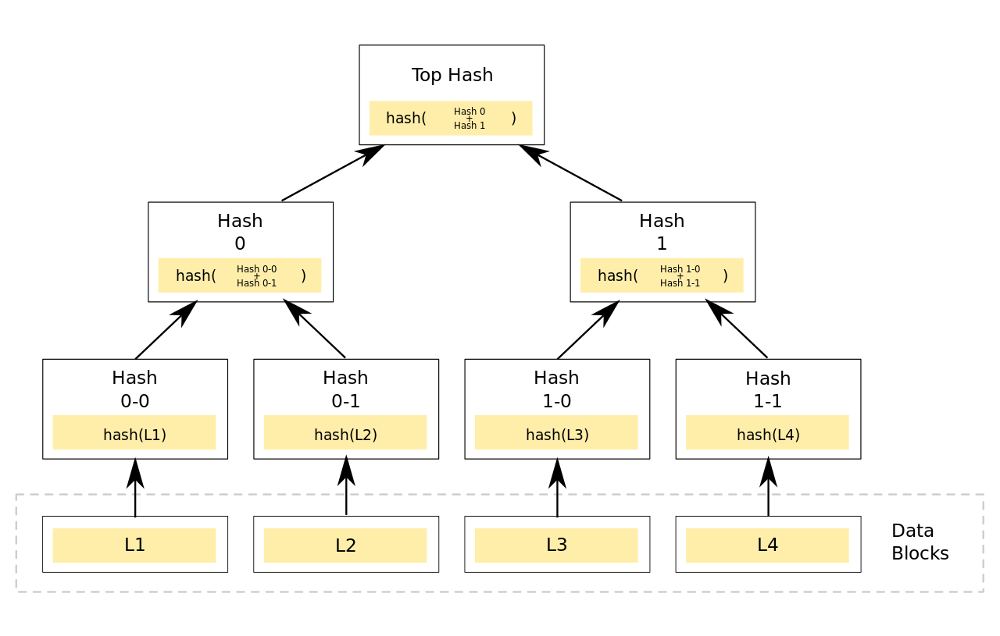

+++
title = "ZKPS-(二)"
date = "2026-04-22"
categories = ["密码学习"]

+++

# ZKPS学习-(二)

**前言**

后面这几个题目比前面要简单不少

但是好几个题目都没有体会到其中的"零知识"在哪...，还是太菜了

## Pairing-Based Cryptography

定义：

配对是一个函数 e: G1×G2 -> GT，它是双线性的，即满足：

- 对于任意整数 (a, b) 和任意群元素 (g, h)，等式 e([a]g, [b]h)= ab e(g,h) 成立
- 配对必须是非退化的，即 e(g,h)=0 当且仅当 g=0 或 h=0。注意：这里的 0 表示单位元
- 对于密码学应用，配对函数 e 必须在多项式时间内可计算

分类：

配对主要分为两类：当两个源群相同时（G1=G2）称为对称配对，当两个源群不同时称为非对称配对

进一步区分强非对称配对和弱非对称配对。强非对称配对是指在 G1 和 G2 之间难以建立同态映射；弱非对称配对则相反

- 类型 1：对称配对，其中 G1=G2
- 类型 2：弱非对称配对，存在一个可计算的、多项式时间的同态映射 ϕ:G2→G1
- 类型 3：强非对称配对，目前未知任何这样的 G1 与 G2 之间的同态映射

generate.py

```python
from py_ecc.optimized_bn128 import G1, G2, multiply, pairing
import os

FLAG = b"crypto{?????????????????}"

def gen_test(is_true):
    x = int(os.urandom(8).hex(), 16)
    y = int(os.urandom(8).hex(), 16)
    bias = 1 if is_true else int(os.urandom(2).hex(), 16)
    xG = multiply(G1, x)
    yG = multiply(G2, y)
    zG = pairing(yG, multiply(xG, bias))
    return xG, yG, zG

challenges = []

for bit in bin(int(FLAG.hex(),16))[2:]:
    xG, yG, zG = gen_test(int(bit))
    challenges.append([xG, yG, zG])

with open("output.txt", "w") as f:
    for chal in challenges:
        # Note: in your solution script, you can read each line by calling eval() on it
        f.write(str(chal))
        f.write("\n")
```

一个简单的判定问题

$G_x = xG_1,G_y=yG_2$

如果 bit=1，$G_z=e(G_y,G_x)$

如果 bit=0，$G_z=e(G_y,rG_x)$

Gx, Gy 都知道，再模拟计算一次和输出的结果比对一下即可

唯一的问题是数据类型的问题，让 ai 搞一下就好了

## Couples

Boneh–Lynn–Shacham（BLS）数字签名是一种密码协议，该方案在验证过程中使用了双线性配对

**密钥生成**

在 (0, r) 范围内随机选择一个整数 x（其中 r 为生成元的阶）

 x 作为私钥，对应的公钥为 [x]g，由椭圆曲线的生成元 g 乘以 x 得到

**签名**

要对消息 m 进行签名，签名者先做一个哈希 h=hash(m)，然后 H=hg'，最后生成签名 S=[x]H

**验证**

要验证签名S，需要检查签名与生成元 g 的双线性配对 e(S, g) 是否等于消息哈希值与公钥的配对 e(H, [x]g)。验证成功则说明签名是真实的，并且是由对应的私钥创建的

$e(H,[x]g)=hx\cdot e(g',g)$

$e(S,g) = hx\cdot e(g',g)$

```python
from py_ecc.optimized_bn128 import G1, G2, multiply, pairing, is_on_curve, b, FQ
from hashlib import sha256
import os
from utils import listener

p = 21888242871839275222246405745257275088696311157297823662689037894645226208583
FLAG = b"crypto{???????????????????????????????????????????????????}"

def poly(power, x):
    return (pow(x,power+7,p) - pow(x,3,p)) % p # (x**(power+7)-x**3) % p

def inverse(u, v):
    u3, v3 = u, v
    u1, v1 = 1, 0
    while v3 > 0:
        q = u3 // v3
        u1, v1 = v1, u1 - v1*q
        u3, v3 = v3, u3 - v3*q
    while u1<0:
        u1 = u1 + v
    return u1

def hash_to_curve(h, G):
    return multiply(G,h)

class Challenge:
    def __init__(self):
        self.before_input = "Welcome! Have fun with this strange implementation...\n"
        self.x = int(os.urandom(192//8).hex(), 16)
        self.z = 17

    def BLS(self, hsh,  G):
        h = int(sha256(FLAG).hexdigest(),16)
        H = hash_to_curve(h, G2)
        print(G)
        if not is_on_curve(G, b):
            return False
        received_H = hash_to_curve(hsh, G2)
        xH = multiply(H, self.x)
        xG = multiply(G, self.x)
        xzH = multiply(xH, self.z)
        xzG = multiply(xG, self.z)
        l = pairing(xzH, G1)
        r = pairing(received_H, xzG)
        return l == r

    def set_internal_z(self, z):
        z = inverse(poly(z, self.x), p)
        if (self.x*z) % p == 1:
            raise Exception("Wtf?")
        self.z = z

    def challenge(self, your_input):
        if not "option" in your_input:
            return {"error": "You must send an option to this server"}

        if your_input["option"] == "set_internal_z":
            try:
                new_z = int(your_input["z"],16)
                if not 0 < new_z < p:
                    return {"error": "this is a mandatory: 0 < z < p"}
                self.set_internal_z(new_z)
            except Exception as e:
                return {"error": str(e)}
            return {"msg": "Internal z changed!"}

        elif your_input["option"] == "do_proof":
            try:
                G = your_input["G"].replace("(","").replace(")","").strip().split(",")
                G = (FQ(int(G[0])), FQ(int(G[1])), FQ(int(G[2])))
                hsh =  int(your_input["hsh"], 16)
                if self.BLS(hsh, G):
                    return {"msg":FLAG.decode()}
                else:
                    return {"msg": "you failed!"}
            except Exception as e:
                import traceback
                print(traceback.format_exc())
                return {"error": str(e)}
        else:
            return {"error": "Invalid option"}


import builtins; builtins.Challenge = Challenge # hack to enable challenge to be run locally, see https://cryptohack.org/faq/#listener
listener.start_server(port=13415)
```

$h',G'$ 为自己输入，进行如下计算

$h=Hash(flag),H = hG_2$

$H' = h'G_2$

$H_x=xH=xhG_2$

$G_x=xG'$

$H_{xz} = zH_x=xzhG_2$

$G_{xz} = zG_x = xzG'$

然后判断 l 是否等于 r

$l = e(H_{xz},G_1)=xzh\cdot e(G_2,G_1)$

$r = e(H',G_{xz}) = xzh' \cdot e(G_2,G')$

正常来说，想要相等就需要 G‘=G1 且 h'=h，但显然无法得知 h

注意到 set_internal_z 的操作中，用了自己实现的 inverse 函数，而这个函数处理 0 的逆元时会返回 0

只需要传入 z=p-5，那么 $(x^{z+7}-x^3) \equiv 0 \pmod p$，最后就将 z 设置为了0，那么显然这时候 l==r 成立

## [HASH] Merkle Trees

Merkle tree (默克尔树)，是一种二叉树

**每个结点存放的都是哈希值**，其叶子结点存放原始数据块的哈希值；对于非叶子结点，其内容为将其左右孩子结点内的哈希值拼接后得到的哈希值

如图所示，直观的表示



```python
from hashlib import sha256
import os

FLAG = b"crypto{??????????????????????????????}"

def hash256(data):
    return sha256(data).digest()

def merge_nodes(a, b):
    return hash256(a+b)

def gen_test(is_true):
    a = hash256(os.urandom(8))
    b = hash256(os.urandom(8))
    c = hash256(os.urandom(8))
    d = hash256(os.urandom(8))
    bias = b"" if is_true else os.urandom(8)
    left = merge_nodes(a, b+bias)
    right = merge_nodes(c, d)
    root = merge_nodes(left, right)
    return a.hex(), b.hex(), c.hex(), d.hex(), root.hex()

challenges = []

for bit in bin(int(FLAG.hex(),16))[2:]:
    a, b, c, d, root = gen_test(int(bit))
    challenges.append([a, b, c, d, root])

with open("output.txt", "w") as f:
    for chal in challenges:
        # Note: in your solution script, you can read each line by calling eval() on it
        f.write(str(chal))
        f.write("\n")
```

同样是一个简单的判定问题

如果 bit=1，left=a+b，right=c+d

如果 bit=0，left=a+b+r，right=c+d

a, b, c, d 都知道，再模拟计算一次和输出的结果比对一下即可

## Mister Saplin's Preview

You should complete the "Merkle Trees" challenge in the "Hashes" category before playing this challenge!

完成了前置挑战，可以看看这个题是在干什么了

```python
from hashlib import sha256
from threading import Thread
import os
from utils import listener

FLAG = b"crypto{??????????????????????????????????????????????????????????????????}"

def hash256(data):
    return sha256(data).digest()

def merge_nodes(a, b):
    return hash256(a+b)

class Challenge:
    def __init__(self):
        self.before_input = "Welcome to the saplins previews system implementation!\n"
        self.datas = os.urandom(64)
        self.balance = 99
        self.nodes = []
        self.build_saplin()
        self.balance_validated = False
        self.layer_price = {0:20, 1:50, 2:110}

    def build_saplin(self):
        self.nodes.append([hash256(self.datas[i:i+8]) for i in range(0,64,8)])
        self.nodes.append([merge_nodes(*self.nodes[0][i:i+2]) for i in range(0,8,2)])
        self.nodes.append([merge_nodes(*self.nodes[1][i:i+2]) for i in range(0,4,2)])
        self.nodes.append([merge_nodes(*self.nodes[2][0:2])])

    def request_checker(self, wanted_nodes):
        # just checking if the balance has enough credits
        credits_needed = 0
        for layer in wanted_nodes.keys():
            for _ in range(wanted_nodes[layer]):
                credits_needed += self.layer_price[layer]

        if credits_needed > self.balance:
            self.balance_validated = False
        else:
            self.balance_validated = True
            self.balance -= credits_needed

    def balance_check(self, wanted_nodes):
        layers = wanted_nodes.keys()
        # dealing with trivials cases
        for layer in layers:
            if layer >= 3 or layer < 0:
                self.balance_validated = False
                return
        if 2 in layers and wanted_nodes[2] >= 1:
            # too high node even with the starting balance
            self.balance_validated = False
            return
        # dealing with common cases
        t = Thread(target=self.request_checker, args=[wanted_nodes])
        t.start()

    def saplin_proof(self, user_input):
        return user_input == self.nodes[-1][0]

    def challenge(self, your_input):
        if not "option" in your_input:
            return {"error": "You must send an option to this server"}

        if your_input["option"] == "get_nodes":
            self.balance_validated = None
            try:
                raw_wanted_nodes = your_input["nodes"].split(";")
                wanted_nodes = {int(layer.split(",")[0]): int(layer.split(",")[1]) for layer in raw_wanted_nodes}
                self.balance_check(wanted_nodes)
                if self.balance_validated != False:
                    nodes = []
                    for layer in wanted_nodes:
                        nodes.append(list(map(bytes.hex, self.nodes[layer][:wanted_nodes[layer]])))
                    return {"msg": str(nodes)}
                else:
                    return {"error": "You don't have enough credits!"}
            except Exception as e:
                return {"error": str(e)}

        elif your_input["option"] == "do_proof":
            try:
                hsh =  bytes.fromhex(your_input["root"])
                if self.saplin_proof(hsh):
                    return {"msg": FLAG.decode()}
                else:
                    return {"msg": "you failed!"}
            except Exception as e:
                return {"error": str(e)}
        else:
            return {"error": "Invalid option"}
```

构造了一个有8个叶子的 Merkle tree；nodes 形如 [[ (8个) ], [ (4个) ], [ (2个) ], [ (1个) ]]，对应的层数为0, 1, 2, 3；即第0层代表叶子层，第3层为根结点

余额为99，一个第0层结点花费20，一个第1层结点花费50，一个第2层结点花费110

最多只能买4个0层结点或2个1层结点，显然是不够恢复根节点的

那么问题出在那里了呢？检查余额是否够用的时候用的代码是

```python
t = Thread(target=self.request_checker, args=[wanted_nodes])
t.start()
```

这里创建了一个新的子进程 t，然后 `t.start()`，但是这并不会让父进程等待子进程，这时候如果传入一个大的参数，子进程还未算完，self.balance_validated = None 仍成立，而 None != False 为 true，故就可直接获取到所有结点，后续就很容易恢复 root 结点了

```bash
Welcome to the saplins previews system implementation!
{"option":"get_nodes","nodes":"1,1000000000"}
{"msg": "[['db617a15b1a1fd01ed01a05c8851416ea2987c4b36e498b186f9afb0aa4ceb20', 'd981b652a5b591d5c705780555ffa5e54db29bb073fa87e99b63aee0665f36ae', 'cbcbbf97d84d4f1af86c2f57056105a21aea067a3f3b63b55c82f5be220ef9b6', '4f3fba440f57ee533107e0ab0add41777c3a0f6b3121317601510574a704c180']]"}
```

> 正确实现应该是：
>
> t = Thread(...)
>
> t.start()
>
> t.join()
>
> t.join() 的作用是强制等待子线程结束后，主线程再继续进行

## Mister Saplins The Prover

```python
from hashlib import sha256
import os
from utils import listener

FLAG = b"crypto{???????????????????????????????????????}"
flen = len(FLAG)
assert flen == 47

def hash256(data):
    return sha256(data).digest()

def merge_nodes(a, b):
    return hash256(a+b)

class Challenge:
    def __init__(self):
        self.before_input = "Welcome to the saplins implementation\n"
        self.secret = os.urandom(64-flen)
        self.datas = self.secret + FLAG
        self.nodes = []
        self.build_saplin()
        self.preview_used = False

    def build_saplin(self):
        self.nodes.append([hash256(self.datas[i:i+8]) for i in range(0,64,8)])
        self.nodes.append([merge_nodes(*self.nodes[0][i:i+2]) for i in range(0,8,2)])
        self.nodes.append([merge_nodes(*self.nodes[1][i:i+2]) for i in range(0,4,2)])
        self.nodes.append([merge_nodes(*self.nodes[2][0:2])])
        for i in range(3):
            following_node = self.nodes[i+1][0]
            self.nodes[i].append(following_node)

    def saplin_proof(self, user_input):
        return user_input == self.nodes[-1][0]

    def challenge(self, your_input):
        if not "option" in your_input:
            return {"error": "You must send an option to this server"}

        if your_input["option"] == "get_node":
            self.balance_validated = None
            try:
                wanted_node = int(your_input["node"])
                if not self.preview_used and wanted_node < len(self.nodes[0])-1: 
                    node = self.nodes[0][wanted_node].hex()
                    self.preview_used = True
                    return {"msg": node}
                else:
                    return {"error": "You can't preview this!"}
            except Exception as e:
                return {"error": str(e)}
            
        elif your_input["option"] == "do_proof":
            try:
                hsh =  bytes.fromhex(your_input["root"])
                if self.saplin_proof(hsh):
                    return {"msg":f"{FLAG}"}
                else:
                    return {"msg": "you failed!"}
            except Exception as e:
                return {"error": str(e)}
        else:
            return {"error": "Invalid option"}
```

同样是8个叶子结点，不一样的地方是叶子结点的内容不再是全部随机的字节，现在是17个随机bytes+47bytes的flag；并且 nodes[0], nodes[1], nodes[2] 添加了对应的下一层的第一个结点

正常情况下是只能获取 nodes[0] 的 0-7 中的某**一个**结点，但是没有检查输入为负数的情况，故可以输入-1，得到的正好是 nodes[0] 的前两个结点合并的结果

第三个结点是1个随机byte+b'crypto{'，后面5个结点是固定的

刚刚好，先连5次拿到后五个结点，然后拿到-1索引，最后爆破一字节即可

## Let's Prove It

```python
from Crypto.Util.number import bytes_to_long, long_to_bytes, isPrime
import hashlib
import random
import os
import string
from utils import listener

def add_random_nonprintable(byte_str):
    index = random.randint(0, len(byte_str))
    non_printable_byte = random.randint(0, 255)
    while chr(non_printable_byte) in string.printable:
        non_printable_byte = random.randint(0, 255)
    return byte_str[:index] + bytes([non_printable_byte]) + byte_str[index:]

def xor(a, b):
     assert len(a) == len(b)
     return bytes(x ^ y for x, y in zip(a, b))

def xor_nonce(byte_str, nonce):
    start = byte_str[:7]
    end = byte_str[-1:]
    middle = byte_str[7:-1]
    return start + xor(middle, nonce) + bytes(end)

FLAG = b"crypto{??????????????????????????????}"
BITS = 2 << 9
g = 2
max_turns = 12

assert len(FLAG) == 38

class Challenge:
    def __init__(self):
        global FLAG
        self.nonce = os.urandom(31)
        self.refresh()
        self.before_input = f"This server is made to share proofs...\nThat is the nonce for this instance: {self.nonce.hex()}\n"
        self.your_turn = 1
        self.turn = 0
        self.FLAG = bytes_to_long(xor_nonce(add_random_nonprintable(FLAG), self.nonce))

    def getPrime(self, N):
        while True:
            number = self.R.getrandbits(N) | 1
            if isPrime(number, randfunc=lambda x: long_to_bytes(self.R.getrandbits(x))):
                break
        return number

    def refresh(self, seed=None):
        self.seed = os.urandom(8) if seed == None else seed
        self.R = random.Random(self.nonce + self.seed)

    def fiatShamir(self):
        p = self.getPrime(BITS)
        y = pow(g, self.FLAG, p)
        self.refresh()
        self.v = self.R.getrandbits(BITS >> 1)
        t = pow(g, self.v, p)
        c = bytes_to_long(hashlib.sha3_256(long_to_bytes(t ^ y ^ g)).digest()) ** 2
        r = (self.v - c * self.FLAG) % (p - 1)
        assert t == (pow(g, r, p) * pow(y, c, p)) % p # the proof
        return (t, r), (g, y)

    def challenge(self, your_input):
        if self.turn >= max_turns:
            return {"error": "You can leave this instance, we've enough spoke"}

        if not "option" in your_input:
            return {"error": "You must send an option to this server"}

        if your_input["option"] == "refresh" and self.your_turn < 2:
            return {
                "error": "It's the server's turn! It's a conversation between you and the server, not a monologue :p"
            }

        elif your_input["option"] == "get_proof":
            (t, r), (g, y) = self.fiatShamir()
            self.your_turn += 1
            self.turn += 1
            return {"t": t, "r": r, "g": g, "y": y}

        elif your_input["option"] == "refresh" and self.your_turn >= 2:
            if not "seed" in your_input:
                return {"error": "You need to send a seed"}
            try:
                seed = bytes.fromhex(your_input["seed"])
            except ValueError:
                return {"error": "seed must be an hexadecimal value"}
            self.your_turn = 0
            self.refresh(seed)
            return {"msg": "seed refreshed succesfully!"}
        else:
            return {"error": "Invalid option"}
```

题目背景是 fiatShamir 变换后的 DLP 版本的 ZKP

$y \equiv g^{flag} \pmod p$ 

```
→ t

← c (fs 变换，hash 替代)

→ r
```

一些具体细节

$t \equiv g^v \pmod p$

$c = [hash(t \oplus y \oplus g)]^2$

$r \equiv v-c\cdot flag \pmod {p-1}$

验证的是 $t \equiv g^r y^c \pmod p$  因为 $g^ry^c \equiv g^{v-c\cdot flag}g^{flag\cdot c} \equiv g^v \pmod p$

---

好了，下面该想想怎么做了；有2种操作，一种是得到一组证明记录，另一种是重置 random 的 seed

先获取一组证明，然后重置种子，这时种子就是已知的了，可以求出 p，然后再获取一组证明

p 是 1024bit 的，容易注意到 v 是 512bit，flag 是 300bit 左右，c 是 512bit，那就有问题了

$r \equiv v-c\cdot flag \pmod {p-1}$，实则就是 $r = v - c \cdot flag + p-1$

而这个时候只需要两边除一个 c， $flag = \frac{v - r + p-1}{c} \approx \frac{ - r + p-1}{c}$，不需要 v 也能把 flag 求出来

最后还有一步，题目给 flag 插入了一个字节，然后用 nonce 对 flag 做了一个异或加密；不过由于 nonce 已知，很容易就恢复了

这样得到的结果大概最低两字节有偏差，不过挺好猜出来的

翻了一下题解，预期是打 HNP，~~一开始我也是这么想的...~~
$$
(k_1,k_2,...,k_n,w,1) \begin{pmatrix}
p-1 & & & & & \\
& p-1 & & & & \\
& & \ddots&  & & \\
& & &p-1  &  & \\
c_1&c_2 & \cdots &c_n &1  &\\
r_1&r_2 & \cdots & r_n& & K\\
\end{pmatrix} = (v_1,v_2,..,v_n,w,K)
$$

## Let's Prove It Again

```python
from Crypto.Util.number import bytes_to_long, long_to_bytes, isPrime
import hashlib
import random
import os
import string
from utils import listener

def add_random_nonprintable(byte_str):
    index = random.randint(0, len(byte_str))
    non_printable_byte = random.randint(0, 255)
    while chr(non_printable_byte) in string.printable:
        non_printable_byte = random.randint(0, 255)
    return byte_str[:index] + bytes([non_printable_byte]) + byte_str[index:]

def xor(a, b):
     assert len(a) == len(b)
     return bytes(x ^ y for x, y in zip(a, b))

def xor_nonce(byte_str, nonce):
    start = byte_str[:7]
    end = byte_str[-1:]
    middle = byte_str[7:-1]
    return start + xor(middle, nonce) + bytes(end)

FLAG = b"crypto{??????????????????????????????}"
BITS = 2 << 9
g = 2
max_turns = 4

assert len(FLAG) == 38

class Challenge:
    def __init__(self):
        global FLAG
        self.nonce = os.urandom(31)
        self.refresh()
        self.before_input = f"This server is made to share proofs...\nThat is the nonce for this instance: {self.nonce.hex()}\n"
        self.your_turn = 1
        self.v = self.R.getrandbits(BITS >> 1)
        self.turn = 0
        self.FLAG = bytes_to_long(xor_nonce(add_random_nonprintable(FLAG), self.nonce))

    def getPrime(self, N):
        while True:
            number = self.R.getrandbits(N) | 1
            if isPrime(number, randfunc=lambda x: long_to_bytes(self.R.getrandbits(x))):
                break
        return number

    def refresh(self, seed=None):
        self.seed = os.urandom(8) if seed == None else seed
        self.R = random.Random(self.nonce + self.seed)

    def fiatShamir(self):
        p = self.getPrime(BITS)
        y = pow(g, self.FLAG, p)
        self.refresh()
        t = pow(g, self.v, p)
        c = bytes_to_long(hashlib.sha3_256(long_to_bytes(t ^ y ^ g ^ self.R.randint(2, BITS))).digest())
        r = (self.v - c * self.FLAG) % (p - 1)
        assert t == (pow(g, r, p) * pow(y, c, p)) % p  # the proof
        return (t, r), (g, y)

    def challenge(self, your_input):
        if self.turn >= max_turns:
            return {"error": "You can leave this instance, we've enough spoke"}

        if not "option" in your_input:
            return {"error": "You must send an option to this server"}

        if your_input["option"] == "refresh" and self.your_turn < 2:
            return {
                "error": "It's the server's turn! It's a conversation between you and the server, not a monologue :p"
            }

        elif your_input["option"] == "get_proof":
            (t, r), (g, y) = self.fiatShamir()
            self.your_turn += 1
            self.turn += 1
            return {"t": t, "r": r, "g": g, "y": y}

        elif your_input["option"] == "refresh" and self.your_turn >= 2:
            if not "seed" in your_input:
                return {"error": "You need to send a seed"}
            try:
                seed = bytes.fromhex(your_input["seed"])
            except ValueError:
                return {"error": "seed must be an hexadecimal value"}
            self.your_turn = 0
            self.refresh(seed)
            return {"msg": "seed refreshed succesfully!"}
        else:
            return {"error": "Invalid option"}
```

现在的 c 是 256bit，直接除现在误差太大不可行；且变成了未知的，但是可爆破，有大概 1024 种情况，恢复出正确的 c

现在最多只能查询四轮，而且如果我们为了让 p 可控重置种子，那么会消耗掉2次查询，最后只能得到2组有用数据，而只用1组/2组的数据我试了试，HNP 出不来

关键在于这次的 v 是固定不变的

$r_1 = v - c_1 \cdot flag + p_1-1$ 

$r_2 = v - c_2 \cdot flag + p_2-1$ 

交互流程，两次 refresh 传入不同 seed 就可得到两组不同的记录

```
get
refresh
get -> p1
get
refresh
get -> p2
```

$r_1-r_2 = (c_2-c_1)\cdot flag + p_1 - p_2$ 即可求出 flag

补充：实际上设置一样的 seed 取两组一样的 p 也可以，此时的 p, y, t 一样，但是 c, r 不一样

