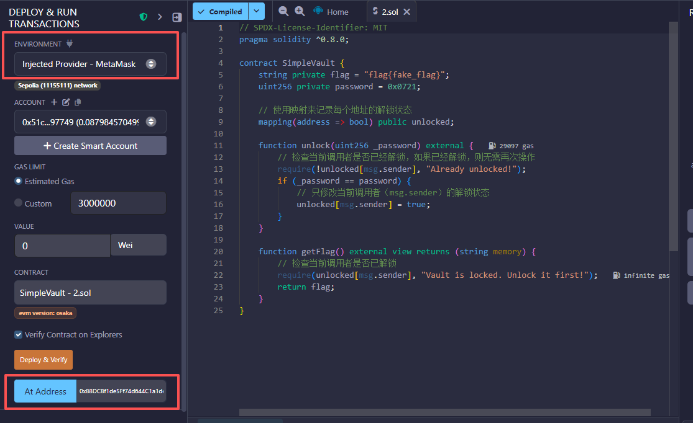
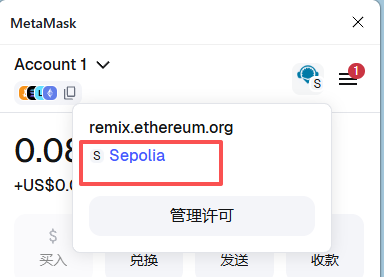
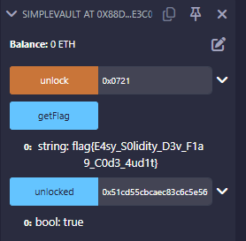
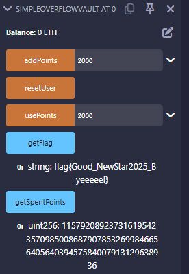

+++
title = "Blockchain入门-(一)"
date = "2026-03-05"
categories = ["区块链学习"]

+++
# Blockchain入门-(一)

**前言**

之前就想学点别的东西，但又不知道学什么好，感觉区块链可能比较好玩，就看一看

本文主要了解一些基础概念以及 remix 和 metamask 的基本使用


## 基础概念阐述

**注：这部分内容大多摘抄自 [CTF Wiki](https://ctf-wiki.org/blockchain/introduction/)**

### 一些名词英汉互译

Ethereum：以太坊

Ether：以太币（简称 ETH）

Solidity：用于编写智能合约的高级语言

Smart Contract：智能合约

### Solidity

Solidity 是一种用于编写智能合约的高级语言，语法类似于 JavaScript。在以太坊平台上，Solidity 编写的智能合约可以被编译成字节码在以太坊虚拟机 EVM 上运行

### Remix

基于浏览器的 Solidity 编译器和集成开发环境，提供了交互式界面，以及编译、调用测试、发布等一系列功能，使用方便  [http://remix.ethereum.org/](http://remix.ethereum.org/#optimize=false&runs=200&evmVersion=null)

### MetaMask

一个外部账户通常由私钥文件控制，拥有私钥的用户就可以拥有对应地址的账户里的 Ether 使用权。我们通常把管理这些数字密钥的软件称为**钱包**，而我们所说的备份钱包其实就是备份账户的私钥文件

metamask是非常好用也是用的最多的以太坊钱包，头像是**小狐狸**标识，Chrome 提供了其插件，其不仅可以管理外部账户，而且可以便捷切换测试链网络，并且可以自定义 RPC 网络

### RPC

RPC（Remote Procedure Call）远程过程调用是一种协议，允许应用程序向**其他计算机**上的程序请求服务，即一个程序（客户端）与另一个程序（服务器）进行通信并执行代码。当客户端发出 RPC 调用时，请求通过网络传送到 RPC 服务器，服务器处理请求并返回响应

在区块链中，它提供了一个标准化的窗口，让外部应用程序能够：读取区块链数据（查询余额、交易详情、区块信息、智能合约状态等）；向区块链写入数据（发送交易、部署或调用智能合约）；获取网络状态等

### 账户

在以太坊中，一个重要的概念就是账户（Account），分为两种类型，分别是外部账户和合约账户

- 外部账户

外部账户是由人创建的，可以存储以太币，是由公钥和私钥控制的账户。每个外部账户拥有一对公私钥，这对密钥用于签署交易，它的地址由公钥决定。外部账户不能包含以太坊虚拟机代码

一个外部账户具有以下特性

拥有一定的 Ether

可以发送交易、通过私钥控制

没有相关联的代码

- 合约账户

合约账户是由外部账户创建的账户，包含合约代码 (合约账户和外部账户最大的不同就是它还存有智能合约)。合约账户的地址是由合约创建时合约**创建者的地址**，以及该地址发出的**交易**共同计算得出的。

一个合约账户具有以下特性

拥有一定的 Ether

有相关联的代码，代码通过交易或者其他合约发送的调用来激活

当合约被执行时，只能操作合约账户拥有的特定存储

---

一个以太坊的账户包含 4 个部分：

- nonce: 已执行交易总数，用来标示该账户发出的交易数量
- balance: 账持币数量，记录账户的以太币余额
- storageRoot: 存储区的哈希值，指向智能合约账户的存储数据区
- codeHash: 代码区的哈希值，指向智能合约账户存储的智能合约代码

### 交易

交易（Transaction）是以太坊整体结构中的重要部分，它将以太坊的账户连接起来，起到价值的传递作用。以太坊的交易主要是指一条外部账户发送到区块链上另一账户的消息的签名数据包，其主要包含发送者的签名、接收者的地址以及发送者转移给接收者的以太币数量等内容

以太坊上的每一笔交易都需要支付一定的费用，用于支付交易执行所需要的计算开销。计算开销的费用并不是以太币直接计算的，而是引入 Gas 作为执行开销的基本单位，通过 GasPrice 与以太币进行换算

**交易费用**

- Gas: 衡量一笔交易所消耗的计算资源的基本单位
- Gas Price: 一单位 Gas 所需的手续费（Ether）
- Gas Limit: 交易发送者愿意为这笔交易执行所支付的最大 Gas 数量

**交易内容**

以太坊中的交易是指存储一条从外部账户发送到区块链上另一个账户的消息的签名数据包，它既可以是简单的转账，也可以是包含智能合约代码的消息。一条交易包含以下内容：

- from: 交易发送者的地址，必填
- to: 交易接收者的地址，如果为空则意味这是一个创建智能合约的交易
- value: 发送者要转移给接收者的以太币数量
- data: 存在的数据字段，如果存在，则表明该交易是一个创建或者调用智能合约的交易
- Gas Limit: 表示交易允许消耗的最大 Gas 数量
- GasPrice: 发送者愿意支付给矿工的 Gas 单价
- nonce: 用来区别同一账户发出的不同交易的标记
- hash: 由以上信息生成的散列值（哈希值）
- r、s、v: 交易签名的三个部分，由发送者的私钥对交易 hash 进行签名生成

---

在不同场景下，交易有三种类型

- 转帐交易

转账是最简单的一种交易，从一个账户向另一个账户发送 Ether，发送转账交易时只需要指定交易的发送者、接收者、转移的 Ether 数量即可（在客户端发送交易时，Gas Limit、Gas Price、nonce、hash、签名可以按照默认方式生成），如下所示

```text
web3.eth.sendTransaction({
    from: "0x88D3052D12527F1FbE3a6E1444EA72c4DdB396c2",
    to: "0x75e65F3C1BB334ab927168Bd49F5C44fbB4D480f",
    value: 1000
})
```

- 创建合约的交易

创建合约是指将合约部署到区块链上，这也是通过交易来完成的。创建合约时，to 字段是一个空字符串，data 字段是合约编译后的二进制代码，在之后合约被调用时，该代码的执行结果将作为合约代码，如下所示

```text
web3.eth.sendTransaction({
    from: "0x88D3052D12527F1FbE3a6E1444EA72c4DdB396c2",
    data: "contract binary code"
})
```

- 执行合约的交易

该交易中，to 字段是要调用的智能合约的地址，通过 data 字段指定要调用的方法以及向该方法传入参数，如下所示

```text
web3.eth.sendTransaction({
    from: "0x88D3052D12527F1FbE3a6E1444EA72c4DdB396c2",
    to: "0x75e65F3C1BB334ab927168Bd49F5C44fbB4D480f",
    data: "hash of the invoked method signature and encoded parameters"
})
```


## 入门例题

取自 NewStar CTF 2025 的三道 misc

### [T1] 区块链：以太坊的约定

有四个小问题

1、注册小狐狸钱包，并提交小狐狸钱包助记词个数

用浏览器插件可以注册，助记词个数为12

2、1145141919810 Gwei 等于多少 ETH（只保留整数）

进制转换工具 https://eth-converter.com/ 得到 1145 ETH

3、查询账号 `0x949F8fc083006CC5fb51Da693a57D63eEc90C675` 第一次交易记录的日期，形式如 `20230820`

使用区块链浏览器 https://sepolia.etherscan.io/ 查看地址第一次交易

- Etherscan 是 Ethereum 主网最知名的区块链浏览器

- Sepolia 是一个广泛使用的以太坊测试网络，开发者会在这里部署和测试智能合约，使用的ETH测试币没有实际价值

在 https://sepolia.etherscan.io/ 中可以查看和搜索在 Sepolia 测试网上发生的所有交易、区块、地址、智能合约等信息

在主页搜索地址，找一找即可找到 20240614

4、使用 remix 编译运行附件中的合约，将输出进行提交

在 remix 网站中编译运行文件，左侧边栏 Deploy & run transactions 中 Deployed Contracts 点击 getResult 可以得到结果 solidity

### [T2] 区块链：智能合约

题目描述中告诉合约地址：`0x88DC8f1de5Ff74d644C1a1defDc54869E5Ce3c08`

给了一个.sol文件，内容如下

```solidity
// SPDX-License-Identifier: MIT
pragma solidity ^0.8.0;

contract SimpleVault {
    string private flag = "flag{fake_flag}";
    uint256 private password = 0x0721;

    // 使用映射来记录每个地址的解锁状态
    mapping(address => bool) public unlocked;

    function unlock(uint256 _password) external {
        // 检查当前调用者是否已经解锁，如果已经解锁，则无需再次操作
        require(!unlocked[msg.sender], "Already unlocked!");
        if (_password == password) {
            // 只修改当前调用者（msg.sender）的解锁状态
            unlocked[msg.sender] = true;
        }
    }

    function getFlag() external view returns (string memory) {
        // 检查当前调用者是否已解锁
        require(unlocked[msg.sender], "Vault is locked. Unlock it first!");
        return flag;
    }
}
```

语法不太懂，但是逻辑比较简单。先编译，切换环境为 Injected Provider - MetaMask (直接在 Remix 的默认环境（Remix VM）相当于在本地测试)，然后把合约地址填入，点at address



在 metamask 中把网络切到 Sepolia 测试网



然后去题目给的 Sepolia 测试链水龙头地址：https://sepolia-faucet.pk910.de/ 搞点币

在unlocked里填上自己的地址，unlock里填密码，然后点击，会发起一笔交易，在 metamask 插件里同意，然后等一会即可，unlocked 状态变为 true，点击 getflag 即可



### [T3] 区块链：INTbug

同样是一个.sol附件和一个合约地址 0xB6748b3B308b382E28438cc72872e2D70369D90b

```solidity
// SPDX-License-Identifier: MIT
pragma solidity ^0.8.0;

contract SimpleOverflowVault {
    string private flag = "flag{fake_fake_fake}";
    
    mapping(address => bool) public unlocked;
    mapping(address => uint256) public userPoints;
    uint256 public totalPoints;
    mapping(address => uint256) private userSpentPoints;
    
    event PointsAdded(address indexed user, uint256 points);
    event PointsUsed(address indexed user, uint256 points);
    
    constructor() {
        totalPoints = 0;
        userSpentPoints[msg.sender] = 1000;
    }
    
    function addPoints(uint256 points) external {
        require(points > 0, "Points must be greater than 0");
        
        if (userSpentPoints[msg.sender] == 0) {
            userSpentPoints[msg.sender] = 1000;
        }
        
        userPoints[msg.sender] += points;
        totalPoints += points;
        
        emit PointsAdded(msg.sender, points);
    }
    
    function usePoints(uint256 points) external {
        require(points > 0, "Points must be greater than 0");
        require(userPoints[msg.sender] >= points, "Insufficient points");
        
        if (userSpentPoints[msg.sender] == 0) {
            userSpentPoints[msg.sender] = 1000;
        }
        
        userPoints[msg.sender] -= points;
        
        unchecked {
            totalPoints -= points;
            userSpentPoints[msg.sender] -= points;
        }
        
        if (userSpentPoints[msg.sender] > 1000) {
            unlocked[msg.sender] = true;
        }
        
        emit PointsUsed(msg.sender, points);
    }
    
    function getFlag() external view returns (string memory) {
        require(unlocked[msg.sender], "Vault is locked. Trigger integer underflow first!");
        return flag;
    }
    
    function getSpentPoints() external view returns (uint256) {
        return userSpentPoints[msg.sender] == 0 ? 1000 : userSpentPoints[msg.sender];
    }
    
    function resetUser() external {
        uint256 userCurrentPoints = userPoints[msg.sender];
        
        if (userCurrentPoints > 0) {
            unchecked {
                totalPoints -= userCurrentPoints;
            }
            userPoints[msg.sender] = 0;
        }
        
        userSpentPoints[msg.sender] = 1000;
        unlocked[msg.sender] = false;
    }
}
```

漏洞点在于，无符号整数，如是负数，实际上是一个很大的数

```solidity
        unchecked {
            totalPoints -= points;
            userSpentPoints[msg.sender] -= points;
        }
```

先调用 addPoints 获取一个比1000大的值，如2000，然后调用 usePoints，使用2000点数

这时 userSpentPoints[msg.sender] = 1000，减去2000发生下溢，满足 userSpentPoints[msg.sender] > 1000 条件，可以获取flag



## 参考

1. [Blockchain Security Overview - CTF Wiki](https://ctf-wiki.org/blockchain/introduction/)