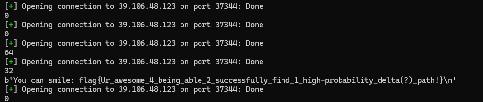

+++
title = "NewStar CTF 2025 Crypto WP"
date = "2025-11-04"
description = "NewStar CTF 2025 Crypto 方向题目解析"
categories = ["WP"]
tags = ["Crypto"]
image="fengmian.jpg"
+++


**写在前面的一些话**<br >
继moectf之后打的第二场ctf比赛，前两周主要做了cry和逆向，后面就只做了cry了，其他方向都做不动了...<br >
这次的crypto一共24道题，大部分难度适中，~~没有特别繁琐的分组密码题目~~，相比moe，难度相差不大，或者说稍微难一点，考的东西涉及的更广，另外重要的一点就是不只有附件题，还有远程题目，趣味性相较moe确实更高，总之还是挺好玩的<br >


## Week 1

### 唯一表示
这道题是一个中国剩余定理的应用，由若干连续的素数恢复n，而题目中remainders给了，就是c<br >
由c的长度等于used_primes的长度，可以恢复出used_primes，那么就能用中国剩余定理求出n，即message_int<br >

exp
```python
from sympy.ntheory.modular import crt
from Crypto.Util.number import long_to_bytes
from gmpy2 import next_prime

c = [
    1, 2, 2, 4, 0, 2, 11, 11, 8, 23, 1, 30, 35, 0, 18, 30, 55, 60, 29, 42, 8,
    13, 49, 11, 69, 26, 8, 73, 84, 67, 100, 9, 77, 72, 127, 49, 57, 74, 70,
    129, 146, 45, 35, 180, 196, 101, 100, 146, 100, 194, 2, 161, 35, 155
]
l = len(c)
primes = [2]
for i in range(l - 1):
    p = int(next_prime(primes[-1]))
    primes.append(p)
reconstructed, _ = crt(primes, c)
print(long_to_bytes(reconstructed))
# flag{9c8589c2-aecb-4ec4-b027-654bc322e2d1}
```
### 小跳蛙
阅读题目源代码后，很容易就能理解在干什么，就是对一个数对(a,b)一直做运算，直到a=b<br >
可以写出一个简单的脚本，调用五次即可拿到flag<br >
flag{Go0d_j0b_t0_Cl34r_thi5_Diff3r3nt_t45k_4_u}<br >
```python
def solve(x, y):
    while x != y:
        if x > y:
            x = x - y
        if x < y:
            y = y - x
    return x, y
print(solve(83934, 76854))
```
### 初识RSA
首先，给了key的md5值`KEY = b'5ae9b7f211e23aac3df5f2b8f3b8eada'`，找一个在线网站解密md5，可以得到`key = b'crypto'`<br >
然后，由P和key算出p，那么就可以分解n了，注意phi(n)的计算公式即可<br >

exp
```python
from Crypto.Util.number import *
import gmpy2

P = 8950704257708450266553505566662195919814660677796969745141332884563215887576312397012443714881729945084204600427983533462340628158820681332200645787691506
n = 44446616188218819786207128669544260200786245231084315865332960254466674511396013452706960167237712984131574242297631824608996400521594802041774252109118569706894250996931000927100268277762882754652796291883967540656284636140320080424646971672065901724016868601110447608443973020392152580956168514740954659431174557221037876268055284535861917524270777789465109449562493757855709667594266126482042307573551713967456278514060120085808631486752297737122542989222157016105822237703651230721732928806660755347805734140734412060262304703945060273095463889784812104712104670060859740991896998661852639384506489736605859678660859641869193937584995837021541846286340552602342167842171089327681673432201518271389316638905030292484631032669474635442148203414558029464840768382970333
c = 42481263623445394280231262620086584153533063717448365833463226221868120488285951050193025217363839722803025158955005926008972866584222969940058732766011030882489151801438753030989861560817833544742490630377584951708209970467576914455924941590147893518967800282895563353672016111485919944929116082425633214088603366618022110688943219824625736102047862782981661923567377952054731667935736545461204871636455479900964960932386422126739648242748169170002728992333044486415920542098358305720024908051943748019208098026882781236570466259348897847759538822450491169806820787193008018522291685488876743242619977085369161240842263956004215038707275256809199564441801377497312252051117441861760886176100719291068180295195677144938101948329274751595514805340601788344134469750781845
e = 65537

key = b'crypto' # 在线网站解密得到
p = P ^ (bytes_to_long(key))
q = gmpy2.isqrt(n // pow(p, 3))
phi = p * p * (p - 1) * q * (q - 1)
d = pow(e, -1, phi)
m = pow(c, d, n)
print(long_to_bytes(m))
# flag{W3lc0me_t0_4h3_w0rl4_0f_Cryptoooo!}
```
### 随机数之旅1
这道题是一个线性同余生成器，关系式为`hint[i+1] = (a * hint[i] + message_int) mod p`<br >
其中，a，p，hint序列都已知，我们只需要利用前两个hint值就能求出明文，注意到 message_int < p<br >
`hint[1] = (a * hint[0] + message_int) mod p`<br >
`hint[1] - a * hint[0] = message_int mod p`

exp
```python
from Crypto.Util.number import long_to_bytes

a = 295789025762601408173828135835543120874436321839537374211067344874253837225114998888279895650663245853
p = 516429062949786265253932153679325182722096129240841519231893318711291039781759818315309383807387756431
hint = [
    184903644789477348923205958932800932778350668414212847594553173870661019334816268921010695722276438808,
    289189387531555679675902459817169546843094450548753333994152067745494929208355954578346190342131249104,
    511308006207171169525638257022520734897714346965062712839542056097960669854911764257355038593653419751,
    166071289874864336172698289575695453201748407996626084705840173384834203981438122602851131719180238215,
    147110858646297801442262599376129381380715215676113653296571296956264538908861108990498641428275853815,
    414834276462759739846090124494902935141631458647045274550722758670850152829207904420646985446140292244
]
m = (hint[1] - a * hint[0]) % p
print(long_to_bytes(m))
# flag{c3bc3ead-01e3-491b-aa2d-d2f042449fd6}
```
### Sagemath使用指哪？
在sagemath中运行题目给的附件代码即可拿到flag<br >
flag{e142d08c-7e7d-43ed-b5ad-af51ffc512ee}<br >
这个题实际上是在一直生成一些群，然后order()方法返回群的阶，以此来生成密钥key，进行异或加密<br >

```sagemath
# Sage 9.3

key=1
G = PSL(2, 11)
key*=G.order()
G = CyclicPermutationGroup(11)
key*=G.order()
G = AlternatingGroup(114)
key*=G.order()
G = PSL(4, 7)
key*=G.order()
G = PSU(3, 4)
key*=G.order()
G = MathieuGroup(12)
key*=G.order()

c=91550542840025722520458836108112308924742424464072171170891749838108012046397534151231852770095499011

key=(int(str(bin(key))[2:][0:42*8],2))
m=c^^key
f=[]
while m>0:
    x=m%256
    f.append(chr(x))
    m//=256
f.reverse()
flag="".join(i for i in f )
print(flag)
```

---

## Week 2


### 置换
这道题考察的就是置换的概念以及运算<br >
题目给了一个F，是一个看着很长的置换的运算<br >
我再做这道题的时候是拿纸和笔算的...感觉也挺方便，注意置换是从右往左算就行<br >
把F算出来之后，反一下就是F的逆函数，比如说F是1映射到4，那么F逆就把4映射到1<br >
把F逆算出来之后(找不到了...)，拿脚本求一下结果<br >
注意置换只作用一次，比如说：先处理的是a映射成b，然后处理b映射成c的时候，不能把刚才a映射成的b也映射成c，要不然就错了，这里用的是大小写的方法避免的<br >
```python
c = 'SUFK_D_SJNPHA_PARNUTDTJOI_WJHH_GACJIJTAHY_IOT_STUNP_YOU.'
c = c.replace('A', 'e')
c = c.replace('B', 'g')
c = c.replace('C', 'f')
c = c.replace('D', 'a')
c = c.replace('E', 'b')
c = c.replace('F', 'c')
c = c.replace('G', 'd')
c = c.replace('H', 'l')
c = c.replace('I', 'n')
c = c.replace('J', 'i')
c = c.replace('K', 'h')
c = c.replace('L', 'k')
c = c.replace('M', 'j')
c = c.replace('N', 'm')
print(c.upper())
# SUCH_A_SIMPLE_PERMUTATION_WILL_DEFINITELY_NOT_STUMP_YOU.
# flag{SUCH_A_SIMPLE_PERMUTATION_WILL_DEFINITELY_NOT_STUMP_YOU.}
```
### FHE: 0 and 1
题目先将flag每个字符转换为8位二进制，然后生成一个大素数p，以p为基础随机生成一个大整数作为公钥，去一位一位的加密flag<br >
注意到`pk_i = p * rand_multiplier + rand_offset`这里的rand_offset很小，然后前面的那部分是p的倍数，那么p就是`pk_i - rand_offset`的因子，我们直接尝试爆破，用gcd函数求出p<br >
```python
pk = ...
c = ...
from Crypto.Util.number import *

pk0 = pk[0]
pk1 = pk[2]
for i in range(1, 11):
    for j in range(1, 11):
        pk0 -= i
        pk1 -= j
        if isPrime(GCD(pk0, pk1)):
            print(GCD(pk0, pk1))
        pk0 = pk[0]
        pk1 = pk[2]
# p = 232705849988154546719847649732849410619
```
可以求出p，这里试了好多数据都可以，就是拿pk[0]和pk[1]不行，挺奇怪的<br >
求出p以后，注意到`c_i = int(bit) + small_noise + large_noise`等式右边的large_noise是p的倍数，模一下p之后就没了，而small_noise是一个偶数，再模一个2也没了，那么就能根据奇偶性判断出bit了<br >
```python
p = 232705849988154546719847649732849410619
flag = ''
for ci in c:
    ci %= p
    if ci % 2 == 0:
        flag += '0'
    else:
        flag += '1'
flag1 = [flag[i:i + 8] for i in range(0, len(flag), 8)]
print(''.join([chr(int(i, 2)) for i in flag1]))
# flag{3235c1ab-6830-480f-b5e0-39be40b94a7d}
```
### RSA_revenge
题目把flag拆成两半并分别加密，我们需要分别解密前后各一半<br >
前半部分的操作是选取3个不同的大素数，然后素因子被随机提升到2到7的小幂次，乘起来得到n1，然后对n1进行rsa加密，输出有素因子列表、模n1、和密文<br >
由于幂次很小，我们可以直接爆破，分解n，求出phi，即可恢复flag的前半部分<br >
```python
from Crypto.Util.number import long_to_bytes, GCD
list1 = ...
n1 = ...
c1 = ...
e = 65537
n11 = 1
for i in range(2, 8):
    for j in range(2, 8):
        for k in range(2, 8):
            n11 *= list1[0]**i
            n11 *= list1[1]**j
            n11 *= list1[2]**k
            if n11 == n1:
                print(i, j, k)
            n11 = 1
```
运行后得到<br >
```python
i, j, k = 3, 5 ,7
phi1 = list1[0]**2 * (list1[0] - 1) * list1[1]**4 * (
    list1[1] - 1) * list1[2]**6 * (list1[2] - 1)
d1 = pow(e, -1, phi1)
m1 = pow(c1, d1, n1)
print(long_to_bytes(m1))
# flag{Ooooo6_y0u_kn0w_F3rm
```
对于后半部分，随机选三个不同的大素数并把它们相乘得到n2<br >
给了`hint1 = pow(m, p2 * q2, n2)`和`hint2 = pow(m, r2, n2)`，我们推导一下<br >
$$
m^{p \cdot q} \equiv h_1 \pmod{n} \\
m^r \equiv h_2 \pmod{n}
$$
对于第二个式子，由于r是n的因子，所以$m^r \equiv h_2 \pmod{r}$，又r是素数，由费马定理可得$m^r \equiv m^{r-1} * m  \equiv m \equiv h_2 \pmod{r}$，结合$m^e \equiv c \pmod{n}$ -> $m^e \equiv c \pmod{r}$可得$h_2^e \equiv c \pmod{r}$，所以r是n2和$h_2^e -c$的公因子，那么我们就可以用gcd函数求出r<br >
另一方面(p+q)是已知的，那么我们可以用n/r得到(p*q)，到这里，phi就可以求出来了<br >
```python
r2 = GCD(n2, hint2**e - c2)
phi2 = r2 - 1
p2q2 = n2 // r2
phi2 *= (p2q2 - hint3 + 1)
d2 = pow(e, -1, phi2)
m2 = pow(c2, d2, n2)
print(long_to_bytes(m2))
# @t_and_Eu13r_v3ry_w3ll!!}
```
得到完整flag`flag{Ooooo6_y0u_kn0w_F3rm@t_and_Eu13r_v3ry_w3ll!!}`

### 群论小测试
这道题考的是对群的类型的判断，需要判断对五个群的类型就能拿到flag，有点像小跳蛙那道题，不过这道题有个好处是即使答错了也不会终止，还能继续答，并且进度也不会清0，这就有个非预期，一直盲猜Cn多试几次就能过...<br >
`flag{I_v3_b3c0m3_@n_e^3Rt_in_gr0up_7h30ry_@Ft3r_5o1ving_7hi5_+++bl3m!!!}`
好吧，还是看一下这个题吧，给了几种类型的群<br >
- n阶循环置换群
- 阿贝尔群
- 对称群
- 二面体群
- 四元数群
- 交错群

每次会输出一个n*n的表格，我们知道群是由一个集合和一种运算组成的，这个表格就是群的运算结果表<br >
没学过群论，这些概念好多都不懂...悲 (<br >
不过既然源代码利用了sagemath，理论上我们也可以用sagemath来判断?<br >
阿贝尔群比较好判断，看是否满足交换律即可<br >
后面的就要去看元素的阶和其他东西结合特定群的定义来判断了<br >

### DLP_1

DLP，即离散对数问题<br >
这道题目是对flag大括号中间的内容进行了分三段的加密，关键是这一句`pow(g[i],x,p[i])`x是我们需要求的，而x在指数位置上，所以求x的问题就叫做离散对数问题<br >
对于离散对数问题，我们采用经典的bsgs算法来解决<br >
直接上脚本<br >

```python
def bsgs(a, b, m): # a ** x = b (mod m)
    from math import isqrt
    a %= m
    b %= m
    if b == 1:
        return 0
    n = isqrt(m) + 1
    value = {}
    an = pow(a, n, m)
    cur = b
    for q in range(n):
        value[cur] = q
        cur = cur * a % m
    cur = an
    for p in range(1, n + 2):
        if cur in value:
            return p * n - value[cur]
        cur = cur * an % m
    return -1


p = [189869646048037, 255751809593851, 216690843046819]
g = [5, 3, 3]
h = [78860859934701, 89478248978180, 81479747246082]
m1 = bsgs(g[0], h[0], p[0])
m2 = bsgs(g[1], h[1], p[1])
m3 = bsgs(g[2], h[2], p[2])

from Crypto.Util.number import *
print(long_to_bytes(m1) + long_to_bytes(m2) + long_to_bytes(m3))
# flag{I_l0v3_DLPPPPP^.^!}
```

## Week3
### 欧皇的生日
题目
```python
import random
from secret import flag

m = 2**22  
a = random.randint(1, m-1)
b = random.randint(1, m-1)
c = random.randint(1, m-1)

def Hash(x):
    return (a*x**2 + b*x + c) % m

print("Find a collision: give me two different numbers x1, x2 with Hash(x1)=Hash(x2).")
print("Input Format: x1 x2")

cnt = 0
while cnt < 5000:
    data = input(":").strip().split()
    if len(data) != 2:
        print("Need two numbers!")
        continue
    try:
        x1, x2 = map(int, data)
    except:
        print("Invalid input")
        continue

    cnt += 1
    x1 %= m
    x2 %= m
    if x1 != x2 and Hash(x1) == Hash(x2):
        print(flag)
        break
    else:
        print("x")
        print(Hash(x1),Hash(x2))
```
一道哈希碰撞的题目，我们的目标是找到两个不同的数x1和x2使得Hash(x1)=Hash(x2)，其中Hash函数定义如下，是一个模m意义下的二次函数<br >
```python
def Hash(x):
    return (a*x**2 + b*x + c) % m
```
其中m已知，为2\*\*22，abc三个参数未知，输入会做一个模m的处理`x1 %= m` `x2 %= m` <br>
我们先尝试几个特殊数字0，1，-1，这样尝试后可以得到a，(a+b+c)，(a-b+c)这三个数模m的值<br>
然后简单化简一下，就能拿到a，b，c模m的值，事实上我们从源代码里可以看到这三个数都是小于m的，其实就是求出了abc这三个数的值<br>
然后，推导一下
$$
a \cdot x_1^2 + b \cdot x_1 + c \equiv a \cdot x_2^2 + b \cdot x_2 + c \pmod{m} \\
a \cdot (x_1 + x_2)(x_1 - x_2) + b \cdot (x_1 - x_2) \equiv 0 \pmod{m}
$$
到这里，还不能直接把(x1-x2)给约掉，因为直接约的话模数m也得除一个gcd(m,x1-x2)<br>
不过我们先考虑一个简单的情况，就是gcd(m,x1-x2)=1
$$
a \cdot (x_1 + x_2) + b  \equiv 0 \pmod{m} \\
(x_1 + x_2) \equiv a^{-1} \cdot (-b) \pmod{m}
$$
想要这样子顺利也很简单，我们选取x1和x2的时候注意x1-x2不是偶数就行<br>
下面是一组数据
```
c = 970212 mod m
a + b + c = 1631836 mod m
a - b + c = 3197842 mod m

a = 1444627
b = 3411301
c = 970212

inv_a = 4028187 # a不一定有逆元，多试几次
-b = 783003
x1 + x2 = 3646297
我们取
x1 = 1823148
x2 = 1823149 # x2 - x1 = 1
```
`flag{-----you---are----so++++lucky+++++}`
### GCL
题目
```python
from Crypto.Util.number import *
import uuid
import random

flag="flag{"+str(uuid.uuid4())+"}"
m=bytes_to_long(flag.encode())
length=m.bit_length()


def encrypt(m):
    gift=[]
    p=getPrime(length+1)
    a=random.randint(2,p-1)
    b=random.randint(2,p-1)

    s=random.randint(2,p-1)
    while len(gift)<10:
        s=(a*inverse(s,p)+b)%p
        if s!=0:
            gift.append(s)
        else:
            gift=[]
            s=random.randint(2,p-1)

    key=(a*inverse(s,p)+b)%p
    return m^key,gift


c,gift=encrypt(m)
print("c=",c)
print("gift=",gift)

"""
c= 18160008429568445340421193226402615775962630020115351294214303830750860843808409781742323237344243089
gift= [131865585354798388503853664204045577497186238155562615801484830104683890877181087005834317031942408283, 109059933499981578098773732552241207995570220834770592696583461488231579239704140357451421969855041379, 98201806091494704187082836852065059816140437191793644297243874711016194459625411781009291718075199135, 18757271931319533257322147585629190099147626954402651433709338855513752753972712032016018862573500407, 44414575833831572247180084691462875843855281105693674992974405001127527490917389843309074213475473796, 119230797767846495009095216222595719657467391997837145037599770904490776264420156248960485317227292047, 55025298938239176714746988606097305944000798467396224542466354530737718336537150422546120714654987068, 61108071970379547679922902146574052023820080507110885404335008795305785800023228103358713867748030391, 73121196162106845765032066055951000614569505693120119413603886103757507878101072263238094066564654117, 41442768650713930642944746020790921582963259300977583069055974755273373804142970727737438848232141888]

"""
```
这是一道线性同余生成器的题目(LCG)，但是递推式有所变化`s = (a * inverse(s, p) + b) % p`多了一步求逆的操作，有点像随机数1.9的升级版，思路是类似的，都是a,b,p均未知，主要从递推式入手做公式推导，有点像高中数列题目，下面推导求解a,b,p的方法(敲这公式太累了QAQ)
$$
\text{gift}[10] = [s_1, s_2, \dots, s_{10}] (注意这里的下标从1开始)\\
\begin{cases}
s_{n+1} \equiv (a \cdot s_n^{-1} + b) \mod p \\
s_{n+2} \equiv (a \cdot s_{n+1}^{-1} + b) \mod p \\
\end{cases} 
$$
对这两个式子，两边同乘右边的逆元可得
$$
\begin{cases}
s_{n+1} \cdot s_{n} \equiv a + b \cdot s_{n} \pmod{p} \\
s_{n+2} \cdot s_{n+1} \equiv a + b \cdot s_{n+1} \pmod{p}
\end{cases}
$$
对上面第一个式子两边同乘s_n+1，第二个式子两边同乘s_n，然后做差，目的是消去带b的项
$$
\begin{cases}
(s_{n+1})^2 \cdot s_n \equiv a \cdot s_{n+1} + b \cdot s_n \cdot s_{n+1} \pmod{p} \\
s_{n+2} \cdot s_{n+1} \cdot s_n \equiv a \cdot s_n + b \cdot s_{n+1} \cdot s_n \pmod{p}\\
\end{cases} \\
s_{n+1} \cdot s_n \cdot(s_{n+2} - s_{n+1})\equiv a  (s_n - s_{n+1}) \equiv -a  (s_{n+1} - s_n) \pmod{p}
$$

记$ t_n = s_{n+1} - s_n$，可得

$$
\begin{cases}
s_{n+1} \cdot s_n \cdot t_{n+2} \equiv  -at_{n+1} \pmod{p} \\
s_{n} \cdot s_{n-1} \cdot t_{n+1} \equiv  -at_n \pmod{p}
\end{cases} \\
$$
第一个式子两边乘$s_ns_{n-1}$，然后两边同乘tn
$$
s_{n+1} \cdot s_n \cdot t_{n+2}  \cdot (s_ns_{n-1}) \equiv  -at_{n+1} \cdot (s_ns_{n-1}) \equiv -a \cdot (-at_n) \equiv a^2t_n \pmod{p}
$$
两边同乘$t_n$
$$
s_{n+1} \cdot s_n \cdot t_{n+2}  \cdot (s_ns_{n-1}) \cdot t_n \equiv   a^2t_n^2 \equiv (-at_n)^2  \equiv (s_ns_{n-1}t_{n+1})^2 \pmod{p} \\
=> (s_{n+1}s_n) \cdot t_{n+2} \cdot t_n  \equiv (s_ns_{n-1})t_{n+1}^2 \pmod{p} \\
再写一式 (s_{n+2}s_{n+1}) \cdot t_{n+1} \cdot t_{n+3}  \equiv (s_{n+1}s_n)t_{n+2}^2 \pmod{p}
$$

现在两个式子中以及把a和b全消去了，剩下的全是已知量，代入n，用gcd函数即可求出p
有了p之后，求a和b就简单了，只需要代回上面的某些式子即可
具体在用gcd求p的时候，发现能求出来好几个大数，但都不是素数，但是这几个大数的公因子是p，有点奇怪
```python
for i in range(2, 8):
    tmp1 = g[i - 1] * g[i]
    tmp2 = g[i] * g[i + 1]
    tmp3 = g[i + 1] * g[i + 2]
    T1 = tmp2 * t[i] * t[i + 2] - tmp1 * t[i + 1]**2
    T2 = tmp3 * t[i + 1] * t[i + 3] - tmp2 * t[i + 2]**2
    p = GCD(T1, T2)
    print(p)
    print(isPrime(p))
# 发现输出一系列大数，但是都不是素数
# 取了其中两个再求gcd
print(GCD(401472189524218142101995883448864287482783058391244724871508835559039668303295079311080270663218422601,535296252698957522802661177931819049977044077854992966495345114078719557737726772414773694217624563468))
print(isPrime(133824063174739380700665294482954762494261019463748241623836278519679889434431693103693423554406140867))
# True，也可以多试几组数据，结果一样
```

剩余exp
```python
c = 18160008429568445340421193226402615775962630020115351294214303830750860843808409781742323237344243089
g =[0,131865585354798388503853664204045577497186238155562615801484830104683890877181087005834317031942408283,109059933499981578098773732552241207995570220834770592696583461488231579239704140357451421969855041379,98201806091494704187082836852065059816140437191793644297243874711016194459625411781009291718075199135,18757271931319533257322147585629190099147626954402651433709338855513752753972712032016018862573500407,44414575833831572247180084691462875843855281105693674992974405001127527490917389843309074213475473796,119230797767846495009095216222595719657467391997837145037599770904490776264420156248960485317227292047,55025298938239176714746988606097305944000798467396224542466354530737718336537150422546120714654987068,61108071970379547679922902146574052023820080507110885404335008795305785800023228103358713867748030391,73121196162106845765032066055951000614569505693120119413603886103757507878101072263238094066564654117,41442768650713930642944746020790921582963259300977583069055974755273373804142970727737438848232141888]
from Crypto.Util.number import *

t = [g[i] - g[i - 1] for i in range(1, len(g))]
t = [0] + t 
# 这里g和t都在开始加了一个0，目的是使得和推导中的下标对应上，好写代码
# p从上面的代码中求出
p = 133824063174739380700665294482954762494261019463748241623836278519679889434431693103693423554406140867
b = (g[3] * g[2] - g[2] * g[1]) * pow(g[2] - g[1], -1, p)
b = b % p
a = (g[2] * g[1] - b * g[1]) % p
key = (a * pow(g[10], -1, p) + b) % p
m = c ^ key
print(long_to_bytes(m))
# flag{2eac1c79-8abd-465e-82f4-96beffed69e4}
```
### 随机数之旅3
题目
```sage
# Sage 9.3
import random
import uuid

flag="flag{"+str(uuid.uuid4())+"}"

n=len(flag)
m=n-1
p=random_prime(2**20)

A=[random.randint(p//2,p-1) for _ in range(m*n)]
A=matrix(Zmod(p),m,n,A)

x=[ord(i) for i in flag]
x=vector(x)

b=A*x

with open("output.txt","w") as f:
    f.write(str(p)+"\n")
    f.write(str(list(A))+"\n")
    f.write(str(list(b)))
```
简要分析
```sage
n = len(flag)
m = n-1
A = [random.randint(p//2,p-1) for _ in range(m*n)]
A = matrix(Zmod(p),m,n,A)
x = [ord(i) for i in flag]
x = vector(x)
b = A * x 
```
A是一个m\*n的矩阵，x是一个n维向量，则b是一个m维向量，现已知A，b，p，我们的目标是求出x向量<br>
由b = A \* x可构造一个方程组，有m = n - 1个方程，n个未知数，看上去是一个欠定方程组，但是其实题目给了flag的格式'flag{...}'也就是说x的内容我们并非全部未知，把第一个字符'f'当成已知量，解一个(n-1)元的方程组即可<br>
我们把A的第一列拎出去，结合线代中矩阵和向量相乘的知识稍改一下b向量即可
exp
```sage
A = ...
b = ...
p = 5323
n = len(A[0])
m = n - 1
A = matrix(Zmod(p), A)
t = ord('f')
A1 = matrix(Zmod(p), m, m)
for i in range(m):
    for j in range(m):
        A1[i, j] = A[i, j + 1]
for i in range(len(b)):
    b[i] -= A[i][0] * t
b = vector(Zmod(p), b)
x0 = A1.solve_right(b)
print('f' + ''.join([chr(i) for i in x0]))
# flag{1f59622f-ccbc-45c0-b9f5-731a51343027}
```
### CBC之舞
题目
```python
import os
from Crypto.Cipher import AES
from Crypto.Util.Padding import pad
import random

BLOCK_SIZE = 16
key = os.urandom(16)
iv2 = os.urandom(16)

#flag为m2的部分内容
cipher = AES.new(key, AES.MODE_CBC, iv2)
padded_m2 = pad(m2, AES.block_size)
print(len(padded_m2))
c2 = cipher.encrypt(padded_m2)
c2_blocks = [c2[i:i+16] for i in range(0, len(c2), 16)]
print(len(c2_blocks))

#偶不，这段不应该被你们看见的
# perm = [1, 2, 3, 0]
# random.shuffle(perm)
# while any(i == perm[i] for i in range(4)):
#     random.shuffle(perm)

c1_blocks = [c2_blocks[i] for i in perm]
c1 = b''.join(c1_blocks)

iv1 = os.urandom(16)
cipher = AES.new(key, AES.MODE_CBC, iv1)
m1 = cipher.decrypt(c1)

print("IV1 (hex):", iv1.hex())
print("IV2 (hex):", iv2.hex())
print("m1 (hex):", m1.hex())
print("c1 (hex):", c1.hex())
print("c2 (hex):", c2.hex())

"""
IV1 (hex): 1e5d251ea78ef68a1282079fd028c747
IV2 (hex): 18777ae4c1a29f4c5db8ba6c5dfe72f1
m1 (hex): f560fd28ed5c5ce7d952eb44b47007e702f42dbb54540dfc78467f48933dbb01ebcf520fd3d23a211d3b4e8c06261966cb178525c25b8058ff792e0f251d3d15
c1 (hex): caf7bc1223c17f848aec854a87b8958d4c518f7287663bfae0b6a5a1e0f0eb95b50c9ea6789a7d77fda5f50d1b8a2183b40cab693ebacf32a9b59faf3b0084ff
c2 (hex): b40cab693ebacf32a9b59faf3b0084ffcaf7bc1223c17f848aec854a87b8958db50c9ea6789a7d77fda5f50d1b8a21834c518f7287663bfae0b6a5a1e0f0eb95
"""
```
考察AES-CBC分组密码的题目，题目的意思是m2为flag明文，我们现在有AES加密后的密文c2和iv2，密钥未知 <br >
以及另一组密文c1，偏移量iv1，和用相同密钥解密的明文m1
关键在于这段代码
```python
# 偶不，这段不应该被你们看见的
perm = [1, 2, 3, 0]
random.shuffle(perm)
while any(i == perm[i] for i in range(4)):
    random.shuffle(perm)
```
这段代码说明c1和c2大小都是4个块，并且c1是c2的4个块的某种排列组合<br >
这样的排列组合的特点是perm的4个索引和索引对应的值都不相等，~~那我们可以枚举出所有的可能情况，然后去遍历~~，写wp的时候突然意识到，c1和c2都知道，那我们直接比对一下不就直接确定出perm了...当时还因为遍历所有情况，代码一直有bug，好吧，那么prem就是[1, 3, 2, 0]
接下来，需要对CBC模式有一些了解，这里就不具体写了，由c1和c2的对应关系直接给出公式
记明文m2 = [F0, F1, F2, F3], m1 = [A, B, C, D]
$$
\begin{cases}
A \oplus \text{iv}_1 = D(C_2[1]) \\
B \oplus C_2[1] = D(C_2[3]) \\
C \oplus C_2[3] = D(C_2[2]) \\
D \oplus C_2[2] = D(C_2[0]) \\
\end{cases} \\
\begin{cases}
D(C_2[1]) \oplus C_2[0] = \text{F}_1 \\
D(C_2[3]) \oplus C_2[2] = \text{F}_3 \\
D(C_2[2]) \oplus C_2[1] = \text{F}_2 \\
D(C_2[0]) \oplus \text{iv}_2 = \text{F}_0 \\
\end{cases} 
$$
exp，公式写清楚后可以直接不用c1
```python
IV1 = bytes.fromhex('1e5d251ea78ef68a1282079fd028c747')
IV2 = bytes.fromhex('18777ae4c1a29f4c5db8ba6c5dfe72f1')
m1 = bytes.fromhex('f560fd28ed5c5ce7d952eb44b47007e702f42dbb54540dfc78467f48933dbb01ebcf520fd3d23a211d3b4e8c06261966cb178525c25b8058ff792e0f251d3d15')
c2 = bytes.fromhex('b40cab693ebacf32a9b59faf3b0084ffcaf7bc1223c17f848aec854a87b8958db50c9ea6789a7d77fda5f50d1b8a21834c518f7287663bfae0b6a5a1e0f0eb95')
c2_blocks = [c2[i:i + 16] for i in range(0, len(c2), 16)]
m1_blocks = [m1[i:i + 16] for i in range(0, len(m1), 16)]

def xor(s1, s2):
    ans = ''
    for i in range(len(s1)):
        tmp = s1[i] ^ s2[i]
        ans += hex(tmp)[2:].zfill(2)
    return bytes.fromhex(ans)


prem = [1, 3, 2, 0]
tmp1 = xor(m1_blocks[0], IV1)
tmp2 = xor(m1_blocks[1], c2_blocks[1])
tmp3 = xor(m1_blocks[2], c2_blocks[3])
tmp4 = xor(m1_blocks[3], c2_blocks[2])

f1 = xor(tmp1, c2_blocks[0]).decode()
f3 = xor(tmp2, c2_blocks[2]).decode()
f2 = xor(tmp3, c2_blocks[1]).decode()
f0 = xor(tmp4, IV2).decode()
print(f0 + f1 + f2 + f3)
# flag{cbc_dancing_1s_the_best_XD_miaowu~_wangang~}
# 也可以打印看一下，f3的后面确实是有填充
```
### 被泄露的素数
题目
```python
from Crypto.Util.number import *
import gmpy2

nbits = 2048
p = getPrime(nbits // 2)
q = getPrime(nbits // 2)
n = p * q
e = 65537

p_bits = int(p).bit_length()
high_bit_count = int(p_bits * 2 / 3)  # 682
p_high = p >> (p_bits - high_bit_count)  # 342

mask = (1 << (high_bit_count - '?')) - 1
p_high_masked = p_high & mask

with open("public_key.pem", "w") as f:
    f.write(f"n = {n}\ne = {e}")

with open("partial_p.txt", "w") as f:
    hex_str = hex(p_high_masked)[2:]
    f.write("???" + hex_str)

c = pow(bytes_to_long(flag), e, n)
with open("ciphertext.bin", "wb") as f:
    f.write(long_to_bytes(c))
```
这道题目考察用Copper Smith方法恢复完整的p，附件给了四个文件<br>
```
public_key.pem 可用记事本打开，得到公钥n和e
ciphertext.bin 可用010打开，拿到加密后的十六进制数据
partial_p.txt p的部分内容
the obscured prime.py 题目源代码
```
先简单处理一下数据
```python
n = 21934359804505952036862374470121480969133157443403593676896735938967557380443712142948340045099502553395200377704119756795591494784154969814547228557820800704252137319116648069964954630897500682893049024415124688093092305470777707518715866086606412935218188227137641451025015198528792875781144610650284639622563092129651357421263335843442984066367152832534441036576325851144177987730637618561519998767356432693944920792456483071919398611969079921679238886430086602278453518529089393964226042148309150493671461870755024341916271456658974034765995703658414257129652933251962572776586195115459121872074657802310744772937
e = 65537
c = '4A F7 F2 8F B6 E2 69 7C D4 40 03 4D 61 9E FF D173 16 81 B5 CC 5B 67 D5 AF 12 4A DE 4D 8F 73 62C7 5D 3C C4 46 4E 33 1C 5E AB C5 8B 7C 9F A7 8237 95 C2 39 A4 2F 0C EE 7D 3A C9 14 8F 06 8C D85B 95 35 71 FB F8 A7 5A CE 51 10 A6 D7 D8 CA 7006 A2 0C D7 39 03 3B CA D6 C4 54 FE BB 8B 46 BB71 C8 4F 77 A3 BD 1E DE 30 02 C7 2D 02 BD B5 D7CB 97 AF D3 CF 2D 1E BA 1B F7 F0 4C 01 F4 3C 49A1 8E 6D E7 C8 29 49 4B 8D 16 06 52 88 12 74 3AF7 2B 7F 27 7C 8E 0F AF F4 86 85 6C ED EF 5E E8D4 41 A4 7C 4C 51 B2 A8 36 69 5B 60 7A 7A D7 C1AD 35 09 1E E6 14 8E 37 A4 03 51 12 41 F1 25 F858 A2 C1 80 C3 24 F9 A1 06 7D 67 C8 96 A0 C2 C20C 58 C5 D7 E5 83 1E 8B 6E EF 1F 4B 54 60 58 E42B 42 3D 55 A2 16 05 A7 F4 02 99 AE 66 42 00 B7FC B9 DF 57 6F 71 47 3B DE A0 87 2D 86 16 00 F1'
c1 = c.replace(' ', '')
c1 = bytes.fromhex(c1)
p = '570845343bee39c510f3b2b7a1c95617aa6c7001854525b74c5e160eb51a2576ec857f680e64a5d6e417d2aaa2adc1387c11ec74616a5eb983c7fb554debbeed5dd7e0b8327f280fee1e66f3fc4c208e9cf6d6d43b'
```
分析题目关键部分，相关数值在后面进行了标注
```python
p_bits = int(p).bit_length() # 1024
high_bit_count = int(p_bits * 2 / 3)  # 682
p_high = p >> (p_bits - high_bit_count)  # 342

mask = (1 << (high_bit_count - '?')) - 1
p_high_masked = p_high & mask
```
这段代码的执行的操作是先把p右移342位，这样低342位的信息就失去了；然后和mask做一个与的操作<br>
high_bit_count - '?' 的结果一定是小于等于682的，也就是说mask是一个小于等于682的全1二进制数<br>
最终得到的p_high_masked就又会失去高位的一些信息，也就是说最终我们得到的是p的中间的一部分内容<br>
我们先看一下现在已知的p有多少位`len1 = len(bin(int(p, 16))[2:])`输出679，这意味着在与mask与运算时，丢失了最高的3位，那我们可以枚举这3位(注意不必从0开始枚举，因为一定有3位，所以从100开始111结束)，然后通过Copper Smith方法恢复p的其余低位<br>
剩余部分exp
```sage
for i in range(4, 8):
    i = bin(i)[2:]
    p1 = i + bin(int(p, 16))[2:]
    p1 = int(p1, 2)
    R.<x> = Zmod(n)[]
    f = (p1 << 342) + x
    roots = f.small_roots(1<<342, 0.4)
    if roots:
        a = int(roots[0])
        p = (p1 << 342) + a
        print(n % p == 0)
        break

q = n // p
from Crypto.Util.number import *
c1 = bytes_to_long(c1)
phi = (p - 1) * (q - 1)
d = pow(e, -1, phi)
m = pow(c1, int(d), n) # 莫名其妙需要int(d)
print(long_to_bytes(int(m)))
# flag{wh3n_th3_m0dul3_i3_bi9_en0ugh_U_c@n_c0ns1der_u3ing_coppersmith}
```

## Week4

### 随机数之旅4
题目
```python
from Crypto.Util.number import getPrime
from Crypto.Util.number import bytes_to_long as b2l
import random
import uuid

p=getPrime(32)
print(p)

flag="flag{"+str(uuid.uuid4())+"}"
pieces=[flag[i:i+3] for i in range(0,len(flag),3)]
c=[b2l(i.encode()) for i in pieces]

x=[random.randint(1,p-1) for i in range(14)]

for i in range(100):
    s=sum(c[i]*x[-14+i] for i in range(14))
    x.append(s%p)

print(x[-28:])

"""
3028255493
[2981540507, 1806477191, 1912594455, 2801509477, 401085215, 818458584, 2397034605, 2120401989, 2008340439, 66147874, 1558789534, 2187085801, 671267991, 2930313508, 924435370, 902711250, 1226810076, 769329795, 2328739529, 1228810265, 1382003520, 1967489557, 2811050420, 1008248532, 1643249997, 639108823, 449982542, 1325050025]
"""
```
由flag的格式可知flag长度为42，故pieces和c的长度均为14，与x一致<br >
关键在于`s=sum(c[i]*x[-14+i] for i in range(14))`是拿x列表的后14个元素与c列表做了一个内积~~(这个说法应该是对的吧)~~然后模p追加到x列表末尾，最后给出了x的末尾28个元素<br >
我们把这个过程以矩阵的形式给出，最左边是一个14阶方阵，我们可以求其逆矩阵，从而恢复c向量<br >
注意到c向量中的每一个分量都是小于p的(从其构造形式可以看出)，那么就可以忽略模p
$$
\begin{pmatrix}
x_0 & x_1 & x_2 & \cdots & x_{13} \\
x_1 & x_2 & x_3 & \cdots & x_{14} \\
x_2 & x_3 & x_4 & \cdots & x_{15} \\
\vdots & \vdots & \vdots & \ddots & \vdots \\
x_{13} & x_{14} & x_{15} & \cdots & x_{26}
\end{pmatrix}
\times
\begin{pmatrix}
c_0 \\ c_1 \\ c_2 \\ \vdots \\ c_{13}
\end{pmatrix}
\equiv
\begin{pmatrix}
x_{14} \\ x_{15} \\ x_{16} \\ \vdots \\ x_{27}
\end{pmatrix}
\pmod{p}
$$
exp
```python
from Crypto.Util.number import long_to_bytes

p = 3028255493
a = [2981540507, 1806477191, 1912594455, 2801509477, 401085215, 818458584,2397034605, 2120401989, 2008340439, 66147874, 1558789534, 2187085801,671267991, 2930313508, 924435370, 902711250, 1226810076, 769329795,2328739529, 1228810265, 1382003520, 1967489557, 2811050420, 1008248532, 1643249997, 639108823, 449982542, 1325050025]
A = matrix(Zmod(p), 14, 14)
for i in range(14):
    for j in range(14):
        A[i, j] = a[i + j]
b = vector(Zmod(p), a[14:])
A_inv = A.inverse()
c = A_inv * b
for i in c:
    print(long_to_bytes(int(i)).decode(), end='')
# flag{188a9250-bd02-4746-8ddd-a32d9c1bb11a}
```
不求逆矩阵，用解方程组的方法也可以的
```python
x1 = A.solve_right(b)  
for i in x1:
    print(long_to_bytes(int(i)).decode(), end='')
```
### 独一无二
题目
```python
# Sage 9.3
from Crypto.Util.number import bytes_to_long as b2l
from Crypto.Util.Padding import pad
from Crypto.Cipher import AES
from sympy import prevprime
import uuid
import random
import os

d=os.urandom(16)
D=b2l(d)
flag = f"flag{{{uuid.uuid4()}}}"
cipher=AES.new(d,AES.MODE_ECB)
ct=cipher.encrypt(pad(flag.encode(),16))
print("ct=",ct)

mes1=b"If you used the same random number when signing,"
mes2=b" then you need to be careful."
e1, e2 = b2l(mes1), b2l(mes2)

p=random_prime(2**128)
A,B=random.randint(1,p-1),random.randint(1,p-1)
E = EllipticCurve(Zmod(p),[A, B])
G=E.gens()[0]
n = prevprime(E.order())
print("n=",n)

k=random.randint(1,n-1)
Q=k*G
r=int(Q[0])%n
k_inv = pow(k, -1, n)
assert r!=0

s1 = (k_inv * (e1 + r * D)) % n
s2 = (k_inv * (e2 + r * D)) % n
print("(r1,s1)=",(r,s1))
print("(r2,s2)=",(r,s2))


"""
ct= b'\xd1\x7fR\xdaz\x9cT\xb8{\x1b\ts\xbcJ6#\x16n\xcedm\xd6v)\x05A3\x87\xc51\xfc\x9d#\xe5\xf2I@\x91\xc3\x96w\xae]\xc3Uf\xd1\xee'
n= 278302096557935581738338462024559946959
(r1,s1)= (264579573280920819291511588977260661069, 157195048165685698821267525173525379816)
(r2,s2)= (264579573280920819291511588977260661069, 61286613457098845815723227657607632607)
"""
```
这是一道和椭圆曲线有关的题目`E = EllipticCurve(Zmod(p),[A, B])`是在构造椭圆曲线，但解题并不要求我们掌握很多这方面的知识<br >
突破点在于对mes1和mes2两条消息签名时，用的r和k都时一样的，我们推导一下，目标是恢复出D
$$
\begin{cases}
s_1 \equiv k_{\text{inv}} \cdot (e_1 + r \cdot D) \mod n \\
s_2 \equiv k_{\text{inv}} \cdot (e_2 + r \cdot D) \mod n
\end{cases} \\
=>
\begin{cases}
k \equiv s_{1\text{inv}} \cdot (e_1 + r \cdot D) \mod n \\
k \equiv s_{2\text{inv}} \cdot (e_2 + r \cdot D) \mod n
\end{cases} \\
=>
s_{1\text{inv}} \cdot (e_1 + r \cdot D) \equiv s_{2\text{inv}} \cdot (e_2 + r \cdot D) \mod n \\
=>
s_{1\text{inv}} \cdot e_1 - s_{2\text{inv}} \cdot e_2 \equiv D \cdot (s_{2\text{inv}} \cdot r - s_{1\text{inv}} \cdot r)  \mod n
$$
好的，到这里只需要两边同乘一个模逆就恢复出D了，那么问题来了，D小于n吗？只有小于才能直接拿到D
这个问题先放一放最后看，我们不妨先试试行不行(是可以的)

exp
```python
from Crypto.Util.number import bytes_to_long as b2l
from Crypto.Util.number import long_to_bytes
from Crypto.Util.Padding import unpad
from Crypto.Cipher import AES

mes1 = b"If you used the same random number when signing,"
mes2 = b" then you need to be careful."
e1, e2 = b2l(mes1), b2l(mes2)

ct = b'\xd1\x7fR\xdaz\x9cT\xb8{\x1b\ts\xbcJ6#\x16n\xcedm\xd6v)\x05A3\x87\xc51\xfc\x9d#\xe5\xf2I@\x91\xc3\x96w\xae]\xc3Uf\xd1\xee'
n = 278302096557935581738338462024559946959
(r1, s1) = (264579573280920819291511588977260661069,157195048165685698821267525173525379816)
(r2, s2) = (264579573280920819291511588977260661069,61286613457098845815723227657607632607)
r = r1
s1_inv = pow(s1, -1, n)
s2_inv = pow(s2, -1, n)
tmp = (s1_inv * e1 - s2_inv * e2) % n
tmp1 = (s2_inv - s1_inv) * r % n
D = tmp * pow(tmp1, -1, n) % n
d = long_to_bytes(D)  
cipher = AES.new(d, AES.MODE_ECB)
m = cipher.decrypt(ct)
print(unpad(m, 16))  # 不去填充直接打印也可以
# flag{035755ac-ba88-401d-93d3-d13607aa7387}
```
好的，我们再看一看D的大小的问题，我们可以求出n的比特长是128位的，`d=os.urandom(16);D=b2l(d)`生成16字节d，那么D小于等于128位，128,127,126...都有可能，刚才我们求出的D是125位的，而且能求出flag，如果D=D_0+k*n (D_0 < n )的话，这里的k不会很大(或许说只有0或1两种可能)，我们也能解
### 共轭迷宫
题目
```python
import numpy as np
from math import sqrt, pi, cos, sin
import hashlib
from decimal import Decimal, getcontext


class Quaternion:

    def __init__(self, w, x, y, z):
        self.w = w
        self.x = x
        self.y = y
        self.z = z

    def __mul__(self, other):
        w1, x1, y1, z1 = self.w, self.x, self.y, self.z
        w2, x2, y2, z2 = other.w, other.x, other.y, other.z
        w = w1 * w2 - x1 * x2 - y1 * y2 - z1 * z2
        x = w1 * x2 + x1 * w2 + y1 * z2 - z1 * y2
        y = w1 * y2 - x1 * z2 + y1 * w2 + z1 * x2
        z = w1 * z2 + x1 * y2 - y1 * x2 + z1 * w2
        return Quaternion(w, x, y, z)

    def inv(self):
        norm_sq = self.w**2 + self.x**2 + self.y**2 + self.z**2
        if abs(norm_sq) < 1e-10:
            raise ValueError("Cannot invert quaternion with zero norm")
        return Quaternion(self.w / norm_sq, -self.x / norm_sq,
                          -self.y / norm_sq, -self.z / norm_sq)

    def conjugate(self):
        return Quaternion(self.w, -self.x, -self.y, -self.z)

    def norm(self):
        getcontext().prec = 50
        w = Decimal(self.w)
        x = Decimal(self.x)
        y = Decimal(self.y)
        z = Decimal(self.z)
        norm_sq = w * w + x * x + y * y + z * z
        n = norm_sq.sqrt()

        return Quaternion(w / n, x / n, y / n, z / n), norm_sq, n

    def __str__(self):
        return f"{self.w}+{self.x}i+{self.y}j+{self.z}k"

    def __eq__(self, other):
        return (abs(self.w - other.w) < 1e-10 and abs(self.x - other.x) < 1e-10
                and abs(self.y - other.y) < 1e-10
                and abs(self.z - other.z) < 1e-10)


def generate_weak_private_key(g, angle_degrees=45):
    getcontext().prec = 50
    x = Decimal(g.x)
    y = Decimal(g.y)
    z = Decimal(g.z)
    g_vector_norm = Decimal(sqrt(x**2 + y**2 + z**2))
    if g_vector_norm < 1e-10:
        return Quaternion(np.cos(np.radians(angle_degrees)),
                          np.sin(np.radians(angle_degrees)), 0, 0).norm()[0]
    u_x = x / g_vector_norm
    u_y = y / g_vector_norm
    u_z = z / g_vector_norm

    angle_rad = Decimal(angle_degrees) * Decimal(pi) / Decimal(180)
    half_angle = angle_rad / Decimal(2)
    w = Decimal(cos(float(half_angle)))
    sin_half = Decimal(sin(float(half_angle)))
    x = sin_half * u_x
    y = sin_half * u_y
    z = sin_half * u_z

    return Quaternion(w, x, y, z)


def encode_flag(flag):
    flag_bytes = flag
    parts = [
        flag_bytes[0:9], flag_bytes[9:18], flag_bytes[18:27], flag_bytes[27:36]
    ]
    print(parts)
    return tuple(int.from_bytes(part, 'big') for part in parts)


def main():
    flag = b'flag{REDACTED}'
    w, x, y, z = encode_flag(flag)
    #生成元g
    g = Quaternion(w, x, y, z)
    # print(g)
    print(f'norm_squared={g.norm()[1]}')
    g = g.norm()[0]
    #Alice的私钥a
    a = generate_weak_private_key(g)
    #Alice的公钥P_A
    P_A = a * g * a.inv()
    #Bob的私钥b
    b = generate_weak_private_key(g, 60)
    #Bob的公钥P_B
    P_B = b * g * b.inv()

    #Alice计算出的共享密钥
    K_Alice = a * P_B * a.inv()
    #Bob计算出的共享密钥
    K_Bob = b * P_A * b.inv()

    print(f'Alice和Bob的共享密钥是否相等: {K_Alice==K_Bob}')
    print(f'Alice的共享密钥: {K_Alice}')


if __name__ == "__main__":
    main()
'''
norm_squared=15960922284361974605582033637987025644912788
Alice和Bob的共享密钥是否相等: True
Alice的共享密钥: 0.47292225874042030771896799291807799271678994351844+0.44018598307489329918958641928841974350737975182974i+0.54174915328248053441099670537355485876445440400706j+0.53766968708489053913141352127029842443636489064268k
化为整数的flag的第一部分后六位十进制数为271603，第二部分后六位十进制数为292847，第三部分后六位十进制数为939167，第四部分后六位十进制数为994109
'''
```
这是一道用四元数的密钥交换协议的题目，重点是四元数一般情况下的乘法是不可交换的<br >
分析主函数，我们的目标是要恢复g，现有的是g的范数和经过密钥交换协议计算后的相等的K_Alice和K_Bob，以及化为整数的flag的各部分的后六位十进制数(这个暂时不知道怎么用，先放一放)，调用g = g.norm()[0]将g转化为单位四元数<br >
自然地，我们下一步要看generate_weak_private_key函数，若g_vector_norm < 1e-10，则返回一个只和角度有关的四元数，否则的话要和g的分量进行一系列运算。演算一下生成私钥a和b的过程，g_vector_norm < 1e-10应当是不成立的，因为g的四个分量w,x,y,z大小应该相差不大，我们发现生成的a和b都是单位四元数，且具有某些相似性，导致a和b的乘法是可交换的(具体验证过程(无脑展开)就不放了)，可以进一步推出a.inv()和b.inv()的乘法也是可交换的<br >
到这里就卡住了，因为之前做乘法的时候都相当于只是在展开多项式，我们需要考虑三角函数形式下的四元数乘法
$$
q = \cos\left(\frac{\theta}{2}\right) + u \sin\left(\frac{\theta}{2}\right)
$$
不难发现，对于a和b和g，u向量是相同的，其中θ是旋转角度，u满足 $\|u\| = \sqrt{u_x^2 + u_y^2 + u_z^2} = 1$，下面是一个结论，如果两个四元数有相同的旋转轴，他们的乘积可表示为(类似于复数乘法的性质：角度相加)
$$
q_1 q_2 = \cos\left(\frac{\theta_1 + \theta_2}{2}\right) + u \sin\left(\frac{\theta_1 + \theta_2}{2}\right)
$$
~~没有具体推导验证，有机会试一下~~  从这里也能更清楚的看出a和b乘法是可交换的<br >
另外一个知识点，a * g * a⁻¹称为四元数共轭作用，特殊地，如果单位四元数a的旋转轴与g的向量部分方向相同（平行），那么：a * g * a⁻¹ = g，那么由于vector_norm >1e-10，K = (ab) * g * (ab)⁻¹ = g<br >
那么就可以写一个简单的exp
```python
import math
from Crypto.Util.number import long_to_bytes

norm_squared = 15960922284361974605582033637987025644912788
w = 0.47292225874042030771896799291807799271678994351844
x = 0.44018598307489329918958641928841974350737975182974
y = 0.54174915328248053441099670537355485876445440400706
z = 0.53766968708489053913141352127029842443636489064268
norm = math.sqrt(norm_squared)
w0 = round(norm * w)
x0 = round(norm * x)
y0 = round(norm * y)
z0 = round(norm * z)
print(long_to_bytes(w0))
print(long_to_bytes(x0))
print(long_to_bytes(y0))
print(long_to_bytes(z0))
```
发现输出是这样的，每个部分都缺两个字节，这是由于在计算中损失了一些精度，这也就是化为整数的flag的各部分的后六位十进制数的作用
```
b'flag{hd\x00\x00'
b'_U_f1nd\x00\x00'
b'uT_@bot\x00\x00'
b'tr1ck?T\x00\x00'
```
稍加修改
```python
flag1 = [271603, 292847, 939167, 994109]
print(long_to_bytes(w0 - w0 % 1000000 + flag1[0]))
print(long_to_bytes(x0 - x0 % 1000000 + flag1[1]))
print(long_to_bytes(y0 - y0 % 1000000 + flag1[2]))
print(long_to_bytes(z0 - z0 % 1000000 + flag1[3]))
# flag{hav3_U_f1nd_ouT_@bout_tr1ck?XD}
```
个人感觉如果不懂四元数确实不好做，通过这个题了解到一些皮毛，还得再仔细研究研究...
### 天虫的秘密
题目
```python
from Crypto.Util.Padding import pad,unpad
from Crypto.Cipher import AES
from secret import FLAG
import base64
import os

KEY=os.urandom(16)
iv1=os.urandom(16)
cipher=AES.new(KEY,AES.MODE_CBC,iv=iv1)
ct=cipher.encrypt(pad(FLAG,16))
print(base64.b64encode(iv1+ct))

def oracle(data_b64: bytes) -> bytes:
    try:
        data = base64.b64decode(data_b64.strip())
        if len(data) < 32 or len(data) % 16 != 0:
            return b'ERR1\n'
        iv = data[:16]
        ct = data[16:]
        cipher = AES.new(KEY, AES.MODE_CBC, iv)
        pt = cipher.decrypt(ct)
        try:
            unpad(pt, 16)
            return b'OK\n'
        except ValueError:
            return b'ERR2\n'
    except Exception:
        return b'ERR3\n'


while True:
    tries=input("Enter what you want to try, format: base64(iv+ct)\n")
    if tries=="q":
        break
    else:
        print(oracle(tries))
```
和AES的填充有关的一道题目，查了查，发现是一个叫Padding oracle的攻击手法，<a href='# https://goodapple.top/archives/217'>参考博客</a>，里面的原理讲的很清楚，看完就懂这道题应该怎么做了，核心就是利用服务器的反馈，使得我们知道去填充是否成功，去逐字节爆破aes解密后的中间值(不是明文)，进一步恢复明文  ~~恍然大悟，天虫指的是填充~~<br>
下面是实现的一个exp，最后的输出有点多，可以把39行的print(res)注释掉，更简洁<br>
不得不提的是，我在循环调用padding_oracle_attack时，每次都会去重新连一次远程，如果服务器端flag是动态的，那么可能会出问题，幸运的是这个题flag是固定的，我想去改这个点，一方面由于pwntools使用不熟练，另一方面一改就有bug，实在改不动了，遂放弃了，就使用这个版本了(
```python
from pwn import *
import base64

def func1(mid_m, tmp_i):
    l = len(mid_m)
    tmp = l + 1
    for t in range(l):
        tmp_i[t] = mid_m[t] ^ tmp
    return tmp_i

def padding_oracle_attack(count):
    io = remote('8.147.132.32', 17242)
    line1 = io.recvline().strip()
    data_b64 = line1[2:-1]
    print(f"Base64 data: {data_b64}")
    io.recvuntil(b"base64(iv+ct)\n")
    original_data = base64.b64decode(data_b64)
    iv = original_data[:16]
    ct_blocks = [
        original_data[i:i + 16] for i in range(16, len(original_data), 16)
    ]
    print(f"IV: {iv.hex()}")
    print(f"CT blocks: {len(ct_blocks)}")
    print(ct_blocks)

    c_tmp = ct_blocks[count] 
    test_iv = bytearray(16)
    mid_m = []
    tmp_i = []
    for j in range(15, -1, -1):
        for i in range(255):
            test_iv[j] = i
            send = bytes(test_iv) + c_tmp
            io.sendline(base64.b64encode(send))
            res = io.recvline()
            io.recvline()
            if b'OK' in res:
                tmp_i.append(i)
                print(res)
                break
        tmp = i ^ (16 - j)
        mid_m.append(tmp)
        tmp_i = func1(mid_m, tmp_i)
        tmp1 = len(tmp_i)
        for k in range(tmp1):
            test_iv[-1 - k] = tmp_i[k]
    mid_m.reverse()
    if count == 0:
        ans = [chr(mid_m[i] ^ iv[i]) for i in range(16)]
    else:
        ans = [chr(mid_m[i] ^ ct_blocks[count - 1][i]) for i in range(16)]
    print(''.join(ans))

for i in range(3):
    padding_oracle_attack(i)
# flag{92a347e1-e485-40e6-b96d-b8d9cfbf14fe}
```
### 三重密钥锁
题目
```python
import random
from Crypto.Util.number import *
from sage.all import *


def encode_flag_to_abc(flag):

    flag_bytes = flag.encode()

    third = len(flag_bytes) // 3
    a_bytes = flag_bytes[:third]
    b_bytes = flag_bytes[third:2 * third]
    c_bytes = flag_bytes[2 * third:]

    a = bytes_to_long(a_bytes)
    b = bytes_to_long(b_bytes)
    c = bytes_to_long(c_bytes)

    return a, b, c


p = random_prime(2 ^ 512, lbound=2 ^ 511)  # 512位素数
bitsize = 128

a, b, c = encode_flag_to_abc(flag)

assert a < 2 ^ bitsize and b < 2 ^ bitsize and c < 2 ^ bitsize

k = random.randint(1, p - 1)
m = random.randint(1, p - 1)
n = random.randint(1, p - 1)

f = (k * a + m * b + n * c) % p

print("=== 三重密钥锁（标量版）===")
print(f"模数 p = {p}")
print(f"系数 k = {k}")
print(f"系数 m = {m}")
print(f"系数 n = {n}")
print(f"验证值 f = {f}")
print(f"提示: a,b,c都是大约{bitsize}比特的整数")
'''
=== 三重密钥锁（标量版）===
模数 p = 10424356578148041779853991789187969944186570125402901113699573185144158488847151089093649435805832723680640302469301322004769382556869280204369016044400623
系数 k = 2016425917343526209264752974016973527106088400191647819396444997081866888816818440804306653900752825844532111319244334210470353279795203950886189568717273
系数 m = 9640575609666038466312358795458735166723157003124018050805657432015561577987823522956739610343817276374800232163184447140344754253531140765054930193240661
系数 n = 8539207304708818916453730202381072788689351891251165656488809155919585187699733568697903825636944248694317545906020707873051567183468920809837554174735591
验证值 f = 3760813688323379339493776734416231127517302841171887658445242754803946122769018586447782634756726656702581791734772105099204609201876825961922712387326893
提示: a,b,c都是大约128比特的整数
'''
```
题目在反复提示a,b,c都是大约128比特的整数，相较于p,k...这些数是较小的，这都在说明要用格的LLL算法解这道题<br >
我们有的是`f = (k * a + m * b + n * c) % p`改写成等式形式
$$
f = k \cdot a + m \cdot b + n \cdot c - t \cdot p
$$
一开始我构造的是这样的
$$
(a, b, c, -t) \times
\begin{pmatrix}
1 & 0 & 0 & k \\
0 & 1 & 0 & m \\
0 & 0 & 1 & n \\
0 & 0 & 0 & p
\end{pmatrix}
= (a, b, c, f)
$$
在这里有一个很重要的定理，~~名字和具体形式都忘记了~~，内容就是一个格矩阵L一定有一个小向量，满足范数(即各分量平方和再开根号)小于等于$\sqrt{n} \cdot \det(L)^{1/n}$，其中n为L中基向量的个数，在这里n=4，如果我们的目标向量，也就是等号右边的向量它的范数比这个界限大，那么我们是规约不出来的<br>
我们代入各个数据的比特位数粗略验证后发现不行，主要原因就是f太大，所以重新构造，右边不能出现f
$$
k \cdot a + m \cdot b + n \cdot c - t \cdot p - f =0 \\
(a, b, c, -t, -1) \times
\begin{pmatrix}
1 & 0 & 0 & 0 & k \\
0 & 1 & 0 & 0 & m \\
0 & 0 & 1 & 0 & n \\
0 & 0 & 0 & 1 & p \\
0 & 0 & 0 & 0 & f
\end{pmatrix}
= (a, b, c, -t, 0)
$$
现在只需要考察一下t的大小就好了$f = k \cdot a + m \cdot b + n \cdot c - t \cdot p$由这个式子各个数字的比特位估算，t的大小和a,b,c相当，可行<br >
接下来验证一下上面的定理是否满足，右边向量的范数大概128位，左边的行列式开五次方大概是100位，发现不行，这种情况就要进行一下简单的配方，具体做法是给L矩阵最后一列都乘一个数，这样使得行列式变大，而右边向量不变，我们这里乘2**150，规约出的最后一位是0，成功<br >
$$
\begin{pmatrix}
1 & 0 & 0 & 0 & 2^{150} \cdot k \\
0 & 1 & 0 & 0 & 2^{150} \cdot m \\
0 & 0 & 1 & 0 & 2^{150} \cdot n \\
0 & 0 & 0 & 1 & 2^{150} \cdot p \\
0 & 0 & 0 & 0 & 2^{150} \cdot f
\end{pmatrix}
$$
到这里再看一眼最开始的四阶矩阵为什么不行，其一是不满足定理的界限，更重要的是没办法配平，改变矩阵的行列式，右边的向量也会变化
exp
```python
p = 10424356578148041779853991789187969944186570125402901113699573185144158488847151089093649435805832723680640302469301322004769382556869280204369016044400623
k = 2016425917343526209264752974016973527106088400191647819396444997081866888816818440804306653900752825844532111319244334210470353279795203950886189568717273
m = 9640575609666038466312358795458735166723157003124018050805657432015561577987823522956739610343817276374800232163184447140344754253531140765054930193240661
n = 8539207304708818916453730202381072788689351891251165656488809155919585187699733568697903825636944248694317545906020707873051567183468920809837554174735591
f = 3760813688323379339493776734416231127517302841171887658445242754803946122769018586447782634756726656702581791734772105099204609201876825961922712387326893
A = matrix([[1, 0, 0, 0, 2**150 * k], [0, 1, 0, 0, 2**150 * m],
            [0, 0, 1, 0, 2**150 * n], [0, 0, 0, 1, 2**150 * p],
            [0, 0, 0, 0, 2**150 * f]])
a = A.LLL()[0]
from Crypto.Util.number import long_to_bytes
for i in a[:3]:
    print(long_to_bytes(abs(int(i))).decode(),end='') # 由于对称性，要带个绝对值转成正数
# flag{op3n_A_d007_t0_th3_w0rld_0f_latt1ce}
```


## Week5

### Poly
题目
```python
def b2l(b: bytes) -> int:
    result = 0
    for byte in b:
        result = (result << 8) | byte
    return result


import uuid

p = random_prime(2**256)  #Sage 9.3
f = f"flag{{{uuid.uuid4()}}}"
x1 = f[:len(f) // 2]
x2 = f[len(f) // 2:]
m1 = b2l(x1.encode())
m2 = b2l(x2.encode())
c1 = (m1 ^ 19 + m1 ^ 18 + 4 * m1 ^ 17) % p
c2 = (5 * m2 ^ 19 + m2 ^ 18 + 4 * m2 ^ 17) % p
s = (m1 ^ 7 * m2 ^ 2 + m2) % p
print((p, c1, c2, s))
"""
(30784558756838163538710632027143185397437897603217673077150297305544071001199, 2909317260219356685336632301474678396728564531244632916913671591997406996972, 4294738619365099885640900866122577092111906369664055461700321556058254607968, 8215705534787817006092091346252328321484153279277254569529867991109185617083)
"""
```
这个题构造了三个多项式，其中c1是关于m1的，c2是关于m2的，而s是一个二元多项式<br >
我们的目标是求出m1和m2，但是这个题有bug，应该是数据太小的缘故，不用s多项式，直接求c1和c2的根就能出结果，之后看看预期解应该怎么做吧<br >
exp
```python
p, c1, c2, s = (30784558756838163538710632027143185397437897603217673077150297305544071001199,2909317260219356685336632301474678396728564531244632916913671591997406996972,4294738619365099885640900866122577092111906369664055461700321556058254607968,8215705534787817006092091346252328321484153279277254569529867991109185617083)

PR.<x> = PolynomialRing(Zmod(p))
f1 = x^19+x^18+4*x^17-c1
f2 = 5*x^19+x^18+4*x^17-c2
roots1 = f1.roots(multiplicities=False)
roots2 = f2.roots(multiplicities=False) # 这个参数的意思是不要根的重数，我们用不上
from Crypto.Util.number import long_to_bytes
for i in roots1:
    print(long_to_bytes(int(i)))
for j in roots2:
    print(long_to_bytes(int(j)))
# flag{3bdb2424-591a-4a92-b587-74951c8ad192}
```
### Smile盒
题目
```python
class CathylinFour:

    def __init__(self, r, key):
        self.r = r
        self.S = (13, 11, 6, 5, 2, 7, 3, 4, 9, 0, 10, 1, 12, 15, 8, 14)  
        self.P = (0, 4, 8, 12, 1, 5, 9, 13, 2, 6, 10, 14, 3, 7, 11, 15)  
        self.key = key
        assert len(key) == self.r + 1

    def deblock(self, m):
        return [(m >> 12) & 0xF, (m >> 8) & 0xF, (m >> 4) & 0xF, m & 0xF]

    def block(self, nibbles):
        return (nibbles[0] << 12) | (nibbles[1] << 8) | (nibbles[2] << 4) | nibbles[3]

    def permute_bits(self, x):
        bits = [(x >> (15 - i)) & 1 for i in range(16)]  
        new_bits = [0] * 16
        for i in range(16):
            new_pos = self.P[i]
            new_bits[new_pos] = bits[i]  
        result = 0
        for i in range(16):
            result = (result << 1) | new_bits[i]  
        return result

    def encrypt(self, m):
        p = m & 0xffff
        for t in range(self.r - 1):  
            p = p ^ self.key[t] 
            p = self.deblock(p)
            p = [self.S[i] for i in p]
            p = self.block(p)
            p = self.permute_bits(p)

        p = p ^ self.key[self.r - 1]  
        p = self.deblock(p)
        p = [self.S[i] for i in p]
        p = self.block(p)
        c = p ^ self.key[-1]

        return c

from secret import FLAG
import random

key = [random.randint(0, 0xffff) for _ in range(3)]
enc = CathylinFour(2, key)
print("Press a number to try. Press 'q' to quit. Press 'k' to get flag.")

while 1:
    x = input("Your input: ")  # Tips: Your input should be 0x????
    if x == 'q':
        print("Bye.")
        break
    elif x == 'k':
        ki = input("Your key:")
        k = int(ki, 16)
        if k == key[-1]:
            print("You can smile:", FLAG)
            break
        else:
            print("Wrong. Bye.")
            break
    else:
        a = int(x, 16)
        c = enc.encrypt(a)
        print("Output:", hex(c))
```
这是一道对S盒差分攻击的题目，参考博客<a href='https://blog.nowcoder.net/n/80fd8f4a695f4f2f96fd94a3248fd9ee'>差分攻击</a>，加密的结构类似于CIPHERFOUR结构，不过是简化版本的，因为只有3个密钥，只经过了两次S盒代换，我们的目标是求出最后一个密钥<br >
我们先求一下题目中的S盒的差分分布表，如下，横坐标为输入差分(从上到下，从0到f)，纵坐标为输出差分(从左到右，从0到f)，求差分分布表的代码放在后面的exp中<br >
简单看一下会发现除了左上角固定的16，第12行和第16行有两个8，8意味着输出差分有1/2的概率出现，比其他情况概率很大，具体地，输入差分为f时，输出差分为3的概率为1/2；输入差分为b时，输出差分为c的概率为1/2，这就是我们主要利用的地方<br >
```
[16, 0, 0, 0, 0, 0, 0, 0, 0, 0, 0, 0, 0, 0, 0, 0]
[0, 0, 0, 4, 0, 2, 4, 2, 0, 2, 0, 2, 0, 0, 0, 0]
[0, 6, 0, 4, 2, 0, 0, 0, 0, 0, 0, 2, 0, 0, 2, 0]
[0, 0, 2, 0, 2, 0, 2, 2, 4, 0, 2, 0, 0, 2, 0, 0]
[0, 2, 2, 0, 0, 4, 0, 0, 0, 0, 0, 0, 2, 0, 0, 6]
[0, 0, 2, 0, 2, 0, 4, 0, 0, 4, 2, 0, 2, 0, 0, 0]
[0, 2, 2, 0, 2, 0, 2, 0, 0, 0, 0, 0, 0, 0, 6, 2]
[0, 2, 0, 0, 0, 2, 0, 4, 4, 2, 0, 0, 0, 2, 0, 0]
[0, 0, 0, 0, 4, 0, 0, 0, 2, 0, 2, 4, 2, 0, 2, 0]
[0, 0, 2, 0, 0, 0, 0, 2, 0, 0, 0, 2, 2, 6, 0, 2]
[0, 0, 0, 0, 0, 2, 0, 2, 0, 2, 4, 2, 0, 0, 0, 4]
[0, 2, 0, 0, 0, 0, 2, 0, 2, 0, 0, 0, 8, 0, 0, 2]
[0, 2, 0, 0, 2, 2, 0, 2, 0, 2, 0, 4, 0, 0, 2, 0]
[0, 0, 6, 0, 0, 0, 0, 2, 2, 0, 0, 0, 0, 2, 4, 0]
[0, 0, 0, 0, 2, 4, 2, 0, 2, 0, 6, 0, 0, 0, 0, 0]
[0, 0, 0, 8, 0, 0, 0, 0, 0, 4, 0, 0, 0, 4, 0, 0]
```
破解思路就是构造两组数据，一组是输入差分为f(0x0000 0x000f)，另一组是输入差分为b(0x0000 0x000b)，这里以m1=0x0000, m2=0x000f为例简述，查询得到对应的密文c1，c2，然后枚举k2，得到w1，w2(c2异或k2)，计算w1和w2通过S盒的逆后的v1和v2，计算v1 xor v2 即v1和v2的差分，则u1=v1 xor k1，u2=v2 xor k1，v1和v2的差分与u1和u2的差分相等，我们就得到了u1和u2的差分，由上知，输入差分为f时，输出差分极有可能是3，我们取出满足这个条件的k2，然后类似地，求出这些k2中满足输入差分为b情况的解，相当于进一步减小范围，尽管做了两轮，输出的k2集合仍不能唯一确定，可能是0，16，32...(试出来的结果)，若k2集合不为空，我们就提交集合的第一个元素，反复尝试，可以成功

exp，跑一次exp相当于交互100次，我测试的结果是大概运行两次脚本，就有其中一次能拿到flag，~~具体概率我也不知道~~，不过确实可行
```python
def deblock(m):
    return [(m >> 12) & 0xF, (m >> 8) & 0xF, (m >> 4) & 0xF, m & 0xF]

def block(nibbles):
    return (nibbles[0] << 12) | (nibbles[1] << 8) | (
        nibbles[2] << 4) | nibbles[3]

from pwn import *

def main():
    S = (13, 11, 6, 5, 2, 7, 3, 4, 9, 0, 10, 1, 12, 15, 8, 14)
    # 求差分分布表
    table = []
    for i in range(16):
        tmp = [0] * 16
        table.append(tmp)
    for i in range(16):
        for j in range(16):
            index = i ^ j
            output = S[i] ^ S[j]
            table[index][output] += 1
    S_inv = []
    for i in range(len(S)):
        S_inv.append(S.index(i))

    io = remote('39.106.48.123', 37344)
    io.recvuntil(b'Your input: ')
    io.sendline(b'0')
    tmp = io.recvuntil(b'Your input: ').decode()
    tmp1 = tmp.index('\n')
    c1 = int(tmp[8:tmp1], 16)

    io.sendline(b'f')
    tmp = io.recvuntil(b'Your input: ').decode()
    tmp1 = tmp.index('\n')
    c2 = int(tmp[8:tmp1], 16)
    io.sendline(b'b')
    tmp = io.recvuntil(b'Your input: ').decode()
    tmp1 = tmp.index('\n')
    c3 = int(tmp[8:tmp1], 16)

    k2_list1 = []
    for k2 in range(0xffff):
        w1 = deblock(c1 ^ k2)
        w2 = deblock(c2 ^ k2)
        v1 = [S_inv[i] for i in w1]
        v2 = [S_inv[i] for i in w2]
        tmp = [v1[i] ^ v2[i] for i in range(4)]
        if tmp[0] == 0 and tmp[1] == 0 and tmp[2] == 1 and tmp[3] == 1:
            k2_list1.append(k2)

    k2_list2 = []
    for k2 in k2_list1:
        w1 = deblock(c1 ^ k2)
        w3 = deblock(c3 ^ k2)
        v1 = [S_inv[i] for i in w1]
        v3 = [S_inv[i] for i in w3]
        tmp = [v1[i] ^ v3[i] for i in range(4)]
        if tmp[0] == 1 and tmp[1] == 1 and tmp[2] == 0 and tmp[3] == 0:
            k2_list2.append(k2)
    print(len(k2_list2))

    if len(k2_list2) > 0:
        key = hex(k2_list2[0])
        io.sendline(b'k')
        io.recvuntil(b'Your key:')
        io.sendline(key.encode())
        tmp = io.recvline()
        if b'You can smile' in tmp:
            print(tmp)

if '__name__' == '__name__':
    for i in range(100):
        main()
# flag{Ur_awesome_4_being_able_2_successfully_find_1_high-probability_delta(?)_path!}
```

### 不给你看喵

题目
```python
import random
import math
from secret import FLAG

p=225791639467198034995070527100776477487
g=3
h=5

def round(n):
    a=[random.randint(1,p-1) for _ in range(n)]
    x=[random.randint(0,1) for _ in range(n)]
    t=sum(a[i]*x[i] for i in range(n))
    print(a)
    print(t)

    C=[]
    for _ in range(n):
        bit=int(input("Every bit: "))
        C.append(bit)

    s=[random.randint(1,p-1) for _ in range(n)]
    print(s)

    S=int(input(">"))
    R=int(input(">"))

    assert R>S
    assert S==sum(s[i]*x[i] for i in range(n))
    assert all(C[i]>1 for i in range(n))
    assert math.prod(pow(C[i],s[i],p) for i in range(n))%p==pow(g,S,p)*pow(h,R,p)%p

round(16)

print(FLAG)
```
我们的目标是满足assert的四个条件，R>S很直白，`S==sum(s[i]*x[i] for i in range(n))`由于n是16，可枚举，我们直接由a和t爆破出x，那么S就能直接求出来了<br >
下一个要求是C数组的每一个元素都要大于1，C是我们自己可控的(注意C和x没关系)，构造的C要满足第四个条件，也是这道题目的核心

$$
\prod_{i=0}^{15} (C_i^{s_i} \mod p) \equiv \left( g^S \cdot h^R \right) \mod p
$$

朴素的想法是，给c取个比较小的数，比如都是2，然后整个式子里只有R是未知的了，求个离散对数就结束了，不过不可行，因为数太大，离散对数耗时太长<br >
这里给出我的构造，由于`S==sum(s[i]*x[i] for i in range(n))`，g的S次幂可以展开如下
$$
g^{\sum_{i=0}^{15} s_i x_i} = g^{s_0 x_0} \cdot g^{s_1 x_1} \cdots g^{s_{15} x_{15}}
$$
利用两边的指数上都有si的特点，且xi只能取0和1，若xi取0，我们就给Ci取p-1，这样Ci的si次幂只能是正负1，取决于si的奇偶性，若xi取1，我们就给Ci取g，这样下来，g的S次幂和等号左边要么相等，要么差个负号，下面我们让h的R次幂为1，利用费马小定理，R=k*(p-1)，乘一个k是为了满足R>S<br >
依旧是概率性做法，我们多试几次，只要g的S次幂和等号左边相等，就能拿到flag了(不需要很多次就能出)<br >

exp，没有用pwntools，需要手动复制粘贴数据
```python
import math

a = [...]
t = ...
for i in range(2**16):
    i1 = bin(i)[2:].zfill(16)
    tmp = 0
    for j in range(len(i1)):
        tmp += int(i1[j]) * a[j]
    if tmp == t:
        break

p = 225791639467198034995070527100776477487
g = 3
h = 5
x = [int(j) for j in list(i1)]
C = []
for i in x:
    if i == 0:
        C.append(p - 1)
    else:
        C.append(3)
s = [...]
S = sum(s[i] * x[i] for i in range(16))
print(S)

# 测试，若相等，就去算一个R，就成功了
tmp = math.prod(pow(C[i], s[i], p) for i in range(16)) % p
tmp1 = pow(g, S, p) % p
print(tmp == tmp1) 
# flag{Do_u_r3a1ly_n33d_me_2_5h0w_u_2_pr0v3_7h4t_1_h4v3_it?}
```
### BLS多重签名：零的裂变
题目太长了就不贴了，有点类似上周的共轭迷宫，如果不知道这个题考的知识点的话就确实不好做<br >
简单说就是服务器端有一个公钥，我们自己注册两个公钥，三个公钥组成的聚合公钥必须等于服务器的固定公钥，且聚合签名验证通过<br >
在BLS签名中，聚合公钥是通过将多个公钥（椭圆曲线上的点）相加得到的，具体地<br >
私钥是一个大整数 sk <br >
公钥是椭圆曲线上的一个点：PK = sk × G<br >
若我们构造sk2=-sk1，则聚合公钥就是服务器的固定公钥，那么聚合公钥的签名自然就和服务器的固定公钥的一样了，我们可以通过'sign'命令拿到签名，然后直接利用即可<br >

exp
```python
import json
import socket
from py_ecc.bls import G2ProofOfPossession as bls

order = 52435875175126190479447740508185965837690552500527637822603658699938581184513

def main():
    sock = socket.socket(socket.AF_INET, socket.SOCK_STREAM)
    sock.connect(('39.106.48.123', 26282))
    sock.sendall(json.dumps({"type": "get_info"}).encode() + b'\n')
    server_info = json.loads(sock.recv(1024).decode())
    server_pk = bytes.fromhex(server_info['message']['server_pk'])

    sk1 = 111
    pk1 = bls.SkToPk(sk1)
    sk2 = (-sk1) % order
    pk2 = bls.SkToPk(sk2)
    # 注册公钥要验证pop
    pop1 = bls.Sign(sk1, b"POP")
    pop2 = bls.Sign(sk2, b"POP")

    def register(pk, pop):
        sock.sendall(
            json.dumps({
                "type": "register",
                "pk": pk.hex(),
                "pop": pop.hex()
            }).encode() + b'\n')
        response = json.loads(sock.recv(1024).decode())
        return response

    register(pk1, pop1)
    register(pk2, pop2)

    sock.sendall(
        json.dumps({
            "type": "sign",
            "msg": "get_flag"
        }).encode() + b'\n')
    sig_response = json.loads(sock.recv(1024).decode())
    server_sig = bytes.fromhex(sig_response['message'])

    pks_list = [pk1.hex(), pk2.hex(), server_pk.hex()]
    sock.sendall(
        json.dumps({
            "type": "get_flag",
            "pks": pks_list,
            "sig": server_sig.hex()
        }).encode() + b'\n')
    flag_response = json.loads(sock.recv(1024).decode())

    print("FLAG:", flag_response['message'])


if __name__ == "__main__":
    main()
# flag{a53b79c7-629d-404a-89fa-4d0d8ee06b6f}
```
> 题外话，由于要装py_ecc，我用的wsl直接装不了，要用虚拟环境，记录一下<br >
> sudo apt install python3-venv<br >
> python3 -m venv bls_env # 创建<br >
> source bls_env/bin/activate # 激活<br >
> pip install py-ecc
