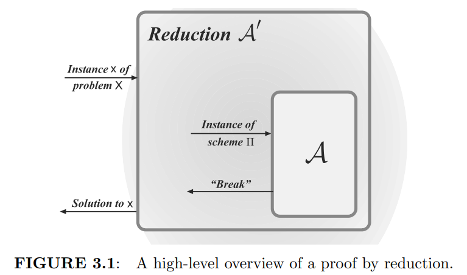

+++
title = "Something about Security Proofs"
date = "2026-08-02"
categories = ["密码学习"]
+++

# Something about Security Proofs

**Preface**

These days, I'm reading the classic book *Introduction to Modern Cryptography* for some reasons. I have learned a lot of concepts that I didn't know before. What's more, it's my first time to try to read an English book(not English textbook), as a result, maybe my English standard will be better. This is also my first time to try to write a EN blog, as you can see, my word levels are very low, like a primary school student.(huh, I will try my best to avoid spelling and grammatical mistakes.)

## Motivation

There are three important principles of modern cryptography, namely: **formal definitions**, **precise assumptions**, and **proofs of security**. This article focuses on the third principle: proofs of security.

A proof of security is always relative to the definition being considered and the assumptions being used. (But I will not talk detailed things about the first two principles here.) Proofs of security give a guarantee that no attacker will succeed. Obviously, proofs need to be rigorous, I will show some examples to demonstrate this.

Talk about to proof, we may not be strange. In junior/senior math studies, we are always asked to prove some theorem. But proofs in cryptography, give me a feeling like some proofs in discrete math, like, the theorem looks right intuitively, however, the formal proofs takes a significant amount of space.

Besides proving directly, a general method is **proofs by reduction** (which is famous). I will give the concept of it and some proof examples as the remaining content of this article.

## Proofs by Reduction

If we want to prove a given construction is computationally secure, (unless the scheme is information-theoretically secure), we must rely on unproven assumptions. The main idea is to prove that the given construction based on the problem/primitive is secure as long as our initial assumption is correct, since the problem is hard or the low-level cryptographic primitive is secure.

A proof that some cryptographic construction $\Pi$ is secure as long as some underlying problem $X$ is hard. We need present a explicit **reduction** showing that how to transform any efficient adversary $A$ that succeeds in breaking $\Pi$ into an efficient algorithm $A'$ that solves $X$. 

A proof by reduction usually has 4 steps:

1. Fix some efficient adversary A attacking $\Pi$. Denote this adversary's success probability by $\varepsilon(n)$.

2. Construct an efficient algorithm $A'$ that attempts to solve problem $X$ by using $A$ as a subroutine. An important point here is that $A'$ knows nothing about how $A$ works, the only thing $A'$ knows is that $A$ is expecting to attack $\Pi$. So, given some input instance x of problem $X$, our algorithm $A'$ will simulate for $A$ an instance of $\Pi$ such that:

   (a) As far as $A$ can tell, it is interacting with $\Pi$. 

   (b) When $A$ succeeds in breaking the instance of $\Pi$ that is being simulated by $A'$, this should allow $A'$ to solve the instance x it was given, at least with inverse polynomial probability $1/p(n)$.

3. Taken together, the above imply that $A'$ solves $X$ with probability $\varepsilon(n)/p(n)$. Now, if $\varepsilon(n)$ isn't negligible then neither is $\varepsilon(n)/p(n)$. Moreover, if $A$ is efficient then we obtain an efficient algorithm $A'$ solving $X$ with non-negligible probability, contradicting our initial assumption.

4. Given our assumption regarding $X$, we conclude that no efficient adversary $A$ can succeed in breaking $\Pi$ with non-negligible probability. Stated differently, $\Pi$ is computationally secure.

This figure shows the idea: Construct an efficient algorithm $A'$ that attempts to solve problem $X$ by using $A$ as a **subroutine**.

## Example 1

**Theorem**

Let $\Pi=(\text{Enc},\text{Dec})$ be a fixed-length private-key encryption scheme for messages of length l that is EAV-secure. Then for all PPT adversaries A and $i \in \{1,...,l\}$, there is a negligible function negl such that
$$
\Pr\left[
\mathcal{A}\left(1^n,\operatorname{Enc}_k(m)\right)=m^i
\right]
\leq
\frac{1}{2}+\operatorname{negl}(n)
$$
where the probability is taken over uniform $m \in \{0,1\}^l$ and $k \in \{0,1\}^n$, the randomness of A, and the randomness of Enc.

**Proof**

The theorem above means that if A can determine the i-th bit of m from Enc(m) (namely, A violates the equation above), then we can use A to construct A‘ that can break scheme $\Pi$. 

Let $I_0 \subset \{0,1\}^l$ be the set of all strings whose i-th bit is 0, and $I_1 \subset \{0,1\}^l$ be the set of all strings whose i-th bit is 1.

Then, we can construct **Adversary** $A'(1^n)$:

1. Choose uniform $m_0 \in I_0$ and $m_1\in I_1$. Output $m_0, m_1$.
2. Upon observing a ciphertext c, invoke $A(1^n, c)$. If A outputs 0, output b'=0; otherwise, output b'=1.

So, we can compute
$$
\begin{aligned}
&\Pr[\text{PrivK}_{A',\Pi}^{\text{eav}}(n)=1] \\
&= \Pr[\mathcal{A}\left(1^n,\text{Enc}_k(m_b)\right)=b] \\
&= \frac{1}{2}\Pr\nolimits_{m_0\leftarrow I_0}[\mathcal{A}\left(1^n,\text{Enc}_k(m_0)\right)=0]+ \frac{1}{2}\Pr\nolimits_{m_1\leftarrow I_1}[\mathcal{A}\left(1^n,\text{Enc}_k(m_1)\right)=1]\\
&= \Pr[\mathcal{A}\left(1^n,\text{Enc}_k(m)\right)=m^i]
\end{aligned}
$$
Since $\Pi$ is EAV-secure, thus
$$
\Pr[\text{PrivK}_{A',\Pi}^{\text{eav}}(n)=1] \leq \frac{1}{2} + \text{negl}(n)
$$
then can conclude
$$
\Pr[\mathcal{A}\left(1^n,\operatorname{Enc}_k(m)\right)=m^i]\leq \frac{1}{2} + \text{negl}(n)
$$
Now, we reach our target.

## Example 2

**Theorem**

If G is a pseudorandom generator, then construction below is an EAV-secure, fixed-length private-key encryption scheme for messages of length $l(n)$.

**Construction**

Let G be a pseudorandom generator with expansion factor $l(n)$. Define a fixed-length private-key encryption scheme for messages of length $l(n)$ as follows:

- Gen: on input $1^n$, choose uniform $k \in \{0,1\}^n$ and output it as the key.
- Enc: on input a key $k \in \{0,1\}^n$ and a message $m \in \{0,1\}^{l(n)}$, output the ciphertext

$$
c :=  G(k) \oplus m
$$

- Dec: on input a key $k \in \{0,1\}^n$ and a ciphertext $c \in \{0,1\}^{l(n)}$, output the message

$$
m := G(k) \oplus c
$$

**Proof**

First, recall the definition of EAV-secure, which is also our final target here. Namely:

For any probabilistic polynomial-time adversary A there is a negligible function negl such that
$$
\text{Pr}[\text{PrivK}_{A,\Pi}^\text{eav}(n)=1] \leq \frac{1}{2} + \text{negl}(n)
$$
The main idea is that: if a uniform pad replaces the pseudorandom pad G(k), then the scheme will be identical to the one-time pad encryption scheme and the probability A guesses correctly will be 1/2.

Then, we need to do reduction. The method is use A to construct a distinguisher D, then D can distinguish the output of G from a uniform string because of the ability of A (here, D is the role A' we talked above). D outputs 1 means A succeeds and D guesses that w comes from G. In detail:

**Distinguisher D:** D is given as input a string $w \in \{0,1\}^{l(n)}$

1. Run $A(1^n)$ to obtain a pair of messages $m_0,m_1 \in \{0,1\}^{l(n)}$
2. Choose a uniform bit $b \in {0,1}$. Set $c :=  w \oplus m_b$
3. Give c to A and obtain output b'. Output 1 if b'=b, and output 0 otherwise.

Then, we define a modified encryption scheme $\widetilde{\Pi}=(\widetilde{\mathsf{Gen}},\widetilde{\mathsf{Enc}},\widetilde{\mathsf{Dec}})$ that is exactly one-time pad encryption scheme (except append a security parameter). That is $\widetilde{\mathsf{Gen}}$ outputs a uniform key k of length $l(n)$, then $\widetilde{\mathsf{Enc}}$ and $\widetilde{\mathsf{Dec}}$ use the k. Perfect secrecy of the one-time pad implies
$$
\text{Pr}[\text{PrivK}_{A,\widetilde{\Pi}}^\text{eav}(n)=1] = \frac{1}{2}
$$
Then, there are two cases:

1. If w is chosen uniformly from $\{0,1\}^{l(n)}$, then A is given a ciphertext $c :=  w \oplus m_b$ where w is uniform. Since D outputs 1 exactly when A succeeds in its eav-experiment, we therefore have

$$
\Pr\nolimits_{w\leftarrow\{0,1\}^{\ell(n)}}
\left[D(w)=1\right]= \Pr\left[
\operatorname{PrivK}_{\mathcal{A},\widetilde{\Pi}}^{\mathrm{eav}}(n)=1
\right]
=\frac{1}{2}
$$

2. if w is generated by choosing uniform $k \in \{0,1\}^n$ and then w=G(k), then A is given a ciphertext $c :=  w \oplus m_b$ where w=G(k), we therefore have

$$
\Pr\nolimits_{k\leftarrow\{0,1\}^{n}}
\left[D(G(k))=1\right]=
\Pr\left[
\operatorname{PrivK}_{\mathcal{A},\Pi}^{\mathrm{eav}}(n)=1
\right]
$$

Since G is a pseudorandom generator, there is a negligible function negl such that
$$
\left | \Pr\nolimits_{k\leftarrow\{0,1\}^{n}}
\left[D(G(k))=1\right]- \Pr\nolimits_{w\leftarrow\{0,1\}^{\ell(n)}} \left[D(w)=1\right]\right | \leq \operatorname{negl}(n)
$$
then, we have
$$
\left | \Pr\left[\operatorname{PrivK}_{\mathcal{A},\Pi}^{\mathrm{eav}}(n)=1\right] - \frac{1}{2} \right |
\leq \operatorname{negl}(n)
$$
this implies 
$$
\Pr\left[
\operatorname{PrivK}_{\mathcal{A},\Pi}^{\mathrm{eav}}(n)=1
\right] \leq
\frac{1}{2}+\operatorname{negl}(n)
$$
Since A was an arbitrary PPT adversary, this completes the proof that $\Pi$ is EAV-secure.

> Note that, although it feels like we should use proof by contradiction, but in fact, we just use A to construct A', and find some equations (the relation between A and A'), then use the assumption, finally we complete the proof.
>
> I mean that we don't need to truly suppose A can break $\Pi$, namely, don't need to violate the target equation. At least that's the case in these two examples. Nevertheless, proof by contradiction is also feasible just with some difference in the final section.

## Example 3

**Theorem**

If F is a pseudorandom function, then construction below is a CPA-secure, fixed-length private-key encryption scheme for messages of length $n$.

**Construction**

Let F be a pseudorandom function. Define a fixed-length private-key encryption scheme for messages of length n as follows:

- Gen: on input $1^n$, choose uniform $k \in \{0,1\}^n$ and output it.
- Enc: on input a key $k \in \{0,1\}^n$ and a message $m \in \{0,1\}^{n}$, choose uniform $r\in\{0,1\}^n$ and output the ciphertext

$$
c :=\langle r, F_k(r)\oplus m \rangle
$$

- Dec: on input a key $k \in \{0,1\}^n$ and a ciphertext $c =\langle r, s \rangle$, output the message

$$
m := F_k(r)\oplus s
$$

**Proof**

Similar to example 2, we define a modified encryption scheme $\widetilde{\Pi}=(\widetilde{\mathsf{Gen}},\widetilde{\mathsf{Enc}},\widetilde{\mathsf{Dec}})$ that a random function f takes the place of $F_k$.

Fix an arbitrary PPT adversary A, and let q(n) be an upper bound on the number of queries that $A(1^n)$ makes to its encryption oracle. (q is upper-bounded by some polynomial)

We use A to construct a distinguisher D. D is given oracle access to a function O, its goal is to determine whether O is pseudorandom or random. D simulates experiment $\text{PrivK}^\text{cpa}$ for A, and observes A succeeds or not. If A succeeds then D guesses O must be a pseudorandom function, whereas A doesn't succeed then D guesses O must be a random function.

**Distinguisher D**: D is given input $1^n$ and access to an oracle O: $\{0,1\}^n \rightarrow \{0,1\}^n$

1. Run $A(1^n)$. Whenever A queries its encryption oracle on a message $m \in \{0,1\}^n$, answer this query in the following way:
   1. Choose uniform $r\in \{0,1\}^n$
   2. Query O(r) and obtain response y
   3. Return the ciphertext $\langle r, y\oplus m \rangle$ to A
2. When A outputs messages $m_0,m_1 \in \{0,1\}^n$, choose a uniform bit $b \in \{0,1\}$ and then:
   1. Choose uniform $r \in \{0,1\}^n$
   2. Query O(r) and obtain response y
   3. Return the ciphertext $\langle r, y\oplus m_b \rangle$ to A
3. Continue answering encryption-oracle queries of A as before until A outputs a bit b'. Output 1 if b'=b, and 0 otherwise.

Then, we need to find relations between the two as follows:

1. If D's oracle is a pseudorandom function, we have

$$
\Pr\nolimits_{k\leftarrow\{0,1\}^{n}}
\left[
D^{F_k(\mathord{\cdot})}(1^n)=1
\right]
= \Pr\left[
\operatorname{PrivK}_{\mathcal{A},\Pi}^{\mathrm{cpa}}(n)=1
\right]
$$

2. If D's oracle is a random function, we have

$$
\Pr\nolimits_{f\leftarrow\mathrm{Func}_n}
\left[
D^{f(\mathord{\cdot})}(1^n)=1
\right]
= \Pr\left[
\operatorname{PrivK}_{\mathcal{A},\widetilde{\Pi}}^{\mathrm{cpa}}(n)=1
\right]
$$

Since the assumption that F is a pseudorandom function, we have
$$
\left | \Pr\left[ D^{F_k(\mathord{\cdot})}(1^n)=1 \right]- 
\Pr\left[D^{f(\mathord{\cdot})}(1^n)=1 \right] 
\right | \leq \operatorname{negl}(n)
$$
Combining the above equations, we have
$$
\left |
\Pr\left[
\operatorname{PrivK}_{\mathcal{A},\Pi}^{\mathrm{cpa}}(n)=1
\right] -
\Pr\left[
\operatorname{PrivK}_{\mathcal{A},\widetilde{\Pi}}^{\mathrm{cpa}}(n)=1
\right]
\right |
\leq
\operatorname{negl}(n)
$$
Our goal is something about the left Pr, so next thing we need to do is compute the right one.

Every time a message m is encrypted in $\text{PrivK}_{\mathcal{A},\widetilde{\Pi}}^{\mathrm{cpa}}(n)$ (either by the encryption oracle $\langle r, f(r)\oplus m \rangle$ or when the challenge ciphertext is computed $\langle r^*, f(r^*)\oplus m_b \rangle$), due to the r is chosen uniformly, there are 2 possibilities:

1. The value $r^*$ is never appeared in queries. In this case, the probability A outputs b'=b is exactly 1/2
2. The value $r^*$ is used when answering at least one of A's queries. In this case, A can easily determine which message is encrypted. However, since A makes at most q(n) queries to its encryption oracle. The probability of this case is at most $q(n)/2^n$

Let **repeat** denote the event that $r^*$ is used by the encryption oracle when answering at least one of A's queries. Therefore:
$$
\begin{aligned}
&\Pr\left[
\operatorname{PrivK}_{\mathcal{A},\widetilde{\Pi}}^{\mathrm{cpa}}(n)=1
\right]
\\
&=
\Pr\left[
\operatorname{PrivK}_{\mathcal{A},\widetilde{\Pi}}^{\mathrm{cpa}}(n)=1
\land \mathsf{repeat}
\right]
+
\Pr\left[
\operatorname{PrivK}_{\mathcal{A},\widetilde{\Pi}}^{\mathrm{cpa}}(n)=1
\land \overline{\mathsf{repeat}}
\right]
\\
&\leq
\Pr\left[\mathsf{repeat}\right]
+
\Pr\left[
\left.
\operatorname{PrivK}_{\mathcal{A},\widetilde{\Pi}}^{\mathrm{cpa}}(n)=1
\,\right|\,
\overline{\mathsf{repeat}}
\right]
\\
&\leq
\frac{q(n)}{2^n}+\frac{1}{2}
\end{aligned}
$$
Finally, we conclude that
$$
\Pr\left[
\operatorname{PrivK}_{\mathcal{A},\Pi}^{\mathrm{cpa}}(n)=1
\right] \leq \frac{1}{2} + \frac{q(n)}{2^n}+ \text{negl}(n)
$$
Since q(n) is polynomial, $q(n)/2^n$ is negligible, and the sum of 2 negligible functions is negligible, namely
$$
\Pr\left[
\operatorname{PrivK}_{\mathcal{A},\Pi}^{\mathrm{cpa}}(n)=1
\right] \leq \frac{1}{2}+ \text{negl}'(n)
$$

> I think the core and difficult part of proof is to construct the distinguisher D and find the probability equations.

## Conclusion

I introduce the concept of proofs by reduction and give 3 examples to show the detail construct. These three are classic examples. Maybe I will append more interesting proof examples in the future.
