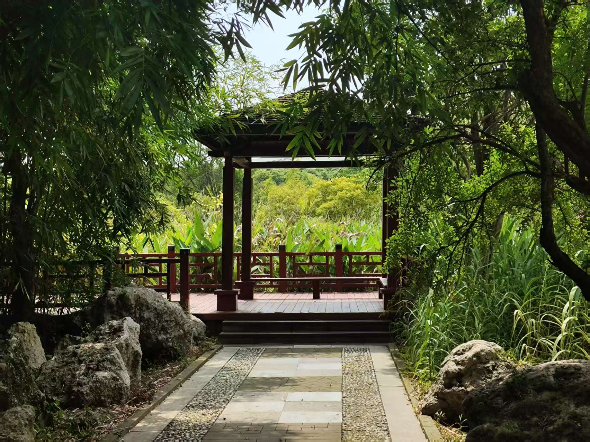
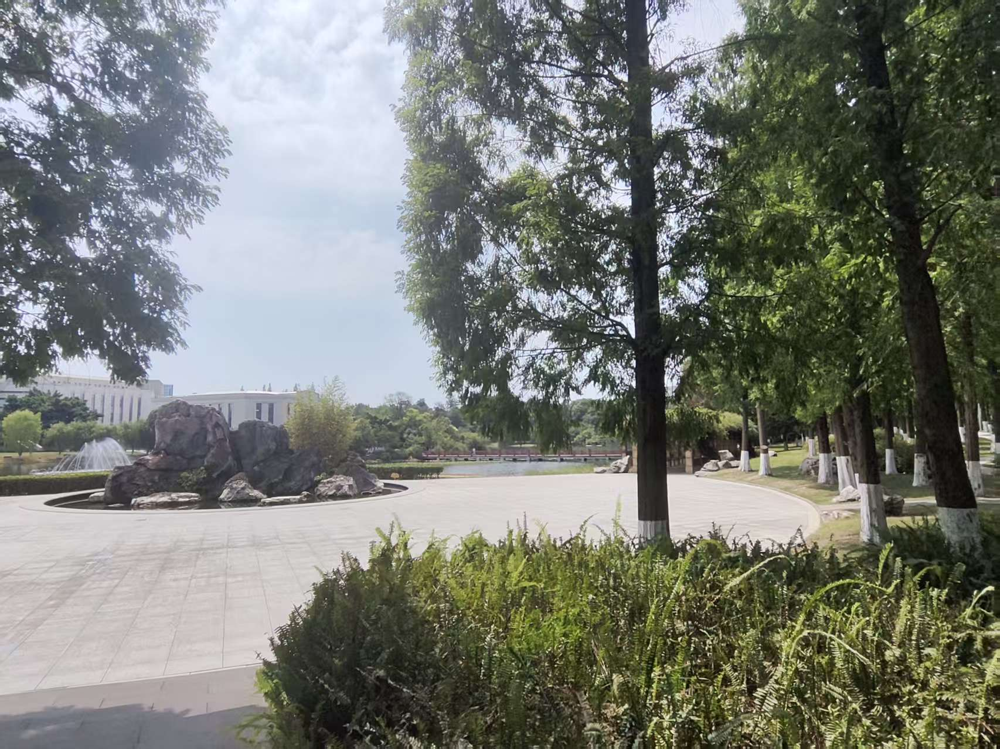
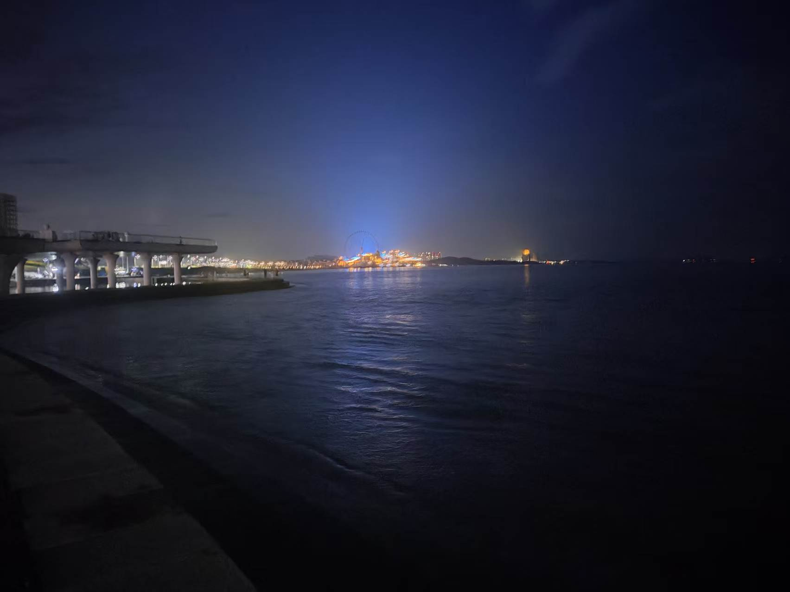
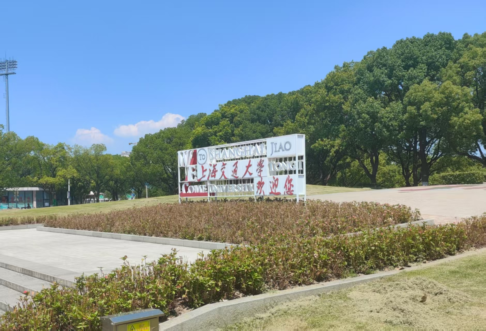

+++
title = "推免回忆录"
date = "2026-10-07"
categories = ["杂谈"]
image="5.png"
description = "一个普通人的自述"

+++

自小时候起，我就不知道一篇文章的开头应该如何写为好，时至今日仍是如此，那便就这样开场吧。我想以本文来记录这些日子的经历，也回顾一下大学三年平平淡淡的光阴，算是为我人生的这个阶段画一个句号吧。

**About Me**

基本情况：我的本科专业是网络空间安全，本科前三年 0 科研经历，竞赛也只是一两个小比赛的奖，只有绩点相对好一些。总而言之，就是一个普普通通的大学生，没有什么出彩的地方。

有趣的是大三开始学了一年 CTF，积累了一点点密码基础，也让我明确了意向专业，即密码学。

蹭了西电网安实验班 1/2 这个足够高的保研率的局势，拿到了普通推免的资格。

## TimeLine

(国庆假期，坐在电脑前，却敲不出多少字了；若放在每次面试结束后的那一刻，我确实有很多想说的；或许是时间过去有一阵子了，也或许是因已尘埃落定，内心无感了；那便以叙事为主吧)

### 夏令营及之前

1. 我在 5 月中旬左右给山大的一位老师发出了我的第一封邮件，里面有我未经完善的第一份简历。当时大抵就是先试试水的心态，看看会收到什么回复。结果出乎我的意料，老师回复的还挺快，表示若对密码学感兴趣，那很欢迎。后来打了一通简单的电话，了解了一些情况，大致就告一段落了，再往后就到夏令营了，后文再谈。

在这之后，我也开始慢慢关注一些夏令营的情况

2. 中科大：这是我第一个报名的夏令营，全称是 "网信安全"科学营，第一次填系统确实挺折磨的，得准备各种信息，还得去找辅导员签字，学院盖章... 不过并没有联系老师。5 月底正式提交了，结果直到 7 月中旬左右才出的，那时已经放暑假了，隔了挺久。最后结果是未入营，而且是默拒，没有任何反馈，只有系统上一直不变的 "待审核"。当时感觉要寄了，有点担心夏 0 营。

3. 西交：6 月初报的名，西交的网安夏令营挺奇怪的，不需要填任何系统，直接邮件联系老师进行交流。因列出的导师名单只有一个研究方向带"密码学"的，故也不需要选了。过了大概几天，老师的一位学生与我交流，本计划是线下去面试一趟，当时还挺激动/紧张的，能去别的学校转一圈感觉挺好玩。不过后来因故改线上了，面试/交流了大概 40 多分钟。当时第一次面试，自我感觉不好也不坏。

   再后来，老师让另一位学生安排一篇论文给我读一读，起初我觉得这并非难事，做 ctf 的时候也看过一些论文，觉得最多最多也就五六十页吧，两个礼拜应该足够读完。结果好家伙，发了一篇 TFHE 的"文档"，接近 300 页，当时我连 FHE 都没怎么了解过。最后结果就是读不动，事实上也没怎么读，(放假了干别的事情去了...后来别的夏令营开了没时间了)，自我放弃了。不得不承认这东西当时给我心理不少压力，现在想来也觉得还是不合理

之后进入大报名阶段，大概就是六月底到七月初这个时间，先后报名了几个夏令营：山大网安学院、华科网安学院、成电计算机学院、上交计算机学院。最后结果不错，都入营了，下面按时间逐个谈一谈

4. 华科：这个夏令营是线上的，基本就是纯宣讲。报名阶段因需填意向导师，故我临时给一位老师发了封邮件，不过没有得到回复，故下午听了宣讲基本就结束了。当时听得困亖了，感觉不如午睡一觉。

5. 成电：7 月 15 日，这是去的第一个线下。其名为 "优秀本科生遴选计划" (好像是叫这个)，简称优本计划。特别之处在于这玩意声称通过之后会发铁 offer，条件是最后系统上成电放第一志愿，是不是只能填一个就不懂了，因为我没通过，hhh；其实实际上就是一个提前的预推免，形式/考察内容也差不多一样；

   大的来了，这玩意到今天我还是想吐槽：之所以报名这个是因为我看其招生专业是有密码学的，既没有密码学院，那其肯定隶属于网安学院，而成电的网安学院是这样的：计算机科学与工程学院(网络空间安全学院)。面试的时候有个阶段是随机抽题回答，我抽到的一个题似乎是计组里的东西，总之我是听都没听过，结果也肯定是寄了(初现端倪)。后面问的问题 0 个和密码学知识有关，即使我的简历上写的基本都和密码相关。后来通过名单大概 100人：90 个计科，10个网安，0个密码；更有意思的是后面发的招生公告密码要招 30 个。难道开设的意义就是等着被调剂的吗...？

   此外：小红书上看到有人统计得出每个组的通过率随组号增大而降低，一组高达70-80%，最后一组不到 10%。组是按什么分的呢？我推测是按报名时间。你既然有随机抽题的环节，为什么不按报考专业分呢？

   不过这一场我也是神人，除了自我介绍什么都没准备，尤其是英语，有个老师问 "为什么选择xxx?"，我就答了两句 "因为这里的密码学 is great，我想在这里学习" 实在编不出来了，然后他惊了，说 "就这？" 😀

   不过学校风景不错

   

   

6. 山大：7 月 18 日，这是去的第二个线下，算是真正意义上的夏令营，为期两天，而且包了食宿，酒店很好👍，不过可能因为是放假了，食堂饭感觉一般。第一天就是宣讲，导师团队介绍自己的方向，然后填意向表；第二天去找了之前联系的老师面谈了一会。此外就是第二天有个密码学会议去旁听了一下，虽然听不懂

   夏令营流程就是选意向导师，然后导师派任务，最后考核，通过即优秀营员；据会上所说，优营基本最后是稳录取的。我的任务就是读 *Introduction to Modern Cryptography*，没错之前写的 Something about Security Proofs 这篇笔记就是源自于此。这是一本 600 多页的英文教材，但是读这个完全没有读西交给的那玩意的压抑感，也能学到真东西，感觉良好

   故七月下旬回家后，接近一个月的时间，基本都在读书，没读完，进度接近 1/2。最后七月底老师进行了考核，有包括我在内的7名同学参与，选出2个优营，最后也是通过了

   此外值得一提的是，学校旁边不远处的海边公园不错，我很喜欢这种感觉

   

7. 上交：参加的第三个也是最后一个线下，在7月底。报的是直博，形式也是预推免的形式，过去之后直接由老师组进行面试。虽说其也是 计算机学院(网安学院、密码学院) 这样多合一的形式，但是比成电合理多了，起码我被问的问题基本都是和密码相关的。最后也是优营通过了。

   其流程大致是(直博)：先面试，面试优营后，联系导师进行双选，双选结束好像就认为是有效力的了。同样报名的时候是需要填导师的，故又临时给一位老师发了封邮件，不过依旧没有得到回复。后来小红书上听说这个东西的优营基本上通过率很高，关键在于能否达成双选。当时重心还是放在山大上的，故在犹豫要不要再联系一下。有意思的是：8月中下旬的时候，有个老师给我发邮件问我意向，当时是挺震惊的，没想过会有这种情况，一看发现是当时面试的一个老师。方向不错，格密码分析，和 ctf 还有点关联，当时跟我讲大概率有名额，情况挺乐观。不过最后结局就是直博缩招了，并没有名额。怎么说呢，有点荒唐。

   

### 过渡

夏令营阶段，6-8月大致的时间线叙述完了，不过在后面阶段有一些交叉。实际上应该是，我在 8 月 25 日左右回了学校，地铁上看到大概是 28 号那几天要进行山大的考核，当时还有点觉得回来早了... 而且2/7的情形实话说是有点慌的，但是之前上交的情况又给了我一点底气。通过之后，有相当一段的时间我在纠结去向问题，抛开别的不谈，光论学校的 title，上交大于山大这应该是显然的，学校 title 固然是上学的人考虑的重要的一环。但是加之学科情况、导师情况、以及先前的交流等等因素，这个选择题变得扑朔迷离。

当时我心底的想法是学校 title 更重一些，此外一点是上交不需要再去一趟参加预推免很人性。但是如上所述，这个问题之后就烟消云散了，发生在9月7日。事实上是挺晚的时间点了，不过我感觉上并没有很大的落差，反倒是有一种如释重负的感觉

### 预推免

预推免伊始的时候我是只打算报一个的，后来也跟老师承诺说预推免通过之后不会放鸽子。but，保研总是充满了不测，后来大概是9月10号左右的时候，老师跟我说今年还是有些竞争的，320个招40个，让我再好好准备准备。而且事实上招生人数还大于优营人数。哎，没办法，故不得已又去再找几个预推免报上一报，那时候已经没几个开着的了，只能"病急乱投医"了，最后报了四个去了两个。

1. 华东师大：新开的密码学院，报名预推免之后也通过了，但是和山大的时间撞了，只能推掉了。

2. 山大：9.17日上午面试，因为优营，面试氛围挺轻松的，不过有个数论问题没答上来... 面试完之后和老师以及学长学姐聊了聊，就撤退了。结果倒是出的挺快，顺利通过，在拟录取范围内。

3. 华科：这个挺神的，我是没想过夏令营能进结果预推免进不了。可能是因为我的综合排名比绩点排名低吧。不过因此时间变得宽裕一些了，也省了路费...

4. 北航：9.19-9.20两天，第一天晚上是机试，就是考算法题，有个题本地测试了一下可以，远程交上去不对，没这方面经验，也不知道怎么改... 有点折磨。第二天面试还可以，数学和密码学的问题基本能答上来，但是别的就不行了，像计网，python爬虫啥的基本上都答不出来，要么说不会要么开编 (爬虫这玩意是个当时刷的网课，有个老师看成绩单上有这个课一直问...我傻了) 。

其实一开始预想的是华科能入，北航不确定。最后是反过来的，结果的话，北航也过了，在拟录取范围内，甚至相对排名比山大的还高一些，不过最后也是放弃了。

此外一些小插曲，17号出发前一两天有上交的老师询问意向，是做对称密码的；甚至20号面试那天候场的时候又接到一个老师的电话；但是已有承诺在先，最后都拒绝了。看来确实是密码学这块有点招不够人的感觉...

### 结束

其实山大预推免出结果的时候就已经算是结束了，后续20几号回了学校，按流程填好系统，接受复试通知和拟录取通知就完事了。

总而言之，我觉得保研这几个月下来，主观上来讲，并不是一件令人舒适的事情。这一整个过程中，我的心态总是浮躁的，静不下心来学习。也会有各种焦虑，比如担心不及别人努力而没有通过考核导致白白投入精力，或者担心最后预推免被刷掉没学上了等等，因为这个东西时间拉的太长，而且变化太多。

此外，我觉得保研不得不去分散自己的精力，即关注多个学校；如果有夏令营就得花时间完成任务，如果是预推免就得专程过去面试。导致没办法专一。感觉这就是目前保研政策和形势下大部分学生的无奈之举。

唉，我也不知道如何用语言去描述这种感受，是一种无力但又不得不去做，是那种花了大把时间在一些没什么意义的事情上的感觉，所做的事情没有提升自己，只是因为你必须做。

当然，保研也是有好处的，比如说大四这一年相对而言会闲一些，能支配空余时间去做一些想做的事情；也可以利用这些时间补一些基础，以后或许能学得更快一些。

不过这些都只是我此刻的感受，几个月后，一年后，三年后，或许会有截然不同的看法。就仿佛现在去回看三年前，可能无法理解当时的自己，不过在当时的认知下，或许已是做出的最好的选择。带着现在的认知去评判之前的自己是不合理的，同样也无法预测几年后自己会变成什么模样。总之吧，活得心安，念头通达就好了。

## 回首

如开头所说的，我也想借此回顾一下大学三年的生活。我就是一个普普通通的大学生，在宿舍与教学楼之间两点一线，过着有课就上课，没课就打游戏的日子，并没有什么特别的地方，就像芸芸众生中的一粒沙。

我想寥寥几句就能概括我的三年

- 大一上初来乍到，正常上课写作业，闲时打游戏；寒假刷动漫、玩游戏

- 大一下生活有一些努力的劲头，是为了转专业，此外生活照旧；暑假想参加数模国赛，但是半途而废了；同时学了一点点深度学习的知识，不过后面也放弃了
- 大二上生活照旧；寒假参加了美赛，那是我体验过的非常痛苦的一段日子
- 大二下生活照旧；暑假准备密码赛以及重要转折点：参加了 moe 2025
- 大三上前期接着准备密码赛，不过最后没晋级就此结束了；此外这一学期开始打各种 ctf 比赛，主要是新生赛，是学习密码的入门和起步阶段；之后参加了技能赛国赛，虽然也没晋级，but 印象深刻的一天；寒假参加了不少 ctf 比赛，算是精进技术的一个重要阶段
- 大三下前期生活照旧+参加各种 ctf 练题；后期的话开始了解推免相关信息并着手做准备了；再往后的暑假就是上面的内容了

前两年的校园生活确实没什么写的，学习上也大部分就是研究研究课程的东西，娱乐上大部分就是呆宿舍和同学打游戏，游戏倒是玩了不少，早期玩王者荣耀、pubg，后面 cs 玩了很长一段时间，再之后无畏契约大概这样；直播也看了不少，尤其是 cs 的各种比赛，观赛时长保守估计几百个小时了；人际上约等于大份 ...

大三接触 ctf 算是一个转机，直到今天也是如此，会用空闲时间做做题什么的。在某种程度上这确实对我影响颇大，一方面如果没打 ctf 的话压根不会有这个博客，也没有这篇文章；另一方面我研究生可能就不读密码了，大抵就随波逐流或者抽签碰运气了。

尽管如此，ctf 也不可否认的是蒸蒸日下了。我刚接触那时候的环境可以感受到还是手搓为主，但也有下坡趋势了，ai 在慢慢变强，不但进步很快，而且也达到了很高的高度；个人感觉大概半年后， 26 年寒假的 hgame 就是一个非常显著的转折，从那之后，排行榜前几，甚至前几页基本上就都是 ai/agent 选手了，冲榜变得索然无味。

不过不以分数为目的的话，只是看看题目休闲还是有趣的。但是换个角度想这对我也是好事，虽然自己一年多的ctf 经历感觉还是有点短命的，不过感觉也到了退出去干别的事情的时候了。

大学前两年尤其是第二年的时候我总是在想诸如人活着的意义，活着到底为了什么之类的问题。有些时候我在想到底什么是重要的、什么又是不重要的。许多先前觉得弥足珍贵的东西现在看来也变得平常了，也有一部分先前觉得可有可无的东西现在却是再不可得了。所以现在有时候我也会问自己：自己做的事情真的有意义吗？真的重要吗？

慢慢地，我的心态变得消极，理念也变得"避世"，我不想关心和我不是强相关的任何事情，不想做任何可有可无的事情，也变得有些不想与人交流，或者说没什么人可以交流，只想过好自己几点一线的生活，做好手头的工作。

不过也并非一无所获，有的时候我又意识到，或许人本身就是意义，在思考人活着的意义这个问题的时候就是意义。又意识到，其实所谓意义虚无缥缈，何必苦苦寻求呢？或许眼下的日子才是答案。

总而言之吧，想减少这方面的情绪，我觉得就是人活着得有盼头，无论是哪一方面的，无论是容易完成的还是很困难的；倘若没有的话活着就会很麻木。

## 展望

我并不喜欢给自己的未来制定明确的计划。有时候会想个大概，还是习惯于"走一步看一步"的这种模式。人生有许多不同的阶段，很久之前，我觉得"好"的人生就是在正确的时间做正确的事，现在也如此，无论何时何地，做好手头的工作一定不会错。

本科阶段已是接近末尾了，或者说已经到研0这个阶段了，未来或许会有很大的区别。故在结尾部分，也稍微想想这半年应该干些什么吧，我想主线大概就这样

- 首位依旧是想调节作息
- 上课方面仔细学学 MPC 和 ZKP 这两门课，争取入门
- 继续读 introduction 这本书，争取读完第一遍

其次有余力的话补点数学知识、读点论文；关于 CTF 应该就慢慢退役了，至少应当是不会花那么多时间在上面了，cryptohack 倒是有空还可以做一做；也有点想培养一门爱好，具体是什么还没想好；其他的话就是活着吧，看直播刷视频玩游戏不用说自然是落不下的 😀

笔至于此，国庆假期也要至于此了，悲。

