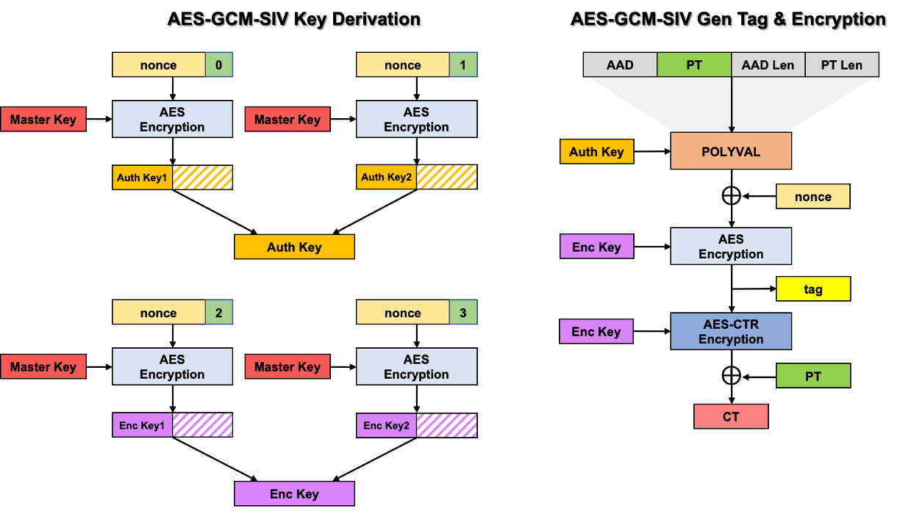

+++
title = "题目切片-(一)"
date = "2026-06-26"
categories = ["密码学习"]
image="111.png"

+++

# 题目切片-(一)

**前言**

"题目切片"系列，用于记录/复现遇到的一些题目

定位是当时做着没什么思路的题目；或是不打算记录比赛所有题目，只记录其中一部分的情况，或许是比较"有趣"的题目 maybe

预计一期放10道题目左右

## [osu!gaming CTF 2025] ssss

```python
#!/usr/local/bin/python3
from Crypto.Util.number import *
import random

p = 2**255 - 19
k = 15
SECRET = random.randrange(0, p)

def lcg(x, a, b, p):
    return (a * x + b) % p

a = random.randrange(0, p)
b = random.randrange(0, p)
poly = [SECRET]
while len(poly) != k: poly.append(lcg(poly[-1], a, b, p-))

def evaluate_poly(f, x):
    return sum(c * pow(x, i, p) for i, c in enumerate(f)) % p

print("welcome to ssss", flush=True)
for _ in range(k - 1):
    x = int(input())
    assert 0 < x < p, "no cheating!"
    print(evaluate_poly(poly, x), flush=True)

if int(input("secret? ")) == SECRET:
    FLAG = open("flag.txt").read()
    print(FLAG, flush=True)
```

用 lcg 生成多项式系数，存放在 poly 列表中，共15个，顺序为从低次向高次，evaluate_poly 函数计算多项式在参数x处的值，可以进行交互，获取14个自定义的多项式值，最后是需要求出 lcg 的初始值

直观上是想从14个方程中恢复15个系数，是不行的，但是本质上相当于只有三个未知数，lcg的参数a，b和初始值SECRET，而可以得到14个方程，故是有机会解出来的，事实上当时也是这么做的，同学提供了一个挺长的脚本，做了一些变换，然后用结式消元解出来了。但是这题当时有100多解，一直觉得不应该这么繁琐，后来偶然看到一篇题解  [密码-CSDN博客](https://blog.csdn.net/weixin_52640415/article/details/154028532?spm=1001.2014.3001.5502)，简洁很多，有一个挺巧妙的降次思想

首先发现 12 | p-1，故在模p的乘法群中，一定存在阶为12的子群，即存在g，满足$g^{12} \equiv 1 \pmod p$，并且不能是再比12小的子群，否则下面构造的 $g^i$ 中会出现重复

至于如何找g，直接找一个原根 g0，然后 $g_0^{\frac{p-1}{12}}$ 即可。之后可以发送 $g^0, g^1,...,g^{11}$ 这12个数
$$
f(x) = c_0 + c_1 x + c_2 x^2 + \cdots + c_{11} x^{11} + c_{12} x^{12} + c_{13} x^{13} + c_{14} x^{14}
$$
 在原始多项式中，对于 $x= g^i$，12，13，14这三个高次项，会降为

$x^{12} = (g^i)^{12} = (g^{12})^i = 1$

$x^{13} = (g^i)^{13} = (g^{13})^i = (g^1)^i = g^i =  x$

$x^{14} = (g^i)^{14} = (g^{14})^i = (g^2)^i = (g^i)^2 = x^2$

即新的多项式
$$
f(x) = (c_0+c_{12}) + (c_1+c_{13}) x + (c_2+c_{14}) x^2 +c_3 x^3 \cdots + c_{11} x^{11}
$$
而我们进行12次查询可得12个点，在sage中有内置函数可以实现拉格朗日插值恢复系数

最后恢复 lcg 就是轻而易举的事情了，下面附上关键部分的代码

```python
p = 2 ** 255 - 19
R.<x0> = GF(p)[]
t = 12 
g0 = primitive_root(p)
g = pow(g0, (p-1)//t, p)
assert pow(g, t, p) == 1

def query():    
	shares = []
	for i in range(t):
		x = pow(g, i, p)
		conn.sendline(str(x).encode())
		y = int(conn.recvline())
		shares.append((x, y))
    
	return list(R.lagrange_polynomial(shares))
```

## [osu!gaming CTF 2025] ssss+

```python
#!/usr/local/bin/python3
from Crypto.Util.number import *
import random

p = 2**255 - 19
k = 15
SECRET = random.randrange(0, p)

def lcg(x, a, b, p):
    return (a * x + b) % p

pp = getPrime(256)
a = random.randrange(0, pp)
b = random.randrange(0, pp)
poly = [SECRET]
while len(poly) != k: poly.append(lcg(poly[-1], a, b, pp))

def evaluate_poly(f, x):
    return sum(c * pow(x, i, p) for i, c in enumerate(f)) % p

print("welcome to ssss", flush=True)
for _ in range(k - 1):
    x = int(input())
    assert 0 < x < p, "no cheating!"
    print(evaluate_poly(poly, x), flush=True)

if int(input("secret? ")) == SECRET:
    FLAG = open("flag.txt").read()
    print(FLAG, flush=True)
```

提升的难度在于lcg的参数pp现在也未知了，多项式的模数p已知且不变

找到g，发送 $g^i$，这些操作不变，仍然可以得到系数 $c_3,c_4,...,c_{11}$ 这些都是模p意义下的，而真实的系数 $d_i$，也就是lcg生成的序列应该是模pp意义下的，他们之间满足关系 $c_i \equiv d_i \pmod p$，即 $d_i = c_i +k_i p$

由于 p<pp，并且p是255bit且略小于 $2^{255}$，pp是256bit，故 $1<\frac{pp}{p}<2$，$p<pp<2p$，$0<pp-p<p$，因此上面的 $k_i$ 只能取 0 和 1，所以需要爆破一系列k，文章里说爆6个可以出结果，原文是去构造了一个理想，计算该理想的 Gröbner 基，(这方面目前还不太懂)

个人是想的简单一些，枚举所有可能的k，得到 $d_i$ 序列，有 4-8 个足够算出 lcg 参数 a，b和pp，然后利用剩余数据判断是否求解正确，应当是可行的，不过也没有具体去试 ~~懒了~~ ，后面有机会整理 lcg 的时候可以再试试

## [0xFun CTF 2026] Oracle

```python
from secret_gen import gen

class Matrix:
    def __init__(self, data, mod):
        self.mat = data
        self.rows = len(data)
        self.cols = len(data[0])
        self.n = mod

    def __mul__(self, other):
        if self.cols != other.rows:
            raise ValueError("Dimension mismatch")
        
        res_data = [[0] * other.cols for _ in range(self.rows)]
        
        for i in range(self.rows):
            for k in range(self.cols):
                if self.mat[i][k] == 0: continue
                for j in range(other.cols):
                    res_data[i][j] = (res_data[i][j] + self.mat[i][k] * other.mat[k][j]) % self.n
            
        return Matrix(res_data, self.n)

    def __pow__(self, exp):
        if self.rows != self.cols:
            raise ValueError("Only square matrices can be exponentiated")
        
        res_data = [[(1 if i == j else 0) for j in range(self.cols)] for i in range(self.rows)]
        res = Matrix(res_data, self.n)
        base = self
        
        while exp > 0:
            if exp % 2 == 1:
                res = res * base
            base = base * base
            exp //= 2
        return res
    
def oracle(x):
    a, b = x // n, x % n
    
    matrix_data = []
    
    for r in range(SIZE):
        row = []
        for c in range(SIZE):
            if r == c:
                row.append(b + 1 + r)
            else:
                row.append(a)
        matrix_data.append(row)
        
    m = Matrix(matrix_data, n)
    m_pow = m ** d
    diag_sum = sum(m_pow.mat[i][i] for i in range(SIZE)) % n
    
    return diag_sum >> 20   # Hopefully, I'm truncating enough bits:3

n_bits = 1024
SIZE = 4   # This should be enough, right?

n, e, c, d, p, q, r = gen(n_bits)
assert n == p * q * r

print(f'e = {e}')
print(f'c = {c}')

while True:
    try:
        x = int(input('Enter message to decrypt: '))
        assert 0 < x and x != c - 1 
        print(oracle(x))
    except:
        print('Error!')
```

实现了一个模意义下的矩阵类，有矩阵乘法和幂运算，oracle 函数结束一个输入 x，构造一个矩阵，其中`a, b = x // n, x % n`，最后返回的是 $M^d$ 的对角线元素和右移20位
$$
M = \begin{pmatrix}
 b+1 & a & a &a \\
 a & b+2 &a  & a\\
a  &  a& b+3 &a \\
 a & a & a & b+4
\end{pmatrix}
$$
当 x<n 的时候，a=0，b=x，那么实际上是一个对角阵，当时也是一直在往这方面想，觉得是利用了矩阵的迹的一些什么性质，看了wp发现不是这样的
$$
M = \begin{pmatrix}
 x+1 &  &  & \\
  & x+2 &  & \\
  &  & x+3 & \\
  &  &  & x+4
\end{pmatrix}
$$
这个题只给了 e 和 c，n没有给，自然是得想办法先求出来的(这一步当时也没做出来)，此外n，e，d，这些参数的生成是一个黑盒，不过记得当时输出的 e 是一个很大的数，事实上确实和这个有关

当时没想到 Matrix 这个类会有问题，在` __mul__` 中有 `if self.mat[i][k] == 0: continue` 这样一句代码，导致上面那种稠密的 M 会比稀疏的对角 M 的运算量大，稠密的要算64次，而稀疏的只要算16次，幂运算会将这种差异放得更大，这样就可以进行侧信道攻击，用二分法把 n 给恢复出来，这部分代码如下

```python
from pwn import *
import time
from tqdm import tqdm
import statistics

n_bits = 1024
Host = ...
Port = ...
io = remote(Host, Port)


def get_timings(val, rounds=5):
    """
    Returns a list of execution times. 
    We analyze the list later (median/mean).
    """
    times = []
    io.clean(timeout=0)
    for _ in range(rounds):
        start = time.perf_counter()
        io.sendline(str(val).encode())
        io.recvline()
        end = time.perf_counter()
        times.append(end - start)
    return times


def find_modulus():
    print(f"[-] Starting Calibration (Target: {n_bits} bits)...")
    fast_times = get_timings(1, rounds=20)
    slow_times = get_timings(pow(2, n_bits), rounds=20)

    med_fast = statistics.median(fast_times)
    med_slow = statistics.median(slow_times)

    gap = med_slow - med_fast

    print(f"[*] Calibration Stats:")
    print(f"    Fast Median: {med_fast:.6f}s")
    print(f"    Slow Median: {med_slow:.6f}s")
    print(f"    Gap        : {gap:.6f}s")

    cutoff = med_fast + (gap / 2)
    print(f"    Threshold  : {cutoff:.6f}s")

    low = pow(2, 0)
    high = pow(2, n_bits)

    print("\n[-] Starting Binary Search...")
    pbar = tqdm(total=n_bits)

    while low < high:
        mid = (low + high) // 2

        times = get_timings(mid, rounds=5)  # Should work for rounds>=3
        t_med = statistics.median(times)

        if t_med > cutoff:
            high = mid
        else:
            low = mid + 1

        pbar.update(1)

    pbar.close()

    print(f"\n[+] Search Complete.")
    print(f"N = {low}")
    return low
```

在本地试了一下，数据大概这样子

```text
快速=0.003413s, 慢速=0.048063s, 阈值=0.025738s
```

最后有了 n 和 e，结合 e 很大的特点，需要猜一下是打连分数，附上官方wp的代码，是一个手搓的python实现，判断条件也很新颖

```python
def attack_multi_prime(e, n):
    x, y = e, n
    n0, d0 = 0, 1
    n1, d1 = 1, 0

    while y != 0:
        q = x // y
        x, y = y, x - q * y
        k = q * n1 + n0
        d = q * d1 + d0

        if d % 2 != 0 and k != 0:
            if (e * d - 1) % k == 0:
                if pow(2, e * d, n) == pow(2, 1, n):
                    if pow(3, e * d, n) == pow(3, 1, n):
                        return d

        n0, d0 = n1, d1
        n1, d1 = k, d

    return None
```

回顾一下，oracle 的返回值实际上没有用，这个题和矩阵RSA也没什么关系，矩阵的作用只有恢复 n，对于 c，就是一个普通的RSA。可能因此误导项以及一些黑盒导致大部分AI做不出来？最后题解很少，只有十几个，别的题300，400+了。这个侧信道设计的倒确实是巧妙，长知识了

## [0xFun CTF 2026] BitStorm

```python
import os
import random

class GiantLinearRNG:
    def __init__(self, seed_int, state_size=32):
        self.size = state_size
        self.state = []
        for i in range(self.size):
            shift = 64 * (self.size - 1 - i)
            self.state.append((seed_int >> shift) & 0xFFFFFFFFFFFFFFFF)

    def next(self):
        s = self.state
        taps = [0, 1, 3, 7, 13, 22, 28, 31]
        
        new_val = 0
        for i in taps:
            val = s[i]
            mixed = val ^ ((val << 11) & 0xFFFFFFFFFFFFFFFF) ^ (val >> 7)
            rot = (i * 3) % 64
            mixed = ((mixed << rot) | (mixed >> (64 - rot))) & 0xFFFFFFFFFFFFFFFF            
            new_val ^= mixed
 
        new_val ^= (s[-1] >> 13) ^ ((s[-1] << 5) & 0xFFFFFFFFFFFFFFFF)
        new_val &= 0xFFFFFFFFFFFFFFFF
        self.state = s[1:] + [new_val]
        
        out = 0
        for i in range(self.size):
            if i % 2 == 0:
                out ^= self.state[i]
            else:
                val = self.state[i]
                out ^= ((val >> 2) | (val << 62)) & 0xFFFFFFFFFFFFFFFF
                
        return out

def main():
    flag = os.environ.get('FLAG', '0xfun{fake_f4lag_for_testing}')    
    if flag.startswith('0xfun{') and flag.endswith('}'):
        content = flag[6:-1]
    else:
        print("Invalid flag format")
        return
    content_bytes = content.encode()
    if len(content_bytes) < 256:
        content_bytes = content_bytes.ljust(256, b'\0')
    else:
        content_bytes = content_bytes[:256]        
    seed_int = int.from_bytes(content_bytes, 'big')
    
    rng = GiantLinearRNG(seed_int, state_size=32)    
    print("Generating output...")
    outputs = []
    for _ in range(60):
        outputs.append(rng.next())        
    print(outputs)

if __name__ == '__main__':
    main()
```

一道 PRNG 的题目，给了一些输出，要把种子给还原出来。生成逻辑可以看懂，但是没什么求解思路

观察发现，涉及到的几种运算有

- 异或 ^
- 左移/右移 << / >>
- 循环移位 << rot | >> 64-rot

关键之处在于这些运算都是 **线性** 的，即对于一个输入(seed) $ X $，输出 $Y$，可以表示为 $XM = Y$，M代表从此 PRNG 内部复杂庞大的运算中抽象出的一个本质线性关系，形状 2048*3840

seed 是 256 * 8 = 2048 bit，输出有 60 * 64 = 3840 bit，方程可以解。下一个问题是如何确定 M 的内容，操作是输入单位向量 (1,0,0,...,0) (0,1,0,...,0) ... (0,0,0,...,1)，调用 PRNG 获取输出，得到的即是对应的 M 的那一行内容

```python
with open('output.txt') as f:
    f.readline()
    outputs  = eval(f.readline())

class GiantLinearRNG:
    ... # 注意把异或 ^ 改成 ^^

out_bits = []
for out in outputs:
    for b in range(64):
        out_bits.append((out >> (63 - b)) & 1)
Y = vector(GF(2), out_bits)

M = Matrix(GF(2), 2048, 60 * 64)
for i in range(2048):
    seed_int = 1 << (2047 - i)
    rng = GiantLinearRNG(seed_int)
    row_bits = []
    for _ in range(60):
        out = rng.next()
        for b in range(64):
            row_bits.append((out >> (63 - b)) & 1)
    M[i] = row_bits

X = M.solve_left(Y)
seed_int = 0
for i in range(2048):
    if X[i] == 1:
        seed_int |= (1 << (2047 - i))
        
content_bytes = int(seed_int).to_bytes(256, 'big')
print(content_bytes.rstrip(b'\x00'))
```

最后的 flag 是`0xfun{L1n34r_4lg3br4_W1th_Z3_1s_Aw3s0m3}`，不过用 ai 生成了一个 z3 脚本，效果不是很好，没跑出来 ( •́ _ •̀)？

接下来谈谈对于这个题 **线性** 的理解，本题是转换到了逐个bit上去考虑的，也就是GF(2)上，而异或就是GF(2)上的加法，故可以认为其是线性的。对于左移，例如 x = (x3, x2, x1, x0)，x << 1 & 0xF，可表示如下，故也是线性的
$$
\begin{pmatrix} x_3 & x_2 & x_1 & x_0 \end{pmatrix} \begin{pmatrix} 0 & 0 & 0 & 0 \\ 1 & 0 & 0 & 0 \\ 0 & 1 & 0 & 0 \\ 0 & 0 & 1 & 0 \end{pmatrix} = \begin{pmatrix} x_2 & x_1 & x_0 & 0 \end{pmatrix}
$$
对于循环移位，相当于对各bit做一个置换，显然也能写成乘一个置换矩阵的形式。此外对于源码中像这样 `mixed = val ^ ((val << 11) & 0xFFFFFFFFFFFFFFFF) ^ (val >> 7)` 的形式，可以认为是线性操作的叠加，仍然是线性的

典型的非线性操作有 Sbox 代换，乘法(按位与)，加入这些操作后整个系统就不再是一个线性系统

## [BackdoorCTF 2025] Ambystoma Mexicanum

```python
from cryptography.hazmat.primitives.ciphers.aead import AESGCMSIV
import binascii
import os

KEY_SIZE = 16
NONCE_SIZE = 12 
FLAG = "flag{lol_this_is_obv_not_the_flag}"

KEYS = []
CIPHERTEXTS = []
CIPHERTEXTS_LEN = 1

REQUEST = "gib me flag plis"

class Service:
    def __init__(self):
        self.key = self.gen_key()
        self.nonce = os.urandom(NONCE_SIZE)
        self.aead = b""

    def gen_key(self):
        self.key = os.urandom(KEY_SIZE)
        return self.key
    
    def decrypt(self, ciphertext, key):
        try:
            plaintext = AESGCMSIV(key).decrypt(self.nonce, ciphertext, self.aead)
            return plaintext
        except Exception:
            return None
        
usertext = ""

ASCII_BANNER = """
    ╔═══════════════════════════════════════════════════════════╗
    ║                    CRYPTIC SERVICE                        ║
    ╚═══════════════════════════════════════════════════════════╝
    
            ∧_∧
           (･ω･)  Protecting your secrets one key at a time...
     
"""

print(ASCII_BANNER)
service = Service()
KEYS.append(service.key.hex())

MENU_HEADER = """
    ╔════════════════════════════════════╗
    ║          MAIN MENU                 ║
    ╚════════════════════════════════════╝
"""

while True:
    print(MENU_HEADER)
    print("Choose an option:")
    print("1. rotate key")
    print("2. debug")
    print("3. push ciphertext")
    print("4. request flag")

    choice = input("Your choice: ").strip()

    if choice == "1":
        service.gen_key()
        KEYS.append(service.key.hex())
        print("\nKey rotated.\n")

    elif choice == "2":
        print(f"\n{KEYS=}")
        print(f"{CIPHERTEXTS=}")
        print(f"nonce={service.nonce.hex()}\n")
    
    elif choice == "3":
        ct = input("\nEnter ciphertext (hex): ").strip()
        CIPHERTEXTS.append(ct)

        if len(CIPHERTEXTS) > CIPHERTEXTS_LEN:
            print("\nSorry, I cannot remember more ciphertexts :(\n")
            break
    
    elif choice == "4":
        for i in range(4):
            key = binascii.unhexlify(KEYS[i % len(KEYS)])
            ct = binascii.unhexlify(CIPHERTEXTS[i % len(CIPHERTEXTS)])

            text = service.decrypt(ct, key)[16 * i:16 * (i+1)].decode('utf-8').strip()

            if not text or len(text) == 0:
                print("why so rude :(\n")
                exit(0)

            usertext += text

        if usertext == REQUEST:
            print(f"Damn, you are something. Here is the flag: {FLAG}\n")
            exit(0)
        else:
            print("Request politely please!!\n")
            exit(0)
    else:
        print("I don't recognize this. Bye!")
```

这个题其实算个脑洞题(或者说是非预期)，主要是为了记录 revenge 版本的，想着完整性就也写一下吧

有四种操作

- rotate key 生成一个16字节的随机密钥，并添加至密钥列表
- debug 查看密钥，密文和nonce
- push ciphertext 输入一个密文，添加至密文列表中，密文列表最大长度为1
- request flag 核心部分

```python
for i in range(4):
    key = binascii.unhexlify(KEYS[i % len(KEYS)])
    ct = binascii.unhexlify(CIPHERTEXTS[i % len(CIPHERTEXTS)])
    text = service.decrypt(ct, key)[16 * i:16 * (i+1)].decode('utf-8').strip()
    if not text or len(text) == 0:
        print("why so rude :(\n")
        exit(0)

    usertext += text
```

依次取 KEYS[i % len(KEYS)] 和 CIPHERTEXTS[i % len(CIPHERTEXTS)]，由于 len(CIPHERTEXTS) = 1，故操作的密文实际上都是同一个，解密后分成四段依次去取 [0:16], [16:32], [32:48], [48:64]，然后拼接起来，结果需要和目标值 REQUEST = "gib me flag plis" 一致，方可获得flag

乍一看上去是要对同一条密文用不同的密钥进行解密，难以控制。事实上，Service()在初始化时会生成一个密钥，然后添加到密钥列表里，我们后续不生成密钥，那么四次用的就是同一个密钥，再结合上 .strip() 去除空格的特性，就可以构造如下

```python
# 不 rotate key，直接 debug 获取 key 和 nonce 
m1 = 'gib m' + 11 * ' '
m2 = 'e f' + 13 * ' '
m3 = 'lag p' + 11 * ' '
m4 = 'lis' + 13 * ' '
m = m1 + m2 + m3 + m4
# 加密 m  发送密文即可
```

## [BackdoorCTF 2025] Ambystoma Mexicanum revenge

```python
for i in range(4):
    try:
        key = binascii.unhexlify(KEYS[i])
        ct = binascii.unhexlify(CIPHERTEXTS[i % len(CIPHERTEXTS)])

        text = service.decrypt(ct, key)[16 * i:16 * (i+1)].decode('utf-8').strip()
        if not text or len(text) == 0 or text is None:
            print("why so rude :(\n")
            exit(0)
    except Exception:
        print("you have no honour!\n")
        exit(0)
        
    usertext += text
```

主体思想一致，但是加了限制，这次必须有4个密钥，意味着不得不去对同一条密文用不同的密钥进行解密，题目用的是 AES-GCM-SIV 算法，下面先学习一下 AES-GCM-SIV

---

AES-GCM-SIV 是一种 AEAD 模式 (Authenticated Encryption with Associated Data) (带附加数据的认证加密)

GCM 代表 Galois/Counter Mode（伽罗瓦/计数器模式）。它是一种提供加密和认证的对称密码工作模式，结合了 CTR 模式的加密和基于伽罗瓦域的 GMAC 消息认证码

SIV 代表 Synthetic Initialization Vector（合成初始化向量）。不是直接用 nonce 当 CTR 的初始计数器，而是从明文和附加数据（AAD）中派生出 IV / tag，再拿这个 tag 去驱动 CTR 加密

其结构图如下，左侧是子密钥派生，右侧是生成tag + 加密



左图上半部分：由 nonce 值以及 0 和 1 值串联，并使用主密钥对其进行加密，得到认证密钥

左图下半部分：类似地，得到加密密钥

右图：采用额外的数据和明文，先使用认证密钥应用 POLYVAL 方法，然后将其与 nonce 值异或，然后使用加密密钥对其进行加密以生成认证标签tag。 接下来，使用加密密钥和 AES-CTR 加密创建密码密钥流，最后将此密钥流与明文进行异或得到密文

---

接下来再分析一下 POLYVAL，结合代码阐述

下面这些函数搭建了在 Python 环境中模拟 POLYVAL 所需的基础设施

```python
# =========== GF(2^128) for POLYVAL ==============
R = PolynomialRing(GF(2), 'x')
x = R.gen()
POLYVAL_modulus = x**128 + x**127 + x**126 + x**121 + 1
K = GF(2**128, name='a', modulus=POLYVAL_modulus)

def bytes_to_bit_array(data):
    bits = []
    for b in data:
        s = bin(b)[2:].zfill(8)
        s = s[::-1]  # little-endian within byte (according to RFC 8452)
        bits.extend(int(bit) for bit in s)
    return bits

def bytes_to_fe(b):
    return K(bytes_to_bit_array(b))

def fe_to_bytes(fe):
    bits = list(fe)
    if len(bits) < 128:
        bits += [0]*(128-len(bits))
    out = bytearray()
    for i in range(0, 128, 8):
        chunk = bits[i:i+8]
        chunk.reverse()
        s = ''.join(str(bit) for bit in chunk)
        out.append(int(s, 2))
    return bytes(out)

def u64_le(i):
    return i.to_bytes(8, "little")

def length_block(aad_len, pt_len):
    # length in bits, little-endian as per RFC 8452
    return u64_le(aad_len * 8) + u64_le(pt_len * 8)
```

bytes_to_bit_array(data) 的作用是对每个字节，转二进制，反转，最后得到的结果是一个长度为 8*len(data) 的列表，其元素为整数0或1

bytes_to_fe(b) 的作用是将 b 作为系数提供给有限域K，一个简单示例如下，得到的结果是一个多项式

```text
sage: K([0,1,1])
a^2 + a
```

fe_to_bytes(fe) 的作用是将域元素(多项式)的系数提取，填充0至128位，然后8位分组，再次取反恢复原始数据

u64_le(i) 的作用是将整数 i 转换为 8 字节的小端序字节串，用于构造长度块

length_block(aad_len, pt_len) 的作用是将长度转换为比特数（乘以 8），用 u64_le 转换为 8 字节小端整数，拼接两个 8 字节得到 16 字节的长度块

具体地，POLYVAL，它是在有限域 $GF(2^{128})$ 上定义的哈希函数，给定一个认证密钥H（16 字节，映射为域元素）和一系列消息块 X1,X2,…,Xn（每个 16 字节），其输出为
$$
S = (\cdots((0 \cdot H + X_1) \cdot H + X_2) \cdot H + \cdots + X_n) \cdot H
$$

展开后得到：

$$
S = \sum_{i=1}^{n} X_i \cdot H^{n+1-i}
$$
这是一个关于 Xi的 **线性组合**

---

下面是两个辅助函数，derive_keys 具体实现的 nonce 拼接和图片有所不同

check_polyval 也有一些图片上没有的细节，AES加密的是 (S_s xor nonce||0^32) & 0x7f in MSB，即把最后一个字节的最高位清0，S_s 是 POLYVAL output，故check时判断的是 s[15] & 0x80 ，即只依据1bit进行判断，若最高位不为零则验证失败，若为零则进行下一步：重新计算 POLYVAL 进行比对

```python
# =========== Key derivation AES-GCM-SIV =========
def derive_keys(master_key, nonce):
    """
    RFC 8452 derive_keys (AES-128).
    Returns (msg_auth_key, msg_enc_key).
    """
    assert len(master_key) in (16, 32)
    assert len(nonce) == 12
    cipher = AES.new(master_key, AES.MODE_ECB)
    blocks = []
    for ctr in range(4):
        blk = cipher.encrypt(ctr.to_bytes(4, "little") + nonce)
        blocks.append(blk)
    msg_auth_key = blocks[0][:8] + blocks[1][:8]
    msg_enc_key  = blocks[2][:8] + blocks[3][:8]
    return msg_auth_key, msg_enc_key

def check_polyval(msg_enc_key, nonce, tag):
    """
    From tag, recover S_s (POLYVAL output) like Malosdaf:
      tag = AES_Enc(mek, (S_s xor nonce||0^32) & 0x7f in MSB)
    """
    cipher = AES.new(msg_enc_key, AES.MODE_ECB)
    s = cipher.decrypt(tag)  # S_s' = S_s xor nonce||0^32, with MSB cleared
    if s[15] & 0x80:
        return False, None
    s = strxor(s, nonce + b"\x00"*4)  # S_s
    return True, s
```

AES-GCM-SIV 的解密流程大致如下：

- 先从密文中取出最后的 tag，AES-CTR 模式解密 CT 得到 PT
- 对 tag 进行第一步校验
- 重新计算 POLYVAL 进行比对

---

AES-GCM-SIV 流程大致清楚了，我们复述一下任务：

希望找到一条密文 c，用四个不同的已知密钥解密它，第一次解密出的明文的第一块，第二次解密出的明文的第二块...都要是我们想要的，并且每次都需要通过 tag 验证

形式化地，想要构造一个单一的密文 C=C1∥C2∥⋯∥Cn∥tag

1. 用每个密钥 j 解密时，认证通过
2. 解密后得到的明文块 Pj,i 满足：对于指定的 j 和 i，Pj,i 等于给定的目标文本（如 P0,0=”gib m“ + 空格，P1,1=”e fla“ + 空格 等）

绕过 tag 第一部分校验可以如下实现，因为只做1bit的校验，故理论上是 (1/2)^4 的概率，可以容易地找到一个 tag 适用于4个 key

```python
# ======= Choose common tag for all 4 keys =======
while True:
    tag = os.urandom(16)
    ok = True
    s_list = []
    for mek in msg_enc_keys:
        ok_tag, s = check_polyval(mek, nonce, tag)
        if not ok_tag:
            ok = False
            break
        s_list.append(s)
    if ok:
        break
```

此时初步的想法是：找到一个满足的 tag，就可以确定CTR模式下四个不同密钥对应的密钥流，进而依据四个明文块构造四个密文块，最后拼上tag。但是如果只是这样简单地构造的话，无法满足 POLYVAL 重新计算出的值能通过校验。故我们需要构造一些方程，设未知数为 $P_{i,j}$ (即用密钥 i 解出的第 j 块明文) 这里的 j 并不是 4 而是 8

我们有三类方程

- POLYVAL 的输出需满足的条件方程
- 密文一致性方程，例如 $C_i = P_{0,i} \oplus KS_{0,i} = P_{j,i} \oplus KS_{j,i}$ 即 $P_{0,i} \oplus P_{j,i} = KS_{0,i} \oplus KS_{j,i}$；$KS_{j,i}$ 代表第 j 个密钥产生的第 i 个 CTR 密钥块
- 已知信息，即 $P_{0,0},P_{1,1},P_{2,2},P_{3,3}$ 这四个块是已知的

设密文(不算tag)解出的明文块数为 n，第一类方程数量有 4 个，第二类有 3n 个，第三类方程数量有 4 个，总数为 3n+8

为了能求出唯一解，3n+8 = 4n，故 n=8，即需要 8 个明文(密文)块

然后可以构造出在 $GF(2^{128})$ 上的方程组，求解后即可构造出密文。其实到这里就结束了，剩下的工作是编写 exp 还有注意一些具体的 RFC 对于 AESGCMSIV 的实现细节，实际上也是挺麻烦的，就此为止吧~ o(*￣▽￣*)o...

**参考**：

1. [AES GCM and AES GCM-SIV mode | Malosdaf Blog](https://blog.malosdaf.me/posts/aes-gcm-and-aes-gcm-siv-mode/)
2. [How we optimized the AES-GCM-SIV encryption algorithm](https://engineering.linecorp.com/en/blog/AES-GCM-SIV-optimization)

3. [RFC 8452: AES-GCM-SIV: Nonce Misuse-Resistant Authenticated Encryption](https://www.rfc-editor.org/rfc/rfc8452.html)

## [DesCTF 2026] Check in

```python
from sage.all import *
from Crypto.Util.number import getStrongPrime, inverse
from hashlib import *

while True:
    p = getStrongPrime(512)
    q = getStrongPrime(512)
    if p % 4 == 3 and q % 4 == 3:
        break
        
N = p * q
phi_N = (p**2 + p + 1) * (q**2 + q + 1)
d = Integer(N)**RR(0.47)
e = inverse(Integer(d), phi_N)
flag = 'flag{' + md5(str(p + q).encode()).hexdigest() + '}'
print(f"e = {e}")
print(f"N = {N}")

"""
e = 20285928988408708385825788658664300305494782819689883492429762785687493161646901961627732482030570554944571523044008931416609595056746847083499405860944240804200816473153171825246196297214879750749954991916614158499347588230595409852985660426387332691700171974951765953937059128044510635005259571262430221092123685629379451869171518153057333553882827808279895371867053070597655168641441209936240962391624079704514097507822408340977683148014817264999772615710237278286803551400605422497036878844692741788304043681532328471441465596285604159664321904195632202009921776619257725630740166796422445907541165144233376010917
N = 162318864198120848289602513685294100213662002310524040016141267082602211702801751627271587107738223466644399363879018058536864307889254050305605097781721847474240769410050480646447538698253600786017599233831714710010395996308361674973789283465587010960323042209564459904257042660293061844258544118566558516881
"""
```

d 是已知的，目标是分解 n
$$
\phi = (p^2+p+1)(q^2+q+1) = n^2+p^2q+p^2+pq^2+n+p+q^2+q+1 \\
ed = 1+k\phi
$$
代入
$$
ed = 1+k(n^2+p^2q+p^2+pq^2+n+p+q^2+q+1)
$$
这时小动一下脑筋，只需要两边同时除一个 $n^2$ (似曾相识的手法)，即可得到 (因为右边的其余各项都是非常小的量)
$$
\frac{ed}{n^2} \approx  k
$$
剩下的就简单了，求出 $\phi$，解个二元方程即可

## [CODEGATE 2026 CTF] Ghost

utils.py

```python
MASK32 = 0xFFFFFFFF
MASK64 = 0xFFFFFFFFFFFFFFFF

def dm_compress(iv, key_words, sboxes):
    return encrypt_block(iv, key_words, sboxes) ^ iv

def encrypt_block(block, key_words, sboxes):
    state = split_block(block)
    state = encrypt_rounds_from_state(state, full_schedule(key_words), sboxes)
    return join_block(*state)

def split_block(block):
    return ((block >> 32) & MASK32, block & MASK32)

def encrypt_rounds_from_state(state, round_keys, sboxes):
    cur = state
    for k in round_keys:
        cur = apply_round(cur, k, sboxes)
    return cur

def apply_round(state, subkey, sboxes):
    left, right = state
    return (right & MASK32, (left ^ round_core(right, subkey, sboxes)) & MASK32)

def round_core(right, subkey, sboxes):
    return rotl32(sbox_layer((right + subkey) & MASK32, sboxes), 11)

def rotl32(x, r):
    x &= MASK32
    return ((x << r) & MASK32) | (x >> (32 - r))

def sbox_layer(x, sboxes):
    y = 0
    for i in range(8):
        nib = (x >> (4 * i)) & 0xF
        y |= (sboxes[i][nib] & 0xF) << (4 * i)
    return y & MASK32

def full_schedule(key_words):
    if len(key_words) != 8:
        raise ValueError("expected 8 key words")
    return list(key_words) * 3 + list(reversed(key_words))

def hex_to_words(hex_string):
    s = hex_string.strip().lower()
    if s.startswith("0x"):
        s = s[2:]
    if len(s) != 64 or any(c not in "0123456789abcdef" for c in s):
        raise ValueError("message block must be 64 hex chars")
    return [int(s[i : i + 8], 16) for i in range(0, 64, 8)]

def join_block(left, right):
    return ((left & MASK32) << 32) | (right & MASK32)
```

server.py

```python
import secrets
from utils import dm_compress, hex_to_words, round_core
from secret import SBOXES, BANNER, FLAG

def main():
    iv = secrets.randbits(64)
    chances = 2**7
    print(BANNER)
    print(f"IV = {iv:016x}")
    print(f"Chances = {chances}/{2**7}")

    while True:
        print(
            "\n"
            "[1] query\n"
            "[2] submit\n"
            "[3] quit"
        )
        choice = input("> ")

        if choice == "1":
            if chances <= 0:
                print("Nope!\n")
                continue
            right_s = input("right > ")
            key_s = input("subkey > ")
            try:
                right = int(right_s, 16)
                subkey = int(key_s, 16)
            except:
                print("Bad input\n")
                continue
            chances -= 1
            y = round_core(right, subkey, SBOXES)
            print(f"core = {y:08x}")

        elif choice == "2":
            m1s = input("m1 > ")
            m2s = input("m2 > ")
            try:
                w1 = hex_to_words(m1s)
                w2 = hex_to_words(m2s)
            except Exception as e:
                continue
            if w1 == w2:
                print("Blocks must differ\n")
                continue
            h1 = dm_compress(iv, w1, SBOXES)
            h2 = dm_compress(iv, w2, SBOXES)
            if h1 == h2:
                print("Good!")
                print(f"flag = {FLAG()}\n")
            else:
                print("Nope!")
            return

        elif choice == "3":
            print("Bye!\n")
            return
        
        else:
            print("Only 1,2,3 are allowed\n")
```

utils.py 中看起来就都是正常的函数，先看看主函数是要我们干什么

SBOXES 是未知的，可以进行一些查询，最后需要提交两个不一样的256bit的消息，使得加密后的密文是一样的 ~~晕了，又是一个没头绪的分组密码~~

首先，本题设计的分组密码每块的大小为32bit，最后需要提交的是256bit，即8个消息块

观察 sbox_layer 这个函数可以知道 SBOXES 应当是由8个4bit (16项) 的 sbox 组合起来的

query 时去调用 round_core 函数，接着核心就是 `sbox_layer((right + subkey) & MASK32, sboxes)`，这里的 right 和 subkey 都是可控的，我们让 subkey 恒取0，这样就可以通过查询 00000000, 11111111,..., ffffffff 恢复出 SBOXES，只需16次查询，绰绰有余

下面考虑如何构造碰撞，在此之前先仔细看一看 dm_compress 是在干什么。其第二个参数 w1，是 hex_to_words 后的结果，是一个**8个32bit整数构成的列表**，后面用作 key_words

然后梳理一下 dm_compress 的流程

1. 把64bit的 IV 分成 (高32bit，低32bit) 记为 (L, R)
1. 调用 full_schedule，将长度为8的 key 列表扩展为长度为32
1. 调用 encrypt_rounds_from_state 加密，进一步地调用：encrypt_rounds_from_state -> apply_round -> round_core
1. apply_round 的作用 (L, R) -> (R, L $\oplus $ round_core(R))
1. round_core 的作用就是先应用 sbox，然后做一个循环左移 r 位
1. 将最后得到的密文与 IV 做一个异或后返回

总结一下，可以看出，其思想是拿 IV 作为消息，用输入的 message 当作密钥去加密；加密一个64bit 的 IV，分为左右两部分，用32个子密钥进行32轮加密，得到一个64bit 的密文，最后与 IV 异或后返回

为了构造碰撞，我们可以这样考虑 $dmcompress(iv, msg) = E(iv) \oplus iv$，若 E(IV) = IV，则最终返回结果就是0，若我们能找到两个不同 msg 都使得 E(IV) = IV 就找到了碰撞

其实上面加密的核心就是一个 **Feistel 网络**，记一轮 Feistel 为 T_k，则 $T_k(L, R) = (R, L \oplus F(R, k))$

> Feistel 公式回顾：
>
> 加密：$(L_i,R_i)$ -> $(L_{i+1},R_{i+1})$
>
> $L_{i+1} = R_i $ 
>
> $R_{i+1} = L_i \oplus F(R_i,k)$
>
> 解密：$(L_{i+1},R_{i+1})$ -> $(L_i,R_i)$
>
> $R_i = L_{i+1}$
>
> $L_i = R_{i+1}\oplus F(R_i,k) = R_{i+1}\oplus F(L_{i+1},k)$

此外，记 x = (L, R)，S(x) = (R, L)，则 Feistel 的解密，即 $T_k^{-1}$，有 $T_k^{-1}=ST_kS$

> $ST_KS(x) = ST_KS(L,R)=ST_K(R,L)=S(L,R\oplus(L,k)) = (R\oplus(L,k),L)$
>
> $T_k^{-1}(x)=T_k^{-1}(L,R)=(R\oplus F(L,k),L)$ 

我们设构造的消息为 m = [K0 K1 K2 K3 K4 K5 K6 K7]，派生出的密钥如下

```
K0 K1 K2 K3 K4 K5 K6 K7
K0 K1 K2 K3 K4 K5 K6 K7
K0 K1 K2 K3 K4 K5 K6 K7
K7 K6 K5 K4 K3 K2 K1 K0
```

把前 8 轮记成一个 8-round 置换 A，那么 32 轮整体可以写成 $E = B ∘ A ∘ A ∘ A$

由上面知：$B = S ∘ A^{-1} ∘ S$

然后做了一个很强的约束，让 A(X, Y) = (X, Y)，那么不难验证 E(X, Y) = (X, Y)，即满足了条件

而这个问题可以用 z3 求解器解决，求出 K0...K7，这时通常很快就能求出一组解。为了再拿到一组不同解，在第二次求解时多加一个限制，要求 K0 最后 1bit 与之前不同，然后再去求 K0...K7，实操后发现 z3 求解速度很快

简单总结一下：恢复 sbox 部分不难；后续构造碰撞需对 Feistel 网络有一定了解，实际求解也并不是什么很难，很巧妙的方法，为了实现目的给了一个很强的限制，然后交给 z3 代入网络结构去求解；似乎是有点玄学了...

参考：[CodeGate2026 Writeup · F1ux](https://blog.f1ux.team/archives/codegate2026-wirteup/#ghost)

## [THEM?!CTF 2026] Punctuation

```python
from secret import FLAG, p, q

def bytes_to_long(data: bytes) -> int:
    return int.from_bytes(data, "big")

assert FLAG.startswith(b"THEMCTF{") and FLAG.endswith(b"}")
assert p != q

n = p * q
e = 3

m_question = bytes_to_long(b"THEM?" + FLAG + b"!")
m_bang = bytes_to_long(b"THEM!" + FLAG + b"?")

print(f"n = {n}")
print(f"e = {e}")
print(f"c_question = {pow(m_question, e, n)}")
print(f"c_bang = {pow(m_bang, e, n)}")
print(f"flag_len = {len(FLAG)}")
```

output.txt

```
n = 88183024196256411333484553213553846837622439231780396480967109312314357913174425385396184231905765939381960367698537125376473533288141531434345042789797178645864135392661922564207259941331338650097600270616742579575453179095821632880008651838424568933498141806505982361171994397688679468138932151808009068179
e = 3
c_question = 43862735413007212838921290204740237228920015804978660936092290351869586236148422881135933115705865580189043164227764444579442212567444887615221721393945266948407026475728221628198734395544594052170760423327865044863524666382485613853620502506826243391273684653499522966102384658131639487384266064123758554996
c_bang = 66665542371335779429364935032331984667182055425006583461719436282420129123847028566349996921560146372476231977506705605038813943625646058608138540817207845848101241000676402022548634430605544136846901869868655052580588798913771078650808191399486846694919669525753981881703314216258160513542942415095706258060
flag_len = 43
```

虽然 e=3，但是估算一下大小发现这条路应该不行

倒是不难看出来应该是相关信息攻击，这事好久没做了，上次还是在 [MoeCTF](https://hataovo.github.io/p/moectf-2025/#ezhalfgcd)，温习一下
$$
m_1 = a_1 + x + b_1 \\
m_2 = a_2 + x + b_2
$$
令 $f(x) = x-a_2-b_2+a_1+b_1 = x+t$

显然，二者的关系是
$$
m_1 = m_2 -a_2-b_2+a_1+b_1 = f(m_2)
$$
再令 (模多项式)
$$
g_1(x) = (f(x))^e - c_1 \\
g_2(x) =  x^{e}- c_2
$$
那么
$$
g_1(m_2) = (f(m_2))^e - c_1 = m_1^e-c_1 = 0 \\
g_2(m_2) = m_2^{e} - c_2  = 0
$$
显然 $(x-m_2)$ 是 g1 和 g2 的公因式，求 GCD 即可恢复 m2，自然恢复了 flag

简单总结一下就是：当加密的两条消息之间有关系时，找到那个关系，之后可以求多项式 GCD 来进行攻击

## [ImaginaryCTF 2026] pwq

```python
from Crypto.Util.number import getPrime, bytes_to_long

m = b'ictf{REDACTED}'
p = getPrime(512)
q = getPrime(512)
w = getPrime(400)

N = p * q
ct = pow(bytes_to_long(m),0x10001,N)
hint = pow(p+q,0x10001,w)

print(f"ct = {ct}")
print(f"w = {w}")
print(f"N = {N}")
print(f"hint = {hint}")
```

给了一个
$$
hint \equiv (p+q)^e \pmod w
$$
w 是400bit素数，而且是已知量，那么可以轻松求出 $(p+q) \pmod w$ 的值

有点熟悉，不过之前遇到的是给了 p+q 的高位信息。方法类似，
$$
pq = p(p+q-p)=n
$$
两边模 w，据此可恢复 p 模 w 的值，也就是 $p = p_0 + k w$，k 在 112bit 左右，可用 coppersmith 求小根

大概代码如下，可恢复 p 或 q

```python
d1 = pow(e, -1, w - 1)
h1 = pow(hint, d1, w)
P.<x> = PolynomialRing(Zmod(w))
f = x * (h1 - x) - N
# f.roots()
p1 = 286292762528765718772055303563658333154363503213846836814733048115029404343195116575767009007518209319879860316478861941
p2 = 199974261746425316126322435630102686971922852661382877006193312236326922508750945386585479270404923656893955705903077236

P.<y> = PolynomialRing(Zmod(N))
g = w * y + p1
g = g.monic()
ans = g.small_roots(X=2^113, beta=0.4, epsilon=0.04)
```

值得一提的是，求出的是 p 模 w 的值，比如说结果是397bit，这不代表求出的是 p 的低397bit，是两码事；构造的时候应该是 `g = w * y + p1` 而不是 `g = 2^397 * y + p1`；这也是这个题和其他一般题目的一个差异

---

不过我这里放这个题的本意是我看到 [imaginaryCTF-Ⅰ | Misay's blog](https://www.zt2misay2.cn/2026/02/15/imaginaryCTF-Ⅰ/) 里面师傅是拿二元 coppersmith 做的，正好一直想捞一个脚本

求出
$$
p = p_0 + u w\\
q = q_0 + v w
$$
之后，有 
$$
(p_0 + u w)(q_0 + v w) \equiv 0 \pmod n
$$

```python
def small_roots(f, bounds, m=5, d=None):
    if not d:
        d = f.degree()
 
    R = f.base_ring()
    N = R.cardinality()
 
    f /= f.coefficients().pop(0)
    f = f.change_ring(ZZ)
 
    G = Sequence([], f.parent())
    for i in range(m + 1):
        base = N ^ (m - i) * f ^ i
        for shifts in itertools.product(range(d), repeat=f.nvariables()):
            g = base * prod(map(power, f.variables(), shifts))
            G.append(g)
 
    B, monomials = G.coefficient_matrix()
    monomials = vector(monomials)
 
    factors = [monomial(*bounds) for monomial in monomials]
    for i, factor in enumerate(factors):
        B.rescale_col(i, factor)
 
    B = B.dense_matrix().LLL()
 
    B = B.change_ring(QQ)
    for i, factor in enumerate(factors):
        B.rescale_col(i, 1 / factor)
 
    H = Sequence([], f.parent().change_ring(QQ))
    for h in filter(None, B * monomials):
        H.append(h)
        I = H.ideal()
        if I.dimension() == -1:
            H.pop()
        elif I.dimension() == 0:
            roots = []
            for root in I.variety(ring=ZZ):
                root = tuple(R(root[var]) for var in f.variables())
                roots.append(root)
            return roots
    return []

R.<u,v> = PolynomialRing(Zmod(N))
f = (s1 + u*w) * (s2 + v*w)
roots = small_roots(f, (2^113, 2^113)) # u 和 v
```


